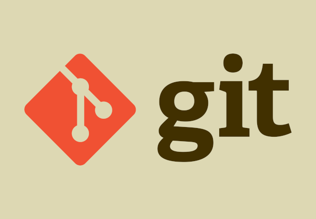

# Лабараторная работа №1
### Цель:
*Познакомиться с системой верстки текстов TeX, языком верстки TeX, издательской системой LaTeX.Выполнить вариант индивидуального задания.*

### Задание:
*Сверстать три страницы научной статьи с использованием системы верстки текстов TeX. 
[На странице](https://proc.ostis.net/proc/Proceedings%20OSTIS-2024.pdf) необходимо взять доклад, соответствующий варианту индивидуального задания.
Доклад представлен в форме статьи в формате *.pdf.
Для написания формального текста предлагается воспользоваться пакетом макросов “scn-latex”. 
Для оформления списка источников использовать \bibliography команду*

### Перед началом работы необходимо подключить специальные пакеты
```
\documentclass[10pt, a4paper]{proc}%создание класса документа, шрифт 10
\usepackage[utf8]{inputenc}%
\usepackage{setspace}%подключение бибилотеки для отступов между строками
\usepackage{ragged2e}%пакет выравнивания
\usepackage{fancyhdr}%пакет задания заголовков
\usepackage{graphicx}%подключение пакета для картинок
\usepackage{amsmath}%пакет для математических формул
\usepackage{enumitem}%пакет для нумерования
\usepackage[left=2.5cm,right=2.5cm,
    top=2.5cm,bottom=2.5cm]{geometry}% создание шаблона с определенными отступами
\setlength{\columnsep}{0.5cm}%расстояние между двумя колонками с текстами
\setcounter{page}{165}% установление номера страницы
```
### Основные команды:
* `\par` - абзац
* `\begin{itemize} ... \end{itemize}` - список без нумерации
* `\begin{enumerate} ... \end{enumerate}` - список с нумерацией
* `\fontsize{10}{13}\selectfont` - первое — это размер шрифта в pt, второе — расстояние между строками в pt
* `\begin{multicols}{2} ... \end{multicols}` - разделяет текст на две колонки
* `\setlength\parindent{10pt}` - устанавливает отступ обзаца
* `\begin{tabular} ... \end{tabular}`
* `\newpage` - новая страница
* `\vspace{N}` - оступ на N

  Более подробно с _LaTex_ можно ознакомиться по [ссылке](https://www.overleaf.com/learn/latex/Learn_LaTeX_in_30_minutes)
# Лабараторная работа №3
### Цель:
*Ознакомится с системой управлениями версиями Git и веб-сервисом GitHub*

### Задание:
Получить практические навыки работы в консоли, использования консольных команд.

[Задания по гиту](https://docs.google.com/document/d/1pkqZWOlte5j6PuPpz7w03tPkw64ctuUwELoI-qctYVQ/edit?tab=t.0)

Для сдачи работы необходимо выполнить все задания и составить отчёт с тем, как эти задания выполнялись

<p  align="left"></p>

### Основные команды Git:
* `git init` - инициализация нового репозитория
* `git status` - проверка файлов на индексирование и наличие его в репозитории
* `git log` - посмотреть протокол коммитов
* `git commit` - делает для проекта снимок текущего состояния изменений, добавленных в раздел проиндексированных файлов
* `git add N.txt` - перенести файл N.txt из рабочего каталога в раздел проиндексированных файлов


### Работа с удаленными хостингами

Популярным хостингом для хранения удаленных репозиториев является *__GitHub__*.
Чтоб начать работу с ним, можно изучить [данную страницу](https://ru.hexlet.io/courses/intro_to_git/lessons/github/theory_unit).

### Вывод:

С помощью Git можно фиксировать изменения в проекте на локальном уровне и при необходимости возвращаться к предыдущим версиям. Также можно создать резервную копию на удалённом сервере, поддерживающем Git, и делиться результатами с другими пользователями.
