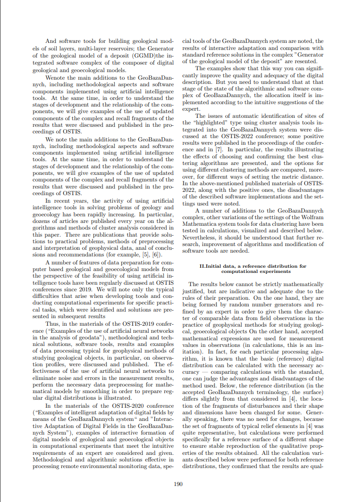

<h1 align="center"
">Лабораторная работа №3</h1>

    

### Цель:
*Ознакомиться с системой управления версиями Git и веб-сервисом GitHub, а также научиться оформлять файлы в формате Markdown.*

## Что такое Git?
> 
> **Git** — это инструмент, который помогает отслеживать изменения в файлах и работать над проектом вместе с другими людьми. Представь, что ты пишешь книгу, и каждый раз, когда ты вносишь изменения, Git сохраняет копию твоей работы. Если что-то пойдет не так, ты всегда можешь вернуться к предыдущей версии.

> ## Основные команды Git
> 
> - `git init` — инициализация нового репозитория.
> - `git clone <URL>` — клонирование существующего репозитория.
> - `git add .` — добавление изменений в индекс.
> - `git commit -m "Сообщение"` — фиксация изменений.
> - `git push origin main` — отправка изменений в удалённый репозиторий.
> - `git pull origin main` — получение изменений из удалённого репозитория.
> - `git status` — проверка статуса репозитория.
> - `git log` — просмотр истории коммитов.
> - `git branch` — управление ветками.
> - `git merge <ветка>` — слияние веток.
> - `git checkout <ветка>` — переключение между ветками.
> ## Полезные ссылки
> 
> - [Инструкция Git для новичков: что это такое, как он работает и какие есть основные команды](https://dan-it.com.ua/blog/instrukcija-git-dlja-novachkiv-shho-ce-take-jak-vin-pracjuie-ta-jaki-ie-osnovni-komandi/)

<h1 align="center"
">Лабораторная работа №3</h1>

### Условие первой лабораторной работы:
Знакомство с системой верстки TeX, изучение языка разметки TeX и издательской системы LaTeX. Надо выполнить задание по выбранному варианту. Для разметки документа можно использовать онлайн-редактор [Overleaf](https://www.overleaf.com) или любые другие редакторы LaTeX.
### Задание

Задание
Сверстать три страницы научной статьи с использованием системы верстки текстов TeX. На странице [Proceedings OSTIS 2024](https://proc.ostis.net/proc/Proceedings%20OSTIS-2024.pdf) необходимо взять доклад, соответствующий варианту индивидуального задания. Доклад представлен в форме статьи в формате *.pdf.

В процессе работы над первой лабораторной работой использовались следующие библиотеки.

| Библиотеки | Описание |
|--------------|----------|
| **hyperref** | Добавляет ссылки в документ. |
| **inputenc** | Позволяет использовать UTF-8, чтобы поддерживать русский и другие символы. |
| **multicol** | Разбивает текст на несколько колонок, как в газетах. |
| **setspace** | Меняет расстояние между строками. |
| **ragged2e** | Делает текст аккуратно выровненным. |
| **fancyhdr** | Настраивает верхние и нижние колонтитулы (заголовки и номера страниц). |
| **titlesec** | Меняет стили заголовков. |
| **graphicx** | Вставляет картинки в документ. |
| **float**    | Помогает точно размещать таблицы и рисунки. |
| **wrapfig**  | Позволяет тексту обтекать картинки. |
| **geometry** | Задает отступы страницы. |

---

### Настройки страницы и колонтитулов

- [ ] **`geometry`**  
  Настраивает отступы на странице:  
  - Слева и справа — 1.9 см.  
  - Сверху — 2.2 см, снизу — 2 см.

- [ ] **`justifying`**  
  Выравнивает текст по ширине страницы, чтобы он выглядел аккуратно.

- [ ] **`fancyhf{}`**  
  Очищает верхние и нижние колонтитулы, убирая все стандартные элементы.

- [ ] **`renewcommand{\headrulewidth}{0pt}`**  
  Убирает линию в верхнем колонтитуле.

- [ ] **`cfoot{\vskip -1.5cm \thepage}`**  
  Помещает номер страницы в нижний колонтитул с небольшим сдвигом вверх.

---

### Настройки текста и абзацев

- [ ] **`linespread{0.81}`**  
  Делает строки плотнее друг к другу (уменьшает межстрочный интервал до 81% от стандартного).

- [ ] **`setlength{\columnsep}{0.5cm}`**  
  Устанавливает расстояние между колонками текста (0.5 см).

- [ ] **`fontsize{80}{14}\selectfont`**  
  Устанавливает размер шрифта 80 и межстрочный интервал 14 (пример для заголовков).

- [ ] **`fontsize{10}{15}\selectfont`**  
  Устанавливает размер шрифта 10 и межстрочный интервал 15 (подходит для основного текста).

- [ ] **`setlength{\parindent}{0.8cm}`**  
  Устанавливает отступ в начале абзаца в 0.8 см.  

- [ ] **`setlength{\parindent}{0.4cm}`**  
  Уменьшает отступ в начале абзаца до 0.4 см.

---

### Нумерация и заголовки

- [ ] **`setcounter{page}{190}`**  
  Задает **начальный номер** страницы (в данном случае, 190).

- [ ] **`renewcommand{\thesection}{\Roman{section}}`**  
  Меняет стиль нумерации разделов на **римские** цифры.

- [ ] **`setcounter{section}{1}`**  
  Устанавливает номер раздела, с которого начнется документ (в данном случае, I).

- [ ] **`titleformat{\section}{\footnotesize\centering\sc\bfseries}{\thesection.}{0cm}{}{}`**  
  Настраивает стиль заголовков:  
  - Маленький шрифт **footnotesize**
  - Центрирование текста **centering**  
  - Полужирный шрифт **bfseries** с заглавными буквами **sc**.  
  - Нумерация с точкой **thesection**
  - Нет отступов перед текстом заголовка **0 см**.

---

### Работа с колонками

- [ ] **`begin{multicols}{2}`**  
  Делит текст на две колонки для компактного размещения.

---
#### Пример вставки изображения и создания на нем ссылки.

##### Пояснение

- **\includegraphics**: Вставляет изображение из файла "picture/1.jpg".
- **\caption**: Создает подпись к изображению.
- **\label**: Устанавливает метку для изображения, чтобы на него можно было сослаться в тексте.
- **\autoref**: Используется для создания ссылки на метку, установленную с помощью \label.

#### Итог выглядит следующим образом:

