<h1 align="center">Лабораторная работа 3 </h1>

 

## Цель работы 
- Познакомиться с программами git, освоить их программные аргументы.

## Задание 
- Получить практические навыки работы в консоли, использования консольных команд

## Команды 
1. Создать локальный репозиторий в текущей папке
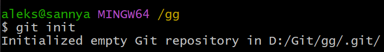
2. Посмотреть статус текущего репозитория
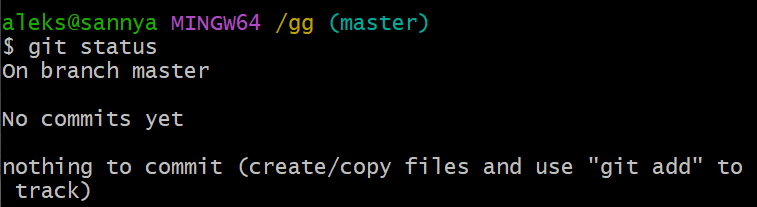

3. Что такое ветка и какая ветка обычно является основной
Ветка - это линия разработки в GitHub. Основной веткой обычно является master или main.   

4. Добавить файл в контекст, который будет коммититься
 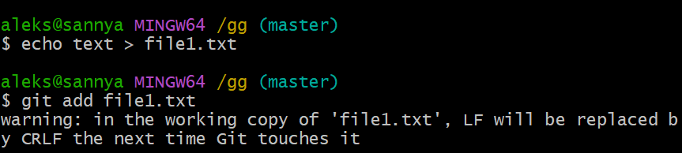
5. Создать коммит на основе текущего контекста и создать для него комментарий
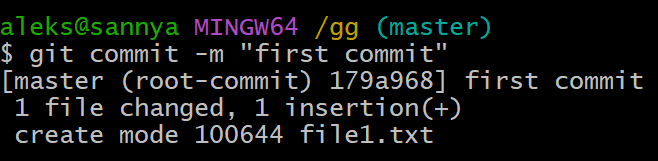
6. Создать коммит, включающий изменения всех наблюдаемых файлов
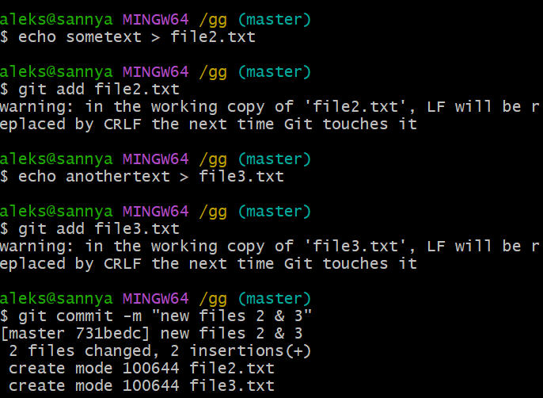
7. посмотреть лог коммитов
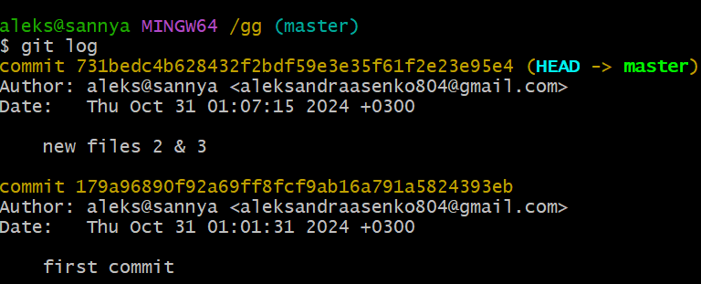
8. Посмотреть информацию о текущих настройках

9. Убрать файл из контекста
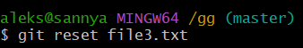
10. Посмотреть измениения в файле по сравнению с последним коммитом

11. убрать измениения относительно последнего коммита 
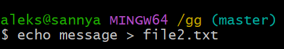
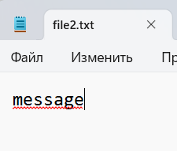
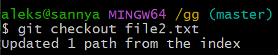
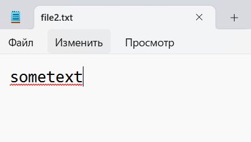
12. Добавить в контекст коммита все измененные и созданные файлы
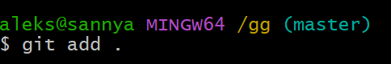
13. Изменить глобальные/локальные настройки

глобальные 

локальные

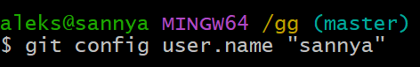
14. переписать имя пользователя 
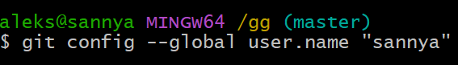
15. посмотреть существующие ветки 
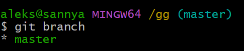
16. создать новую ветку
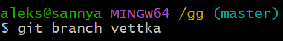
17. переключиться на другую ветку
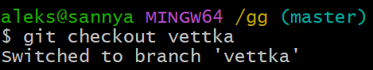
18. создать новую ветку и сразу переключитиься на нее

19. удалить ветку (даже если она не примержена)
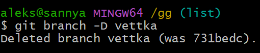
20.примержит изменения из указанной ветки в текущую
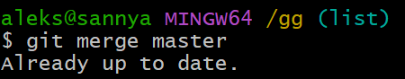
21. в каком случае могут случиться конфликты? сделать конфликт

Конфликт возникает, когда в двух ветках была изменена одна и та же строка в файле или когда некий файл удален в одной ветке и отредактирован в другой. Как правило, конфликты возникают при работе в команде.

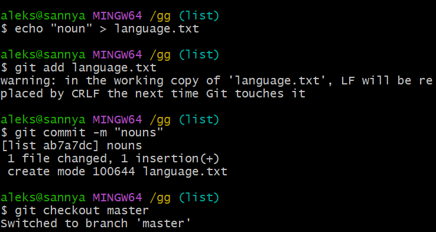
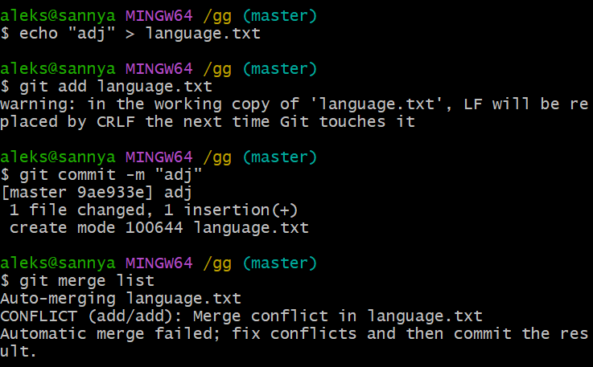
22. как посмотреть, в каких файлах конфликты
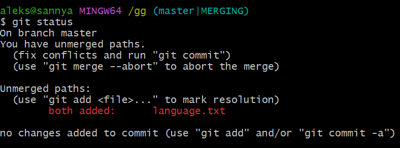
23. как устранить конфликты 
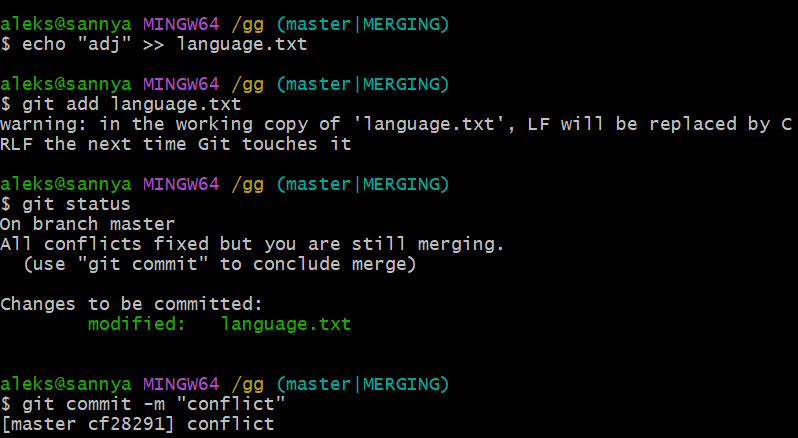
24. как переключиться на указанный коммит
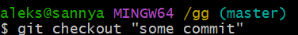
25. сделать ребазирование текущей ветки 
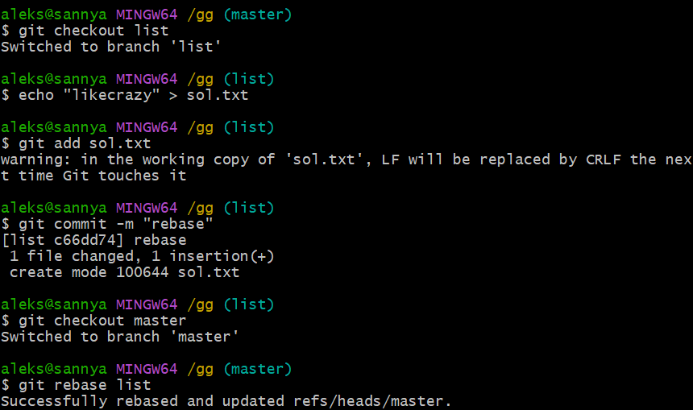
26. отменить ребазирование во время конфликта 
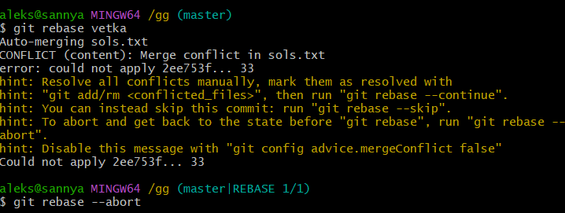
27. пропустить текущий коммит и перейти к следующему
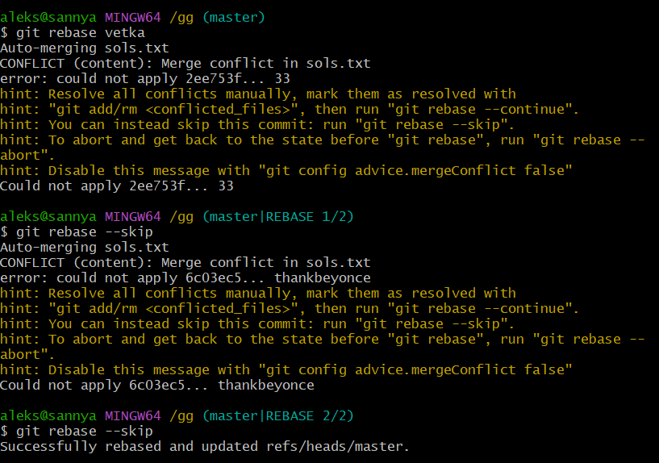
28. отправить измениения из локального репозитория в удаленный
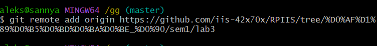
29. забрать изменения из репозитория, для которого были созданные удаленные ветки по умолчанию
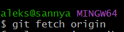
30. забрать изменения удаленной ветки из репозитория по умолчанию, основной ветки
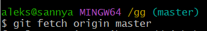
31. 
Для выполнения лабораторной работы я использовал следующие библиотеки:

Вот как выглядит итог:

