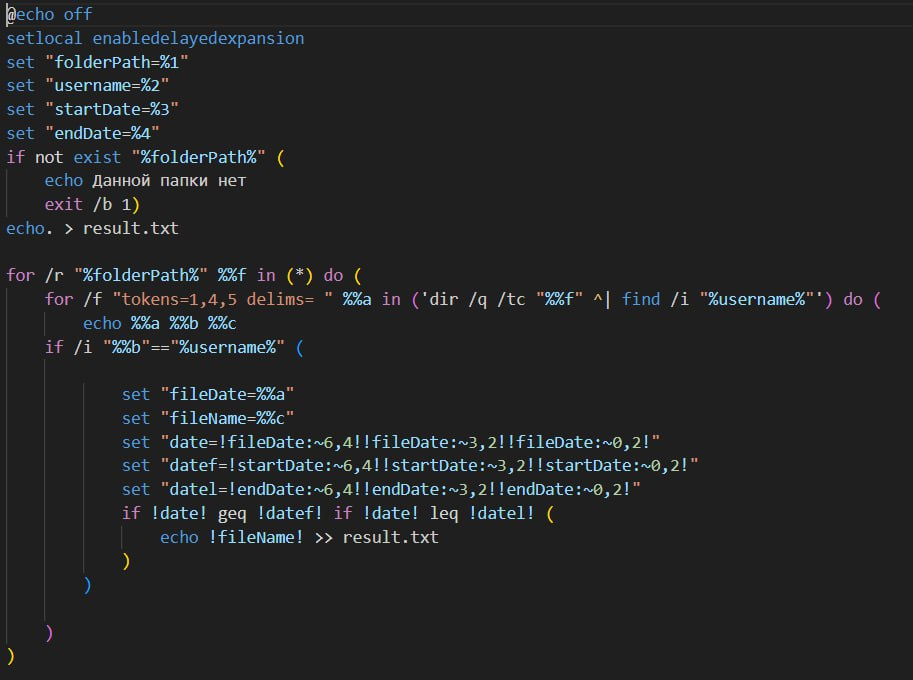

<h1 align="center">Лабораторная работа 5 </h1>

 

## Цель работы 
- Освоить командные оболочки shell (для OS семейства Unix) и cmd (для OS семейства MS Windows):
  - изучить основные встроенные команды,
  - научиться писать файлы сценариев,
  - научиться соотносить командные оболочки для разных OS.
- Освоить командное окружение для OS семейства Unix(утилиты из пакета GNU Core Utilities), и соответствующие им утилиты для OS семейства MS Windows.

## Задание 
- Познакомиться с консольными программными окружениями OS Windows и OS Linux.
- Получить практические навыки работы в консоли, использования консольных команд.

## Ход работы
В ходе лабораторной работы я выполнила вариант 62

Создать файл sh и bat, который выполняет следующее: 

На вход пакетному файлу приходит относительный путь к папке (как параметр пакетного файла). Если такой папки нет, то писать “Данной папки нет” и завершить выполнение программы. В указанной папке должны содержаться различные файлы. Найти файлы, созданные определенным пользователем в определенный период (также задается как параметры пакетного файла), имена найденных файлов вывести в файл result.txt. 

## Результат 
batch:

bash:

## Вывод
В ходе лабораторной работы я:
- oсвоила командные оболочки shell (для OS семейства Unix) и cmd (для OS семейства MS Windows),
- Освоить командное окружение для OS семейства Unix(утилиты из пакета GNU Core Utilities), и соответствующие им утилиты для OS семейства MS Windows.

