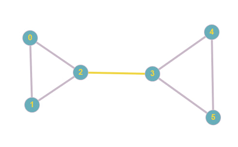
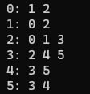

# Рассчетная работа 
В моем варианте расчетной работы нужно было найти число реберной связности графа.

Число реберной связности графа - это число ребер, которые нужно удалить, чтобы граф стал несвязным.
 

- В данном графе нужно убрать одно ребро, чтобы сделать его несвязным. Следовательно число реберной связности - 1.

Для решения задачи я убирал всевозможные ребра, а потом делал поиск в глубину, чтобы узнать, стал ли граф несвязным. 

Мой граф задан списком смежности:

После ввода данных программа выдает количество итераций и ответ.

Вот как выглядит работа программы:

# Вывод

В процессе выполнения рассчетной работы я познакомился с такой структурой данных как графы, научился работать с алгоритмом поиска в глубину и решил поставленную задачу.
