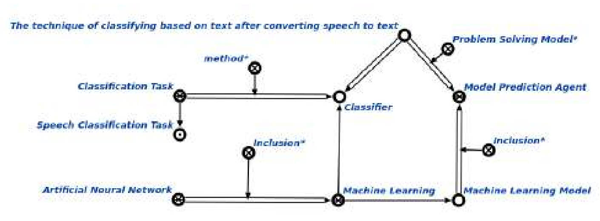

# Лабораторная работа №1
### Цель:
*Научиться верстать при помощью LaTeX*
### Задание:
Сверстать три страницы научной статьи с использованием системы верстки текстов TeX.
На странице (https://proc.ostis.net/proc/Proceedings%20OSTIS-2024.pdf) необходимо взять доклад, соответствующий варианту индивидуального задания.Доклад представлен в форме статьи в формате *.pdf.
Для написания формального текста предлагается воспользоваться пакетом макросов “scn-latex”. Для оформления списка источников использовать \bibliography команду

### Основные команды:
* `\par` - абзац
* `\begin{itemize} ... \end{itemize}` - список без нумерации
*  `\fontsize{10}{13}\selectfont` - первое — это размер шрифта в pt, второе — расстояние между строками в pt
* `\begin{multicols}{2} ... \end{multicols}` - разделяет текст на две колонки
*  `\scnheader` - наименование понятия
  Более подробно с _LaTex_ можно ознакомиться по ссылке (https://www.overleaf.com/learn/latex/Learn_LaTeX_in_30_minutes)
  
  
### Прилагаемые файлы/ссылки:
* main.tex (https://github.com/iis-42x70x/RPIIS/blob/%D0%98%D1%81%D0%B0%D0%B5%D0%BD%D0%BA%D0%BE_%D0%95/sem1/laba3/main.tex) - исходный файл вёрстки
* pioivis1 (3).pdf (https://github.com/iis-42x70x/RPIIS/blob/%D0%98%D1%81%D0%B0%D0%B5%D0%BD%D0%BA%D0%BE_%D0%95/sem1/laba3/pioivis1%20(3).pdf) - готовый pdf-файл с вёрсткой
* Гайд (https://www.overleaf.com/learn/latex/Learn_LaTeX_in_30_minutes) от создателей overleaf(LaTeX за 30 минут)
# Лабораторная работа №3
### Цель:
*Ознакомится с системой управлениями версиями Git и веб-сервисом GitHub*
### Задание:
Получить практические навыки работы в консоли, использования консольных команд.
Задания по гиту (https://docs.google.com/document/d/1pkqZWOlte5j6PuPpz7w03tPkw64ctuUwELoI-qctYVQ/edit?tab=t.0)
Для сдачи работы необходимо выполнить все задания и составить отчёт с тем, как эти задания выполнялись
### Основные команды Git:
* git init - инициализация нового репозитория* git status - проверка файлов на индексирование и наличие его в репозитории
* git log - посмотреть протокол коммитов* git commit - делает для проекта снимок текущего состояния изменений, добавленных в раздел проиндексированных файлов

### Работа с удаленными хостингами
Популярным хостингом для хранения удаленных репозиториев является *__GitHub__*.
Чтоб начать работу с ним, можно изучить данную страницу (https://ru.hexlet.io/courses/intro_to_git/lessons/github/theory_unit).
### Вывод:
С помощью Git можно фиксировать изменения в проекте на локальном уровне и при необходимости возвращаться к предыдущим версиям. Также можно создать резервную копию на удалённом сервере, поддерживающем Git, и делиться результатами с другими пользователями.
