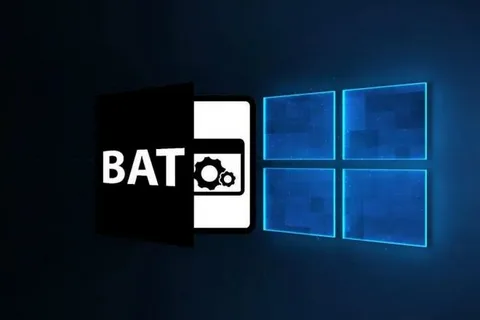

# Лабараторная работа №5
### Цель:
* Освоить командные оболочки shell (для OS семейства Unix) и cmd (для OS семейства MS Windows): изучить основные встроенные команды, научиться писать файлы сценариев, научиться соотносить командные оболочки для разных OS.
* Освоить командное окружение для OS семейства Unix(утилиты из пакета GNU Core Utilities), и соответствующие им утилиты для OS семейства MS Windows.
### Задание:
Вариант 61:

Создать файл sh и bat, который выполняет следующее:

На вход пакетному файлу приходит 2 относительных пути к папкам (как параметры пакетного файла). Если какой-нибудь папки нет, то писать “Данной папки нет - [Заданный_путь]” и завершить выполнение программы. В первой заданной папке должно содержаться некоторое число различных файлов. Всем файлам из данной директории присвоить атрибуты "только чтение", кроме файлов, тип которых *.txt. Перенести во вторую папку файлы с расширением txt.

### Bat файл:
<p  align="center"></p>

```
@echo off
if "%~2"=="" (
  echo Usage: %~nx0 ^<source_directory^> ^<destination_directory^>
  exit /b 1
)

set "SRC_DIR=%~1"
set "DST_DIR=%~2"

if not exist "%SRC_DIR%" (
  echo Данной папки нет - %SRC_DIR%
  exit /b 1
)

if not exist "%DST_DIR%" (
  echo Данной папки нет - %DST_DIR%
  exit /b 1
)

for %%F in ("%SRC_DIR%\*") do (
  if "%%~xF"==".txt" (
    move "%%F" "%DST_DIR%"
  ) else (
    attrib +r "%%F"
  )
)
```
### Sh файл:
<p  align="center"></p>

```
#!/bin/bash

if [ $# -ne 2 ]; then
  echo "Usage: $0 <source_directory> <destination_directory>"
  exit 1
fi

SRC_DIR=$1
DST_DIR=$2

if [ ! -d "$SRC_DIR" ]; then
  echo "Данной папки нет - $SRC_DIR"
  exit 1
fi

if [ ! -d "$DST_DIR" ]; then
  echo "Данной папки нет - $DST_DIR"
  exit 1
fi

for file in "$SRC_DIR"/*; do
  if [ -f "$file" ]; then
    if [[ "$file" != *.txt ]]; then
      chmod 444 "$file"
    else
      mv "$file" "$DST_DIR"
    fi
  fi
done

```
### Полезные сайты:
Подойдёт для тех, кто начал работать с bat файлами: [ссылка](https://help.reg.ru/support/servery-vps/oblachnyye-servery/rabota-s-serverom/kak-sozdat-bat-fayl-i-rabotat-s-nim#0).

Также можно почитать это: [batch script](https://habr.com/ru/sandbox/168937/).

А здесь можно почитать про sh файлы: [ссылка](https://selectel.ru/blog/tutorials/linux-bash-scripting-guide/).

### Вывод:
Файлы с расширением .bat и .sh являются скриптовыми файлами, которые используются для автоматизации задач в операционных системах Windows и Unix/Linux соответственно. 
Оба типа файлов являются мощными инструментами для автоматизации и управления системами, но они предназначены для различных операционных систем и имеют свои уникальные особенности и возможности. Знание их различий и умений написания может существенно упростить выполнение рутинных задач и улучшить производительность работы.


