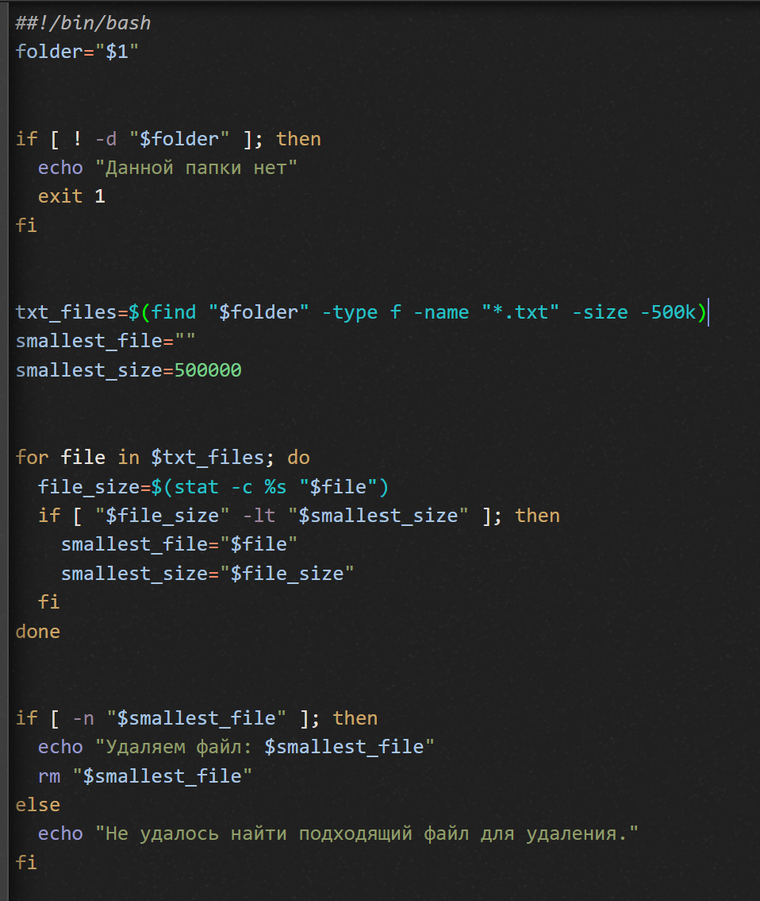

### Лабораторная работа номер 5:

### Вариант 45: 
На вход пакетному файлу приходит относительный или абсолютный путь к папке (как параметр пакетного файла). Если такой папки нет, то писать “Данной папки нет” и завершить выполнение программы. Если такая папка есть, то в ней и ее подкаталогах находим файлы с расширением txt, которые меньше 500Kb и из них удаляем самый маленький.

### Цель работы:

1) Освоить командные оболочки shell (для OS семейства Unix) и cmd (для OS семейства MS Windows):

изучить основные встроенные команды,

научиться писать файлы сценариев,

научиться соотносить командные оболочки для разных OS.

2)Освоить командное окружение для OS семейства Unix(утилиты из пакета GNU Core Utilities), и соответствующие им утилиты для OS семейства MS Windows.

### Ход работы:

Используя интернет-ресурсы мне удалось написать скрипт, который выполняет то, что сказано в условии. Вот мой скрипт на Windows:

Для того, чтобы запустить скрипт на Windows необходимо выполнить следующие действия:

- Нажать сочетание клавиш Win + R;  
- В появившемся окне написать cmd и нажать enter;  
- В открывшейся консоли перейти к папке, в которой хранится скрипт (cd путь\к\папке)  
- Вписать "название_скрипта.bat", пробел, "Название_папки".

А вот так он реализован на Linux:

Для запуска скрипта на Linux необходимо выполнить следующие действия:  
- Открыть терминал  
- Перейти в директорию, содержащую данный скрипт (cd путь/к/папке)  
- Воспользоваться следующей командой: bash "название_скрипта.sh" "передаваемые_параметры" (если таковы необходимы)  

Вывод: В ходе данной лабораторной работы я изучил основные встроенные команды, научился писать файлы сценариев, научился соотносить командные оболочки для разных OS, также освоил командное окружение Unix и MS Windows.
