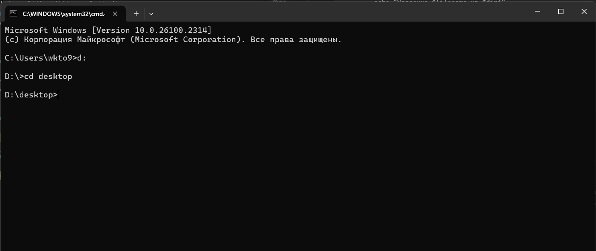

# Лабораторная 5
В результате выполнения лабораторной работы я познакомился с исполняемыми файлами .sh и .bat для ОС Linux и Windows соответственно.

В моем задании нужно было написать исполняемый файл, который синхронизировал бы 2 папки (из первой удалял файлы, которых нет во второй и копировал файлы из второй в первую, которых нет в первой).

Файл .bat:

```
@echo off
set dir1=%~1
set dir2=%~2
for  %%I in (%dir1%\*) do ( 
	if not exist %dir2%\%%~nxI (
		del %dir1%\%%~nxI 
		echo ydalenie %%~nxI iz %dir1%
	)
)   
for  %%I in (%dir2%\*) do (
	if not exist %dir1%\%%~nxI (
		copy %dir2%\%%~nxI %dir1%\%%~nxI
		echo Kopirovanie %%~nxI v %dir1%
	)
)
pause
```

Файл .sh:

```
#!/bin/bash

dir1="$1"
dir2="$2"

for file in "$dir1"/*; do
    filename=$(basename "$file")
    if [[ ! -e "$dir2/$filename" ]]; then
        rm "$file"
        echo "Удаление $filename из $dir1"
    fi
done
for file in "$dir2"/*; do
    filename=$(basename "$file")
    if [[ ! -e "$dir1/$filename" ]]; then
        cp "$file" "$dir1/$filename"
        echo "Копирование $filename в $dir1"
    fi
done
echo "done"
```
Для того чтобы запустить файл .bat нужно следовать следующим инструкциям:

1.Перейти в директорию где находится исполняемый файл.
 
2. ввести в командную строку имя исполняемого файла .bat и передать на вход 2 параметра
(папки которые мы будем синхронизировать) и нажать enter.


Для того чтобы запустить файл .sh нужно следовать следующим инструкциям:
1. перейти в директорию где находится исполняемый файл.

2. ввести в командную строку ./имя.sh ./путь_к_1_папке ./путь_к_2_папке, нажать enter.

## ВЫВОД
В обоих исполняемых файлах есть команды, выполняющие одинаковые операции, например цикл for. Так же знак $ и "/%"/"%" на linux и windows выполняют одиннаковую функцию, но пишутся по-разному.

