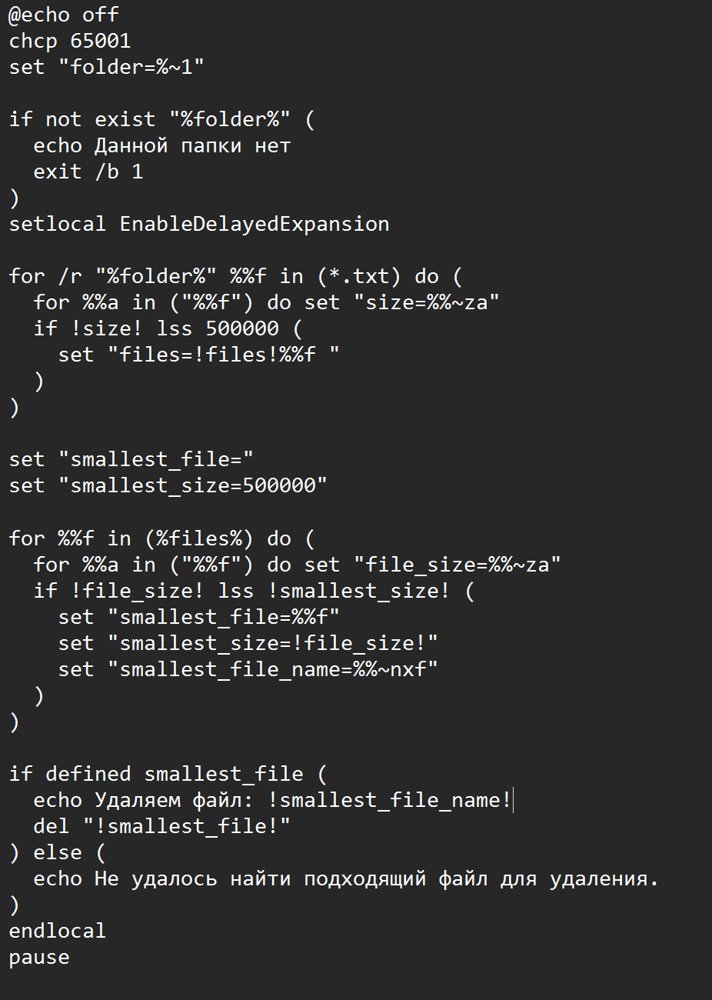

<h1 align="center">Лабараторная работа №5</h1>

## Цели:

* **Ознакомиться с теоритичесими сведениями о скриптах** 
* **Выполнить выданный вариант лабораторной работы**

## Вариант:
Для выполненения лабораторной работы ине был выдан 35 вариант из документа 
<a href="https://docs.google.com/document/d/1jQIRngcwNa9yVtQns-ID8a5rRZHwlNSgp8OFaTEHMHc/edit?usp=drive_link"> на Google disk </a>

## Выполнение лабораторной работы


**Скрипт, или сценарий** — это небольшая программа, которая выполняет конкретную задачу. Обычно у скриптов нет своего визуального интерфейса: это код, который запускается по команде, отрабатывает, совершает нужные действия и завершается. Обычно такие программы нужны, чтобы автоматизировать повторяющиеся действия.

Вот ссылка, в которой описаны все основные команды **bash** скриптов <a href="https://devhints.io/bash">Bash</a>. А здесь то, как запустить <a href="https://wiki.merionet.ru/articles/kak-zapustit-bash-skript-v-linux#:~:text=%D0%A7%D1%82%D0%BE%D0%B1%D1%8B%20%D0%B7%D0%B0%D0%BF%D1%83%D1%81%D1%82%D0%B8%D1%82%D1%8C%20%D1%81%D0%BA%D1%80%D0%B8%D0%BF%D1%82%20Bash%20%D0%B2,%D1%85%D0%BE%D1%82%D0%B8%D1%82%D0%B5%20%D0%B2%D1%8B%D0%BF%D0%BE%D0%BB%D0%BD%D0%B8%D1%82%D1%8C%2C%20%D1%81%20%D0%BD%D0%B5%D0%BE%D0%B1%D1%8F%D0%B7%D0%B0%D1%82%D0%B5%D0%BB%D1%8C%D0%BD%D1%8B%D0%BC%D0%B8%20%D0%B0%D1%80%D0%B3%D1%83%D0%BC%D0%B5%D0%BD%D1%82%D0%B0%D0%BC%D0%B8.&text=%D0%9A%D1%80%D0%BE%D0%BC%D0%B5%20%D1%82%D0%BE%D0%B3%D0%BE%2C%20%D0%B2%D1%8B%20%D0%BC%D0%BE%D0%B6%D0%B5%D1%82%D0%B5%20%D0%B8%D1%81%D0%BF%D0%BE%D0%BB%D1%8C%D0%B7%D0%BE%D0%B2%D0%B0%D1%82%D1%8C,%D0%B2%D0%B0%D1%88%D0%B5%D0%BC%20%D0%B4%D0%B8%D1%81%D1%82%D1%80%D0%B8%D0%B1%D1%83%D1%82%D0%B8%D0%B2%D0%B5%20%D1%83%D1%81%D1%82%D0%B0%D0%BD%D0%BE%D0%B2%D0%BB%D0%B5%D0%BD%D0%B0%20%D1%83%D1%82%D0%B8%D0%BB%D0%B8%D1%82%D0%B0%20sh%20.&text=%24%20bash%20script%20This%20is%20the%20output%20from%20your%20script!">  Bash script</a>

Вот ссылка, перейдя по которой, можно узнать основные команды **bat** , а также научиться запускать **bat** скрипт. <a href="https://help.reg.ru/support/servery-vps/oblachnyye-servery/rabota-s-serverom/kak-sozdat-bat-fayl-i-rabotat-s-nim">Bat</a>

### Для написания скриптов я использовал два языка:
**bat(windows)**
 <p align=center>

</p>

**sh(linux)**
<p align=center>

</p>


###  Вот вариант кода Sh


```
#!/bin/bash
directory=$1
min_size=$2
max_size=$3 
name=$4
file_result="scriptt.txt"
> $file_result
if [ ! -d "$directory" ]; then
echo "this name of directory is not in this computer"
exit 1
fi
counter=0
for file in $(find "$directory" -type f); do
file_size=$(stat -c%s "$file")
file_name=$(stat -c '%U' "$file")
if [ "$file_size" -ge "$min_size" ] && [ "$file_size" -le "$max_size" ] && [ "$file_name" == "$name" ]; then
echo "$file, $file_size" >>"$file_result"
counter=$((counter+1))
fi
done	
echo $counter
```

### А вот  этот же скрипт только для **Bat**

```
@echo off
setlocal enabledelayedexpansion

REM Проверка количества параметров
if "%~4"=="" (
    echo Использование: %0 путь мин_размер макс_размер владелец
    exit /b 1
)

REM Присваивание параметров переменным
set "dir_path=%~1"
set "min_s=%~2"
set "max_s=%~3"
set "owneroffile=%~4"
set "output_file=result.txt"
set "countto_files=0"

REM Проверка существования директории
if not exist "%dir_path%" (
    echo Данной папки нет
    exit /b 1
)

REM Очистка файла результатов если он существует
echo. > "%output_file%"

REM Поиск файлов
for /r "%dir_path%" %%F in (*) do (
    REM Увеличение счетчика просмотренных файлов
    set /a "countto_files+=1"
    
    REM Получение размера файла
    for %%A in ("%%F") do (
        set "file_size=%%~zA"
        
        REM Получение владельца файла
        for /f "tokens=*" %%O in ('dir /q "%%F" ^| findstr /i /c:"%owneroffile%"') do (
            REM Проверка размера и владельца
            if !file_size! GEQ %min_s% if !file_size! LEQ %max_s% (
                echo %%~dpF,%%~nxF,!file_size! >> "%output_file%"
    
            )
        )
    )
)

REM Добавление общего количества просмотренных файлов
echo Всего просмотрено файлов: %countto_files% >> "%output_file%"

endlocal
```
### Область применения

* **Сейчас скрипты используются почти в любой области разработки. В первую очередь это веб: одни скрипты отвечают за выполнение действий на «внешней» стороне сайта, другие — занимаются отправкой и обработкой данных с сервера и обратно.**

* **Скрипты можно использовать для автоматизации повседневных действий в любой отрасли. Если речь о разработке — написанный под конкретные задачи сценарий может обрабатывать данные, рисовать график на основе входной информации, связываться с сервером, анимировать дизайн сайта или делать что-то еще. Но и в офисной работе с документами, и в рекламе есть место скриптам. Их пишут программисты или сами работники офиса.**


## Вывод:
 В результате данной лабораторной работы мне  удалось выполнить свой вариант на **bat** и **sh**, а также 
 узнать основную информацию о скриптах.

 ## Используемые исочники:

 * <a href="https://habr.com/ru/articles/540076/">Habr</a>

 * <a href="https://ru.wikipedia.org/wiki/Bash">Википедия</a>

 * <a href="https://help.reg.ru/support/servery-vps/oblachnyye-servery/rabota-s-serverom/kak-sozdat-bat-fayl-i-rabotat-s-nim">Per.py</a>