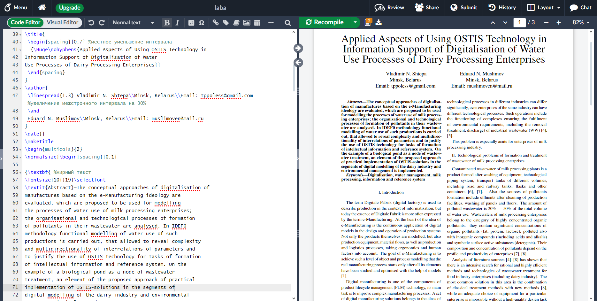

# Лабораторная работа 1
## Цель работы:
Познакомиться с системой верстки текстов _TeX_, языком верстки _TeX_, издательской системой _LaTeX_.Выполнить вариант индивидуального задания.
 ## Задание:
Сверстать три страницы научной статьи с использованием системы верстки текстов TeX.
[На странице](https://proc.ostis.net/proc/Proceedings%20OSTIS-2024.pdf) необходимо взять доклад, соответствующий варианту индивидуального задания.
Доклад представлен в форме статьи в формате *.pdf.
Для написания формального текста предлагается воспользоваться пакетом макросов “scn-latex”. 
Для оформления списка источников использовать \bibliography команду
## Основные команды:
* multicols- для разбиения страницы на части;
* itemize - для создания списка;
* scn - для подключения одноименной библиотеки;
* scnrelfromset - для создания списка(команда доступна только с библиотекой "scn");
* usepackage - для подключения библисотеки;
* % - для комментариев.

Более подробно с _LaTex_ можно ознакомиться по [ссылке](https://www.overleaf.com/learn/latex/Learn_LaTeX_in_30_minutes)

# Лабораторная работа 3
## Цель работы:
Познакомиться с программами git, освоить их программные аргументы.
## Задание:
Получить практические навыки работы в консоли, использования консольных команд.
[Задания по гиту](https://docs.google.com/document/d/1pkqZWOlte5j6PuPpz7w03tPkw64ctuUwELoI-qctYVQ/edit?tab=t.0)
Для сдачи работы необходимо выполнить все задания и составить отчёт с тем, как эти задания выполнялись(скриншоты того что вы вводили и что вам гит отвечал)
## Основные команды:
* init - для создания локального репозитория в текущей папке;
* add - добавить файл к отслеживанию;
* commit - создать коммит;
* remote add - для добавления удалённого репозитория;
* push - для отправления данных в удалённый репозиторий.
Более подробно с основными командами Git можно ознакомиться по [ссылке](https://habr.com/en/articles/587558/)
