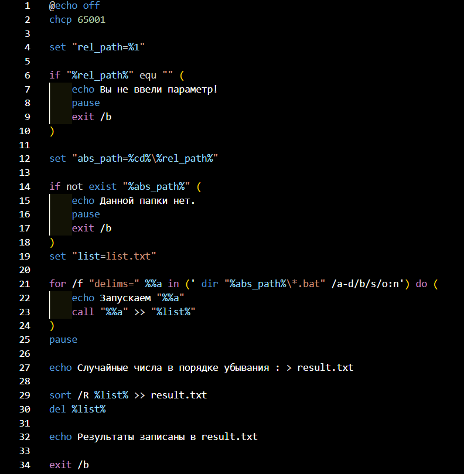
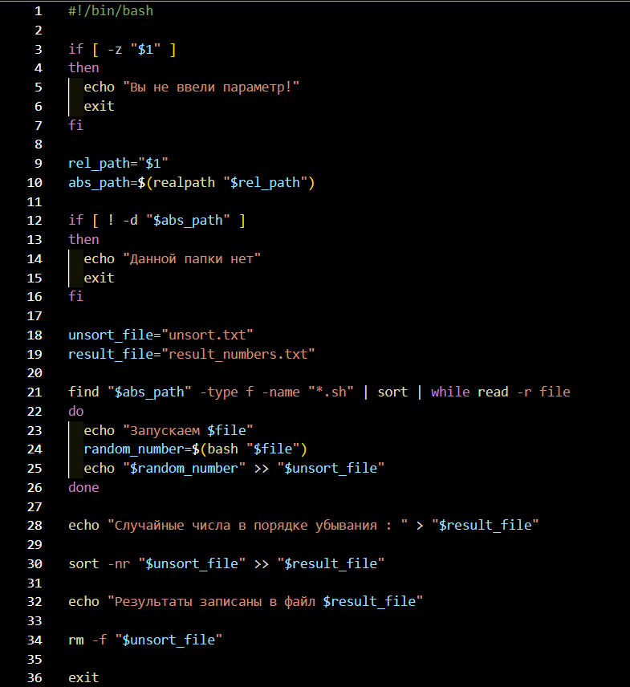

# Лабораторная работа 5
## Цель работы:
* Освоить командные оболочки shell (для OS семейства Unix) и cmd (для OS семейства MS Windows):
1) изучить основные встроенные команды,
2) научиться писать файлы сценариев,
3) научиться соотносить командные оболочки для разных OS.
* Освоить командное окружение для OS семейства Unix(утилиты из пакета GNU Core Utilities), и соответствующие им утилиты для OS семейства MS Windows.
 ## Задание:
* Познакомиться с консольными программными окружениями OS Windows и OS Linux.
* Получить практические навыки работы в консоли, использования консольных команд.
* **Варинт 53**. Создать файл sh и bat, который выполняет следующее: 
На вход пакетному файлу приходит относительный путь к папке (как параметр пакетного файла). 
Если такой папки нет, то писать “Данной папки нет” и завершить выполнение программы. 
Если такая папка есть, то в ней и в ее подкаталогах находить все пакетные файлы (файлы sh или bat) и
 запускаем их в алфавитном порядке (по названию файла). Каждый из скриптов внутри может возвращать какое-то рандомное значение.
 Вывести все эти рандомные значения по убыванию в файл result.txt.
## Ход работы:
Код для Windows:

Код для Linux:
 
## Основные команды:
Для Windows
* echo off - для отключения вывода выполняемых команд;
* call - для вызова скрипта;
* echo - для вывода текста на экран или в файл;
* exit /b - для выхода из текущего подскрипта;
* set - объявление переменных;
* :: - для комментариев.

Для Linux
* #!/bin/bash - указание интерпретатора (какой интерпретатор будет использоваться для выполнения файла и его путь);
* echo - для вывода текста на экран или в файл;
* exit - для выхода из подскрипта;
* find - для поиска файлов и каталогов;
* sort -nr - для сортировки **числовых** значений **по** **убыванию**;
* bash "$file" - для интерпретирования файла как Bash-скрипта и его выполнения.
## Гайд по использованию скриптов
* **Windows** **скрипт**
1) На операционной системе Windows нажмите клавиши win + R. 
2) В открывшемся окне введите cmd и нажмите enter.
3) В открывшейся консоли с помощью команды cd перейдите в папку со скриптом (cd путь/к/папке).
4) Для корректного запуска скрипта введите его название (first_skript.bat) и через пробел название папки, в которой вы хотите искать и запускать .bat файлы.
5) Дальше следуйте указаниям, которые будут появляться в консоли.
6) Для просмотра результата, после завершения скрипта введите result.txt и нажмите enter.
* **Linux** **скрипт**
1) На операционной системе Windows запускаете приложение Git Bash или используете любой другой эмулятор командной строки Unix.
2) В открывшейся консоли с помощью команды cd перейдите в папку со скриптом (cd путь/к/папке).
3) Для корректного запуска скрипта введите команду bash или просто sh дальше через пробел название скрипта (skript.sh) и через пробел название папки, в которой вы хотите искать и запускать .sh файлы. (Пример : sh skript.sh test) 
4) Дальше следуйте указаниям, которые будут появляться в консоли.
5) Для просмотра результата, после завершения скрипта введите cat result_numbers.txt и нажмите enter.
