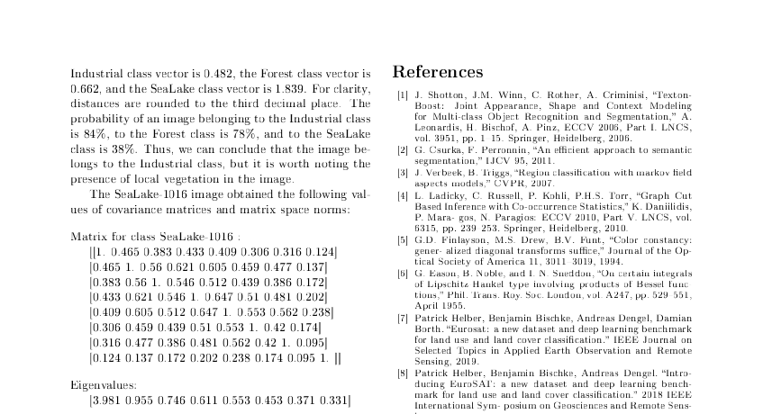
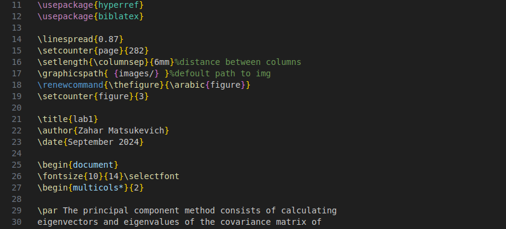
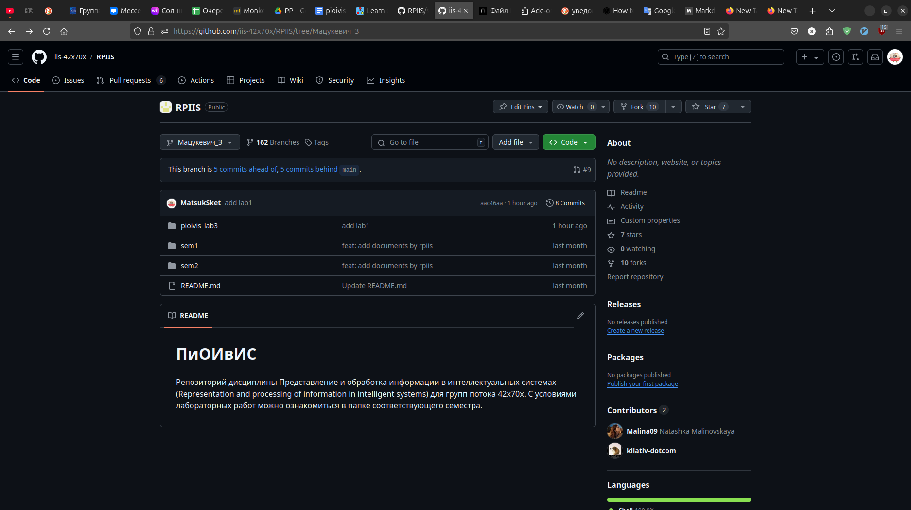

# Лабораторная работа №3

## Условие лабораторной работы №1

В рамках ЛР1 необходимо сверстать страницу сботрика средствами LaTeX. 
Вариант выдаётся проподавателем. Сборник для лр1 доступен по 
[ссылке](https://proc.ostis.net/proc/Proceedings%20OSTIS-2024.pdf).  

Выполнять ЛР1 можно на сайте [overleaf.com](https://www.overleaf.com/learn). 
В результате выполнения лабораторной необходимо добавить скомпилированный 
pdf-файл в выданную вам ветку.

## Цель и выводы лабораторной работы №3

### Цель

Загрузить исходники ЛР1 на выделенную ветку удаленного репозитория GitHub. 
Научиться работать с Git.

### Выводы

1. Восстановил пароль от своего GitHub аккаунта.
2. Научился ориентироваться и работать в системе контроля версий Git и 
платформе GitHub.
3. Научился верстать файлы формата markdown(.md).

## Cкриншоты выполнения работы

Скомпилированный LaTeX документ:

Пример кода на LaTeX:

Мая ветка удаленного репозитория на GitHub:

