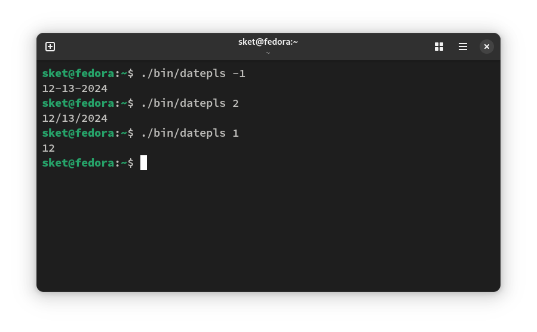

# Лабораторная работа 5
 
### Цель: 
 
Освоить командные оболочки shell (для OS семейства Unix) и cmd (для OS семейства MS Windows):
+ изучить основные встроенные команды,
+ научиться соотносить командные оболочки для разных OS.
+ Освоить командное окружение для OS семейства Unix и соответствующие им утилиты для OS семейства MS Windows.
### Условия задания
Вариант 85. Создать файл sh и bat, которые выполняют следующее: 
На вход пакетному файлу приходит число (как параметры пакетного файла). Если число отрицательное, то выводим сегодняшнюю дату в формате mm-dd-yyyy, если если число положительное и четное, то выводим текущую дату в формате mm/dd/yyyy, если число положительное и нечетное то выводим текущий месяц.

## Batch файл
- ### Код программы :computer:
```batch
@echo off
setlocal enabledelayedexpansion

if "%~1"=="" (
    echo Please enter a number as a parameter
    exit /b
)
set number=%~1

for /f "tokens=2 delims==" %%i in ('wmic os get localdatetime /value ^| find "="') do set date=%%i
set month=!date:~4,2!
set day=!date:~6,2!
set year=!date:~0,4!

if %number% lss 0 (
    echo !month!-!day!-!year!
) 
else (
    set /a mod=number %% 2
    if !mod! equ 0 (
        echo !month!/!day!/!year!
    ) else (
        echo !month!
    )
)

endlocal
```
### Пример работы кода !!!сделать скрин!!!


### Пояснение кода

`@echo off` отключыет вывода выполняемых команд. `setlocal enabledelayedexpansion` для отложенной подстановки переменных. Далее следует условный оператор `if`, который проверяет первый введенный параметр, если его нет, в консоль при помощи команды `echo` выведется текст, запрашивающий параметр, для корректного выполнения скрипта. `set` устанавливает переменную `number` хранящую значение введенного параметра. Следующая конструкция записывает в переменную `date` дату, возвращаемую `wmic os get localedatetime /value`. Такая запись возвращает строку, содержащую много информации о времени и месте нахождения устройства, так что в следующих строках в переменные `month`, `day`, `year` записаны подстроки строки `date`. Числа в конце строк присвоения значений переменным значат с какого символа и сколько символов нужно взять. Последняя конструкция условного оператора `if/else` возвращает дату в формате `mm-dd-yyyy`, если `number` отрицательное, если положительное то проверяем его на четность и выводим дату в формате `mm/dd/yyyy` или просто `mm` в противном случае. Вывод в консоль производится при помощи `echo`.

## Bash файл
- ### Код программы 
```bash
#usr/bin/bash

num=$1

if [ $num -lt 0 ]; then
  echo $(date +"%m-%d-%Y")
elif [ $(( $num % 2 )) -eq 0 ]; then
  echo $(date +"%m/%d/%Y")
else
  echo $(date +"%m")
fi

```

### Пример работы кода 


### Пояснение кода

`#!/bin/bash` указывает интерпретатор (какой интерпретатор будет использоваться для выполнения файла и его путь). Для начала создается переменная `num`, которой присваивается значение первого введенного параметра. Конструкция `if/else` проверяет отрицательность `num` и выводит в консоль дату в формате `mm-dd-yyyy`, в противном случае проверка на четность и вывод  даты в формате `mm/dd/yyyy`, если и эта проверка не проходит, то вывод текущего месяца. Вывод в консоль производится командой `echo` а определение даты и её формата при помощи команды `date` и символа `+`, после которого указывается необходимый формат вывода даты в двойных ковычках.  

### Выводы: 
 В ходе выполнения лабораторной работы по освоению командных оболочек cmd (для операционных систем семейства MS Windows) и shell (для операционных систем семейства Unix) были получены практические навыки работы с консольными программами и командами в различных операционных системах. 
