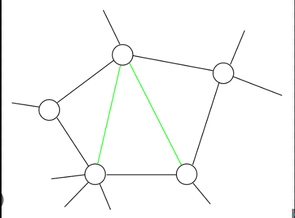
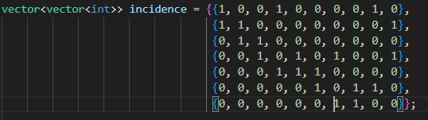
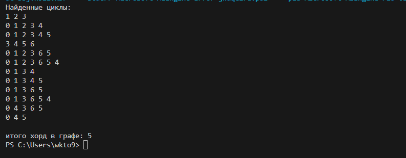

# Рассчетная работа 
В моем варианте рассчетной работы нужно было найти количество хорд в неориентированном графе.
 Хорда в графе - ребро, соединяющее две вершины цикла, но не являющееся его частью.
 

Чтобы найти все хорды в графе нужно найти все циклы.

Для поиска циклов я использовал поиск в глубину. При обходе в глубину вершина посечается как посещенная и цикл идет дальше в вершину, еще не посещенную.
Если из вершины нет возможных путей - поиск возвращается в вершину-родитель текущей.

Мой граф задан матрицей инцидентности

Я путем многократного обхода в глубину нашел все циклы, потом в цикле находил графы.

Циклы выводятся в столбик и после чего подсчитывается количество хорд в графе

# Вывод

В процессе выполнения рассчетной работы я познакомился с такой структурой данных как графы, научился работать с алгоритмом поиска в глубину и решил поставленную задачу.
