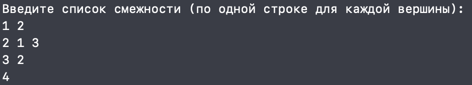
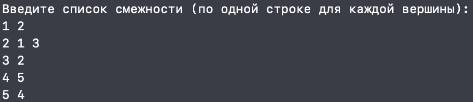
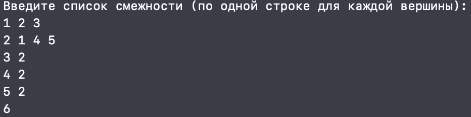
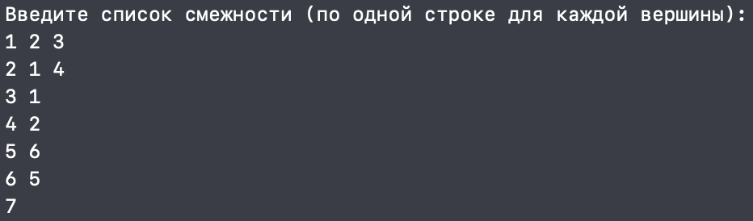
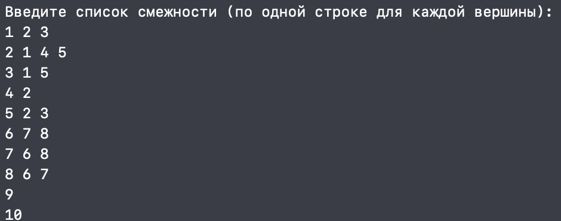

<h1 align="center">Расчётная работа. Теория Графов.</h1>

## Цели:
* Изучить основные понятия в теории графов 
* Научиться различать виды графов
* Уметь использовать основные алгоритмы при работе с графами 

## Задачи:
* Выполнить свой вариант расчётной работы
* Перенести получившееся решение на язык программирования С++
* Ознакомиться с основными алгоритмами по работе с графами

 ## Вариант 2.14
 Определить число компонентов связности неориентированного графа, используя список смежности для задания графа.

 ### Базовые сведения о графах, которые требуются для выполнения расчётной работы 
###

<b>Граф</b> — математическая абстракция реальной системы любой природы, объекты которой обладают парными связями. Граф как математический объект есть совокупность двух множеств — множества самих объектов, называемого множеством вершин, и множества их парных связей, называемого множеством рёбер.

- **Ориентированный граф** — это такой граф, в котором все связки
являются дугами:

- **Неориентированный граф** — это такой граф, в котором все связки
являются ребрами:

- **Компонента связности графа** (или просто компонента графа) — максимальный (по включению) связный подграф графа 

### Основные алгоритмы для работы с графами 

**Список смежности** - один из способов представления графа в виде коллекции списков вершин. Каждой вершине графа соответствует список, состоящий из «соседей» этой вершины.

Обход графа в глубину, или DFS (англ. depth-first search). Стратегия поиска в глубину состоит в том, чтобы идти «вглубь» графа настолько, насколько это возможно, а после упора в тупик пойти обратно до ближайшей развилки, после встречи с которой пойти туда, где ещё не были, повторяя алгоритм.
Пример из кода:

```c++
void dfs(int v, vector<bool>& visited, const map<int, vector<int>>& adj_list, vector<int>& component) {
    visited[v] = true;
    component.push_back(v);
    for (int neighbor : adj_list.at(v)) {
        if (!visited[neighbor]) {
            dfs(neighbor, visited, adj_list, component);
        }
    }
}
```

## Выполнение расчётной работы
### код

* **Подключаем нужные библиотеки, импорт всего пространства имен std.**
  
```c++
#include <iostream>
#include <vector>
#include <map>
#include <set>
#include <sstream>

using namespace std;
```

* **Функция DFS**
* **Функция для поиска компонент связности неориентированного графа с использованием поиска циклов через DFS**

  ```c++
  vector<vector<int>> find_connected_components(int n, const map<int, vector<int>>& adj_list) {
    vector<bool> visited(n + 1, false);
    vector<vector<int>> components;

    for (const auto& [vertex, _] : adj_list) {
        if (!visited[vertex]) {
            vector<int> component;
            dfs(vertex, visited, adj_list, component);
            components.push_back(component);
        }
    }

    return components;
}
* **Задание графов списком смежности**
  
* **Основная часть**.
  
```c++
int main() {
    int n;
    cout << "Введите количество вершин: ";
    cin >> n;

    map<int, vector<int>> adj_list;
    cin.ignore();

    cout << "Введите список смежности (по одной строке для каждой вершины):\n";
    for (int i = 1; i <= n; i++) {
        string line;
        getline(cin, line);
        stringstream ss(line);

        int vertex;
        ss >> vertex;

        int neighbor;
        while (ss >> neighbor) {
            adj_list[vertex].push_back(neighbor);
        }

        if (adj_list.find(vertex) == adj_list.end()) {
            adj_list[vertex] = {};
        }
    }

    vector<vector<int>> components = find_connected_components(n, adj_list);

    cout << "Количество компонент связности: " << components.size() << endl;

    for (size_t i = 0; i < components.size(); i++) {
        cout << "Вершины, принадлежащие " << (i + 1) << "-ой компоненте: ";
        for (size_t j = 0; j < components[i].size(); j++) {
            cout << components[i][j];
            if (j < components[i].size() - 1) cout << " ";
        }
        cout << endl;
    }

    return 0;
}
```

## Тест

### Граф 1

<p ></p>

### Вывод консоли 

<p></p>

### Граф 2

<p ></p>

### Вывод консоли 

<p ></p>

### Граф 3

<p ></p>

### Вывод консоли 

<p ></p>

### Граф 4

<p ></p>

### Вывод консоли 

<p ></p>

### Граф 5

<p ></p>

### Вывод консоли 

<p ></p>


## Вывод
В ходе выполнения данной расчётной работы:
- Ознакомились с понятием графов.
- Изучили, какие виды графов бывают (ориентированные/неориентированные).
- Ознакомились с таким способом представления графов в памяти компьютера, как список смежности.
- Реализовала алгоритм решения задачи [руководства](https://drive.google.com/file/d/1-rSQZex8jW-2DlY2kko18gU1oUAtEGHl/view) на языке программирования C++ с использованием списка смежности.
- Проверили данный алгоритм на корректность при помощи 5 тестов.
## Использованные источники
1. Свободная энциклопедия "Википедия" \[Электронный ресурс\]. — Режим доступа: https://ru.wikipedia.org/wiki/Граф_(математика)
2. Алгоритм поиска в глубину \[Электронный ресурс\]. — Режим доступа: https://habr.com/ru/companies/otus/articles/660725/
3. Сайт "Алгоритм нахождения компонент связности в графе" \[Электронный ресурс\]. — Режим доступа: https://education.yandex.ru/handbook/algorithms/article/algoritm-nahozhdeniya-komponent-svyaznosti-v-grafe
4. Сайт "Олимпиадное программирование в Бресте и Беларуси" \[Электронный ресурс\]. — Режим доступа: https://brestprog.by/topics/topsort/
