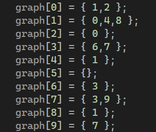
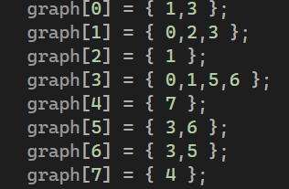
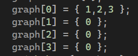
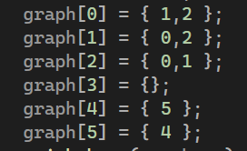
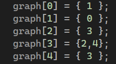
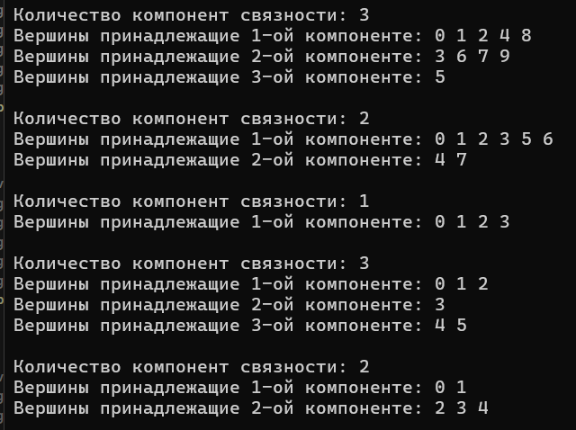

<h1 align="center">Расчётная работа. Теория Графов.</h1>

## Цели:
* Изучить основные понятия в теории графов 
* Научиться различать виды графов
* Уметь использовать основные алгоритмы при работе с графами 

## Задачи:
* Выполнить свой вариант расчётной работы
* Перенести получившееся решение на язык программирования С++
* Ознакомиться с основными алгоритмами по работе с графами

 ## Вариант 2.14
 Определить число компонентов связности неориентированного графа, используя список смежности для задания графа.

 ### Базовые сведения о графах, которые требуются для выполнения расчётной работы 
###

<b>Граф</b> — математическая абстракция реальной системы любой природы, объекты которой обладают парными связями. Граф как математический объект есть совокупность двух множеств — множества самих объектов, называемого множеством вершин, и множества их парных связей, называемого множеством рёбер.

- **Ориентированный граф** — это такой граф, в котором все связки
являются дугами:

- **Неориентированный граф** — это такой граф, в котором все связки
являются ребрами:

- **Компонента связности графа** (или просто компонента графа) — максимальный (по включению) связный подграф графа 

### Основные алгоритмы для работы с графами 

**Список смежности** - один из способов представления графа в виде коллекции списков вершин. Каждой вершине графа соответствует список, состоящий из «соседей» этой вершины.

Обход графа в глубину, или DFS (англ. depth-first search). Стратегия поиска в глубину состоит в том, чтобы идти «вглубь» графа настолько, насколько это возможно, а после упора в тупик пойти обратно до ближайшей развилки, после встречи с которой пойти туда, где ещё не были, повторяя алгоритм.
Пример из кода:

```c++
void dfs(vector < vector<int> > graph, vector<int>& metki, int v0, int kol) {
    metki[v0] = kol;
    for (int j = 0; j < graph[v0].size(); j++) {
        if (!metki[graph[v0][j]]) {
            dfs(graph, metki, graph[v0][j], kol);
        }
    }
}
```

## Выполнение расчётной работы
### код

* **Подключаем нужные библиотеки, импорт всего пространства имен std.**
  
```c++
#include <iostream>
#include <vector>

using namespace std;
```

* **Функция DFS**
* **Функция для поиска компонент связности неориентированного графа с использованием поиска циклов через DFS**

  ```c++
  void poisk_komp(vector < vector<int> > graph, int v) {
    int kol = 1;
    vector<int> metki(v);
    for (int i = 0; i < v; i++) {
        if (!metki[i]) {
            dfs(graph, metki, i, kol);
            kol++;
        }
    }
    kol--;
    vector<vector<int>>komp(kol);
    for (int i = 0; i < v; i++) {
        komp[metki[i] - 1].push_back(i);
    }
    cout << endl << "Количество компонент связности: " << kol << endl;
    for (int i = 0; i < kol; i++) {
        cout << "Вершины принадлежащие " << i + 1 << "-ой компоненте: ";
        for (int j = 0; j < komp[i].size(); j++) {
            cout << komp[i][j] << ' ';
        }
        cout << endl;
    }}
* **Задание графов списком смежности**
  
* **Основная часть**.
  
```c++
int main()
{
    setlocale(LC_ALL, "RU");
    vector < vector<int> > graph;
    int v;
    graph1(graph, v);
    graph2(graph, v);
    graph3(graph, v);
    graph4(graph, v);
    graph5(graph, v);
    return 0;
}
```

## Тест

### Граф 1

<p ></p>

### Граф 2

<p ></p>

### Граф 3

<p ></p>

### Граф 4

<p ></p>

### Граф 5

<p ></p>




## Вывод
В ходе выполнения данной расчётной работы:
- Ознакомились с понятием графов.
- Изучили, какие виды графов бывают (ориентированные/неориентированные).
- Ознакомились с таким способом представления графов в памяти компьютера, как список смежности.
- Реализовала алгоритм решения задачи [руководства](https://drive.google.com/file/d/1-rSQZex8jW-2DlY2kko18gU1oUAtEGHl/view) на языке программирования C++ с использованием списка смежности.
- Проверили данный алгоритм на корректность при помощи 5 тестов.
## Использованные источники
1. Свободная энциклопедия "Википедия" \[Электронный ресурс\]. — Режим доступа: https://ru.wikipedia.org/wiki/Граф_(математика)
2. Сайт "Олимпиадное программирование в Бресте и Беларуси" \[Электронный ресурс\]. — Режим доступа: https://brestprog.by/topics/graphs/
3. Сайт "Олимпиадное программирование в Бресте и Беларуси" \[Электронный ресурс\]. — Режим доступа: https://brestprog.by/topics/dfs/
4. Сайт "Олимпиадное программирование в Бресте и Беларуси" \[Электронный ресурс\]. — Режим доступа: https://brestprog.by/topics/topsort/
