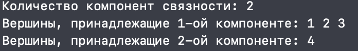
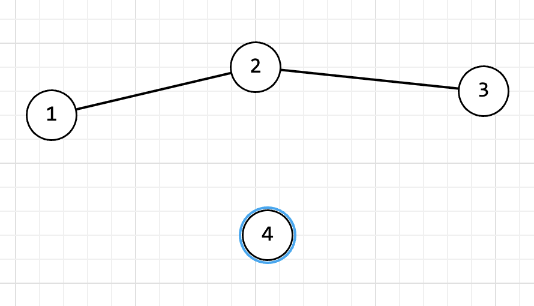
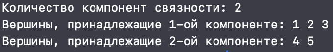
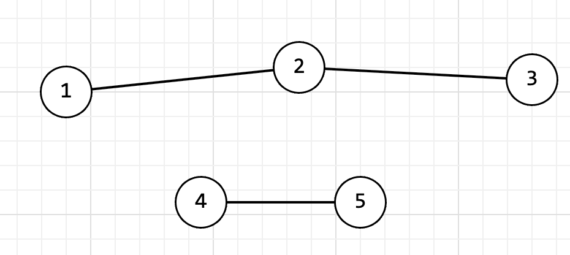
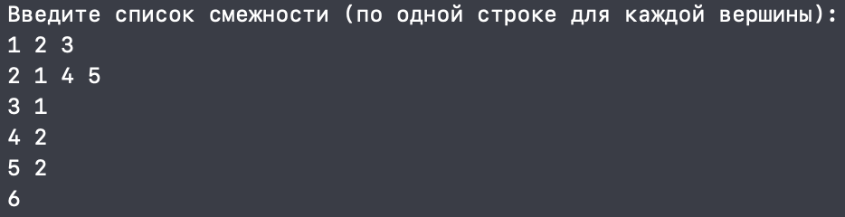
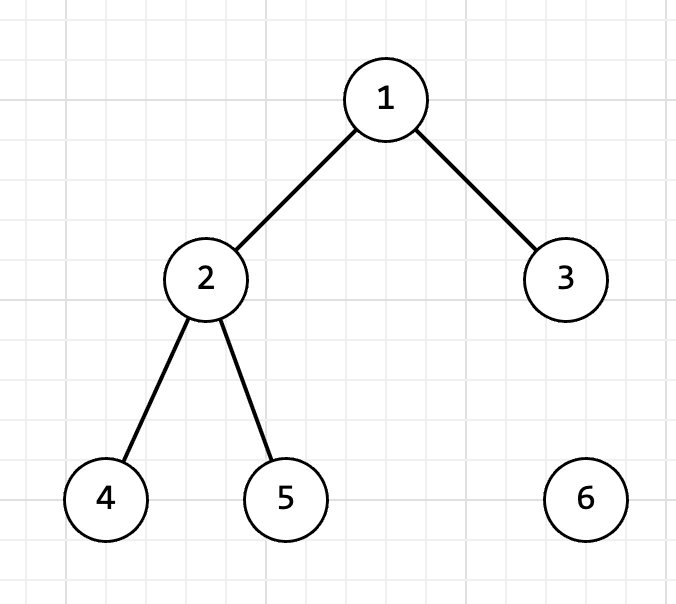
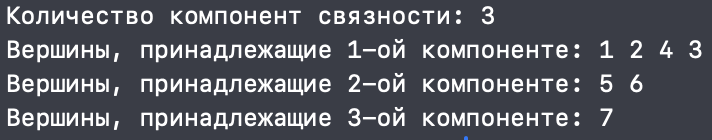
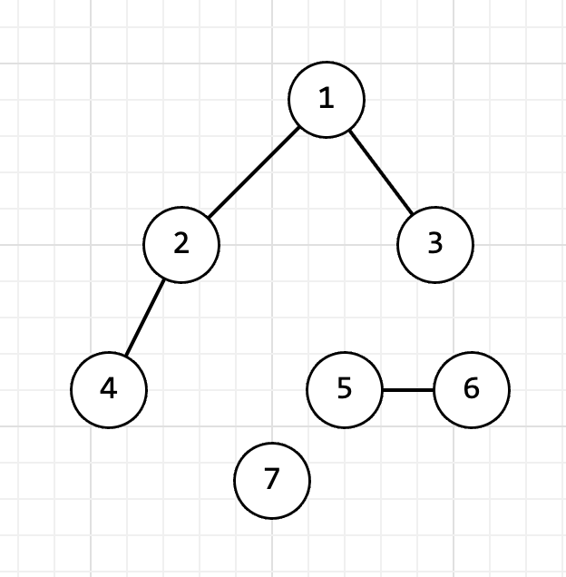
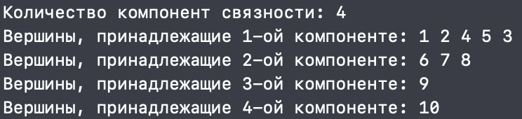
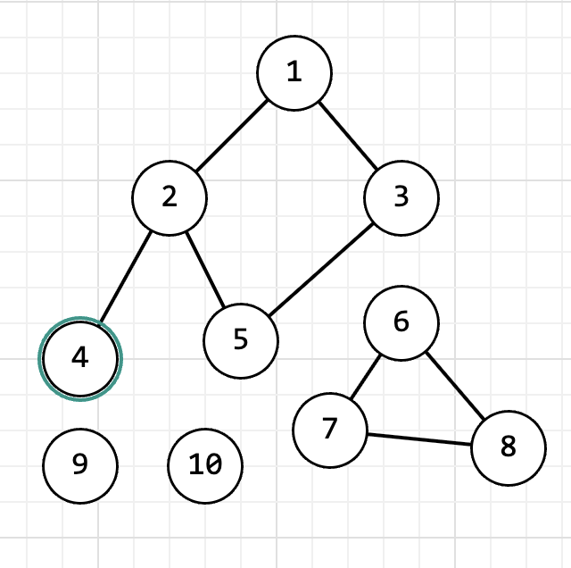

<h1 align="center">Расчётная работа. Теория Графов.</h1>

## Цели:
* Изучить основные понятия в теории графов 
* Научиться различать виды графов
* Уметь использовать основные алгоритмы при работе с графами 

## Задачи:
* Выполнить свой вариант расчётной работы
* Перенести получившееся решение на язык программирования С++
* Ознакомиться с основными алгоритмами по работе с графами

 ## Вариант 2.14
 Определить число компонентов связности неориентированного графа, используя список смежности для задания графа.

 ### Базовые сведения о графах, которые требуются для выполнения расчётной работы 
###

<b>Граф</b> — математическая абстракция реальной системы любой природы, объекты которой обладают парными связями. Граф как математический объект есть совокупность двух множеств — множества самих объектов, называемого множеством вершин, и множества их парных связей, называемого множеством рёбер.

- **Ориентированный граф** — это такой граф, в котором все связки
являются дугами:

- **Неориентированный граф** — это такой граф, в котором все связки
являются ребрами:

- **Компонента связности графа** (или просто компонента графа) — максимальный (по включению) связный подграф графа 

### Основные алгоритмы для работы с графами 

**Список смежности** - один из способов представления графа в виде коллекции списков вершин. Каждой вершине графа соответствует список, состоящий из «соседей» этой вершины.

Обход графа в глубину, или DFS (англ. depth-first search). Стратегия поиска в глубину состоит в том, чтобы идти «вглубь» графа настолько, насколько это возможно, а после упора в тупик пойти обратно до ближайшей развилки, после встречи с которой пойти туда, где ещё не были, повторяя алгоритм.

## Выполнение расчётной работы

## Тест

### Граф 1

### Вывод консоли 

### Изображение

### Граф 2

### Вывод консоли 

### Изображение

### Граф 3

### Вывод консоли 

### Изображение

### Граф 4

### Вывод консоли 

### Изображение

### Граф 5

### Вывод консоли 

### Изображение

## Вывод
В ходе выполнения данной расчётной работы:
- Ознакомились с понятием графов.
- Изучили, какие виды графов бывают (ориентированные/неориентированные).
- Ознакомились с таким способом представления графов в памяти компьютера, как список смежности.
- Реализовали алгоритм решения задачи [руководства](https://drive.google.com/file/d/1-rSQZex8jW-2DlY2kko18gU1oUAtEGHl/view) на языке программирования C++ с использованием списка смежности.
- Проверили данный алгоритм на корректность при помощи 5 тестов.
## Использованные источники
1. Свободная энциклопедия "Википедия" \[Электронный ресурс\]. — Режим доступа: https://ru.wikipedia.org/wiki/Граф_(математика)
2. Алгоритм поиска в глубину \[Электронный ресурс\]. — Режим доступа: https://habr.com/ru/companies/otus/articles/660725/
3. Сайт "Алгоритм нахождения компонент связности в графе" \[Электронный ресурс\]. — Режим доступа: https://education.yandex.ru/handbook/algorithms/article/algoritm-nahozhdeniya-komponent-svyaznosti-v-grafe
4. Сайт "Олимпиадное программирование в Бресте и Беларуси" \[Электронный ресурс\]. — Режим доступа: https://brestprog.by/topics/topsort/
