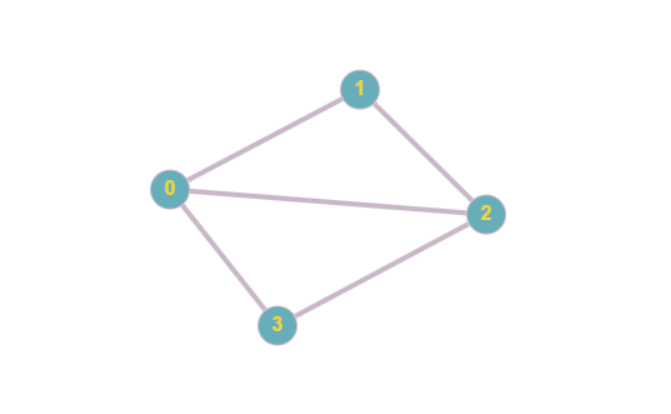
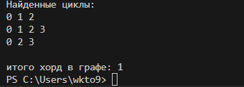
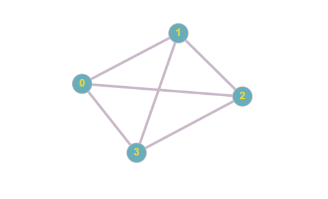
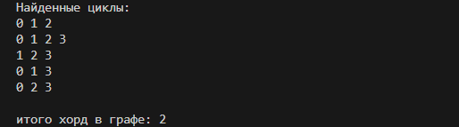
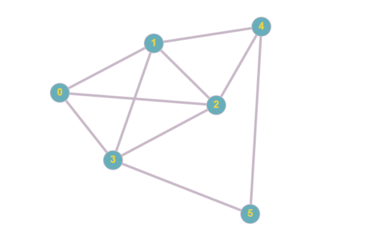
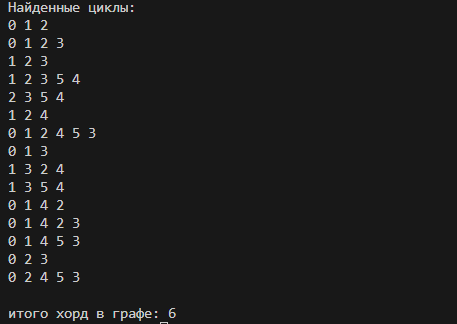
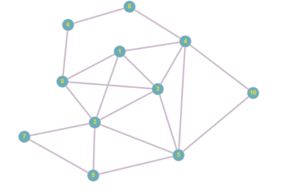
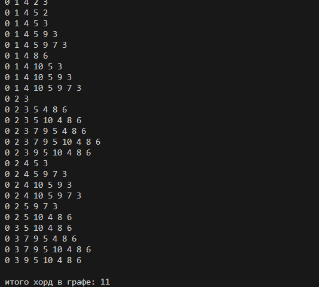
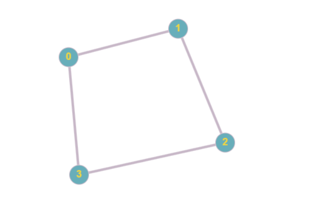
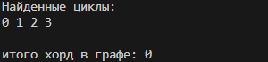

# Рассчетная работа 
В моем варианте рассчетной работы нужно было найти количество хорд в неориентированном графе.
 Хорда в графе - ребро, соединяющее две вершины цикла, но не являющееся его частью.

Мой граф задан матрицей инцидентности.

Я путем многократного обхода в глубину нашел все циклы, потом в цикле находил хорды.
Чтобы найти все хорды в графе нужно найти все циклы.
Для поиска циклов я использовал поиск в глубину. При обходе в глубину вершина посечается как посещенная и цикл идет дальше в вершину, еще не посещенную.
Если из вершины нет возможных путей - поиск возвращается в вершину-родитель текущей.
После чего каждый цикл записывается в массив. Массив сортируется на наличие известных циклов.
После чего в каждом цикле находятся хорды. Если в цикле есть вершины между не соседними ребрами, то эти два ребра (i,j) записываются в массив.
Массив сортируется и подсчитывается количество хорд в графе.

Циклы выводятся в столбик и после чего подсчитывается количество хорд в графе

Примеры работы программы:

# Вывод

В процессе выполнения рассчетной работы я познакомился с такой структурой данных как графы, научился работать с алгоритмом поиска в глубину и решил поставленную задачу.

# Источники
https://neerc.ifmo.ru/wiki/index.php?title=%D0%98%D1%81%D0%BF%D0%BE%D0%BB%D1%8C%D0%B7%D0%BE%D0%B2%D0%B0%D0%BD%D0%B8%D0%B5_%D0%BE%D0%B1%D1%85%D0%BE%D0%B4%D0%B0_%D0%B2_%D0%B3%D0%BB%D1%83%D0%B1%D0%B8%D0%BD%D1%83_%D0%B4%D0%BB%D1%8F_%D0%BF%D0%BE%D0%B8%D1%81%D0%BA%D0%B0_%D1%86%D0%B8%D0%BA%D0%BB%D0%B0

https://www.youtube.com/watch?v=8QFS6AC0WeI&ab_channel=%D0%9E%D0%BB%D0%B8%D0%BC%D0%BF%D0%B8%D0%B0%D0%B4%D0%BD%D0%BE%D0%B5%D0%BF%D1%80%D0%BE%D0%B3%D1%80%D0%B0%D0%BC%D0%BC%D0%B8%D1%80%D0%BE%D0%B2%D0%B0%D0%BD%D0%B8%D0%B5%D0%B2%D0%A3%D0%BB%D0%93%D0%A2%D0%A3

https://ru.wikipedia.org/wiki/%D0%A5%D0%BE%D1%80%D0%B4%D0%B0%D0%BB%D1%8C%D0%BD%D1%8B%D0%B9_%D0%B3%D1%80%D0%B0%D1%84