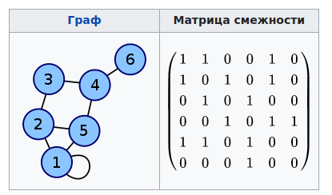
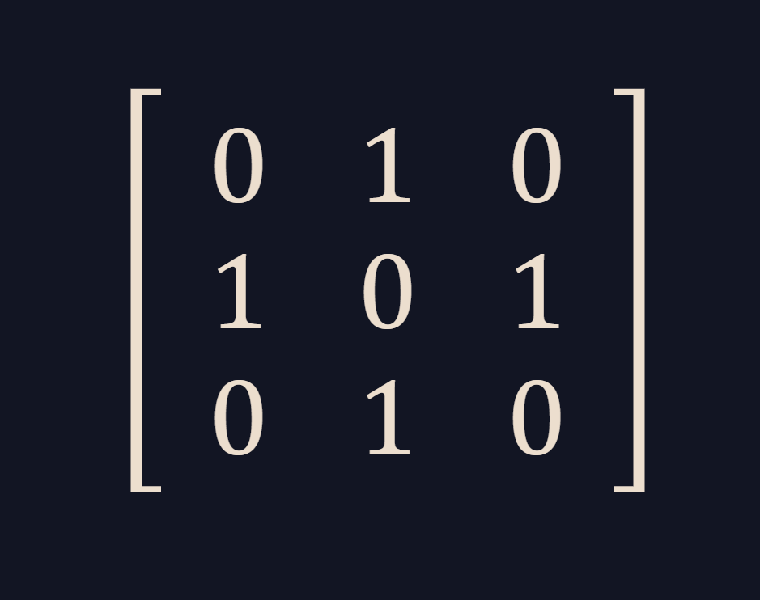

<h1 align="center">Расчётная работа. Теория Графов.</h1>

## Цели:
* Изучить основные понятия в теории графов 
* Научиться различать виды графов
* Уметь использовать основные алгоритмы при работе с графами 

## Задачи:
* Выполнить свой вариант расчётной работы
* Перенести получившееся решение на язык программирования С++
* Ознакомиться с основными алгоритмами по работе с графами

 ## Вариант 
Расчётная работа: вариант **2.5**. Нужно oпределить числовую характеристику графа, такую как ссреднюю степень ребра в неориен-
тированном графе.
### Базовые сведения о графах, которые требуются для выполнения расчётной работы 
###


<b>`Граф`</b> — математическая абстракция реальной системы любой природы, объекты которой обладают парными связями. Граф как математический объект есть совокупность двух множеств — множества самих объектов, называемого множеством вершин, и множества их парных связей, называемого множеством рёбер.

- **`Неориентированный граф`** — это такой граф, в котором все связки
являются ребрами:

- **`Средняя степень ребра графа** — это характеристика графа, которая определяет среднее количество рёбер, связанных с одной вершиной. 

### Основные алгоритмы для работы с графами 

**`Матрица смежности`** — это квадратная матрица, используемая для представления графа в теории графов. Элементы матрицы смежности показывают, существует ли ребро между парой вершин графа. Она широко применяется как для ориентированных, так и для неориентированных графов.
<p ></p>

 ### Пример:
Допустим, у нас есть неориентированный граф с вершинами {1, 2, 3} и рёбрами 
{(1, 2), (2, 3)}.
 Матрица смежности будет выглядеть следующим образом:
<p ></p>

## Выполнение расчётной работы

### Алгоритм

#### Входные данные

На вход алгоритму подаются :

1. Колличество вершин графа.

2. Значения элементов матрицы смежности.


### код для определения средней степени ребра в неориентированном графе:
```c++
#include <iostream>
using namespace std;

int main() {
    int n;  
    cout << "Количество вершин в графе: ";
    cin >> n;

    int matrix[n][n];
    
 cout << "Вводим матрицу смежности: \n";
    for (int i = 0; i < n; i++) {
        for (int j = 0; j < n; j++) {
            cin >> matrix[i][j];
        }
    }
    
    int edgeCount = 0;
    for (int i = 0; i < n; i++) {
        for (int j = i + 1; j < n; j++) {  // Проверяем только верхнюю половину матрицы
            if (matrix[i][j] != 0) {
                edgeCount++;
            }
        }
    }

    if (edgeCount > 0) {
        double avgDegree = (2.0 * edgeCount) / n;  // 2 * количество рёбер / количество вершин
        cout << "Средняя степень ребра: " << avgDegree << endl;
    } else {
        cout << "Граф не содержит рёбер." << endl;
    }

    return 0;
}
```

### Пройдемся по коду:

* **Подключаем нужные библиотеки, импорт всего пространства имен std.**
```c++
#include <iostream>

using namespace std;
```
* **Cоздаем главную функцию и запрашиваем у пользователя значение количества вершин в графе**.
```c++
int main() {
    int n;  
    cout << "Количество вершин в графе: ";
    cin >> n;
```
* **Создаем матрицу смежности и запрашиваем ввод ее элементов**.
```c++
int matrix[n][n];
    
 cout << "Вводим матрицу смежности: \n";
    for (int i = 0; i < n; i++) {
        for (int j = 0; j < n; j++) {
            cin >> matrix[i][j];
        }
    }
```
* **Считаем количество рёбер, проверяя только верхнюю половину матрицы**.
```c++
int edgeCount = 0;
    for (int i = 0; i < n; i++) {
        for (int j = i + 1; j < n; j++) {  // Проверяем только верхнюю половину матрицы
            if (matrix[i][j] != 0) {
                edgeCount++;
            }
        }
    }
```
* **Считаем среднюю степень ребра по формуле 2 * количество рёбер / количество вершин, выводим результат и завершаем программу**.
```c++
if (edgeCount > 0) {
        double avgDegree = (2.0 * edgeCount) / n;  // 2 * количество рёбер / количество вершин
        cout << "Средняя степень ребра: " << avgDegree << endl;
    } else {
        cout << "Граф не содержит рёбер." << endl;
    }

    return 0;
}
```
## Тест

### Проверка №1
- Тестовые значения:
 
  **количество вершин графа** — 5
  **смежная матрица** :
  ```
  0   1   0   1   0
  1   0   1   1   0
  0   1   0   1   0
  1   1   1   0   1
  0   0   0   1   0
  ```
  


### Проверка №2
- Тестовые значения:

  **количество вершин графа** — 3
  
  **количество ребер графа** — 4
  


### Проверка №3
- Тестовые значения:

  **количество вершин графа** — 3
  
  **количество ребер графа** — 3
  


### Проверка №4
- Тестовые значения:

  **количество вершин графа** — 3
  
  **количество ребер графа** — 4
  


## Вывод
В ходе выполнения данной расчётной работы:
- Ознакомилась с понятием графов.
- Изучила, какие виды графов бывают (ориентированные/неориентированные).
- Ознакомилась с таким способом представления графов в памяти компьютера, как матрица смежности.
- Реализовала алгоритм решения задачи 1.2 [руководства](https://drive.google.com/file/d/1-rSQZex8jW-2DlY2kko18gU1oUAtEGHl/view) на языке программирования C++ с использованием матрицы смежности.
- Проверила данный алгоритм на корректность при помощи придуманных мной двух тестов.
## Использованные источники
1. Свободная энциклопедия "Википедия" \[Электронный ресурс\]. — Режим доступа: https://ru.wikipedia.org/wiki/Граф_(математика)
2. Сайт "Олимпиадное программирование в Бресте и Беларуси" \[Электронный ресурс\]. — Режим доступа: https://brestprog.by/topics/graphs/
3. Сайт "Олимпиадное программирование в Бресте и Беларуси" \[Электронный ресурс\]. — Режим доступа: https://brestprog.by/topics/dfs/
4. Сайт "Олимпиадное программирование в Бресте и Беларуси" \[Электронный ресурс\]. — Режим доступа: https://brestprog.by/topics/topsort/
