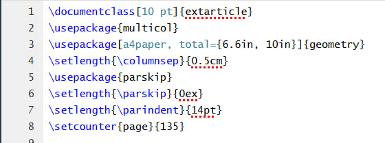

# Лабораторная работа №3
 В рамках л/р №3 необходимо создать исполняемый файл в соответствии с заданным вариантом c помощью языка LaTeX. Лабораторная работа выролнялась через текстовый редактор [overleaf.com](https://www.overleaf.com/).
# Задание
Сверстать три страницы научной статьи с использованием системы верстки текстов TeX.
На странице https://proc.ostis.net/proc/Proceedings%20OSTIS-2024.pdf необходимо взять доклад, соответствующий варианту индивидуального задания.
# Использованные библиотеки и задание формата 

* documentclass - позволяет залать размер шрифта всего текста;
* multicol - библиотека, позволяющая разбить текст на колонки;
* a4paper - позволяет задать отступы от краёв листа;
* columnstep - позволяет задать отступ между колонками;
* parskip - библиотека, позволяющая задать отступы между абзацами;
* parindent - позволяет задать величину красной строки;
* setcounter - позволяет задать счётчик страниц.
# Вывод
В данной лабораторной работе были получены навыки работы с системой контроля версий git и веб-сервиса github посредством ввода команд из командной строки.

