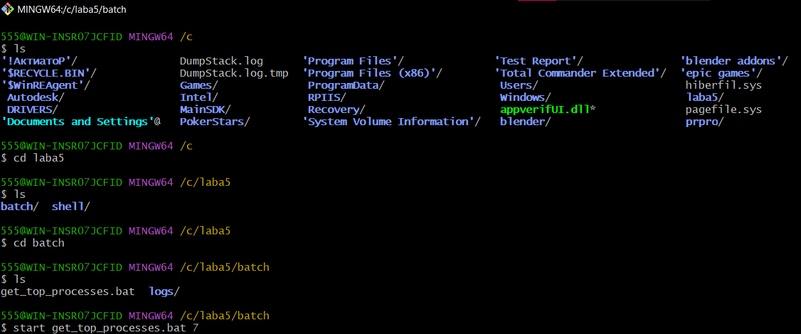
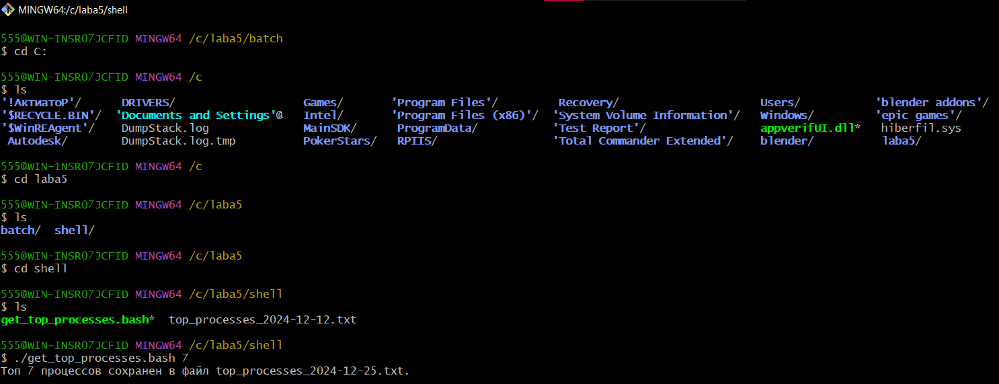

# Лабораторная 5
В результате выполнения лабораторной работы я ознакомился с исполняемыми файлами .sh и .bat для ОС Linux и Windows соответственно.

В моём задании нужно было создать файл sh и bat, который выполняет следующее: на вход пакетному файлу приходит число N как параметр пакетного файла. Найдите top N процессов, которые потребляют больше всего памяти в системе и запишете их в файл с названием текущей даты в формате “имя_процесса дата”

Файл .bat:

```
@echo off

chcp 65001

if "%1"=="" (
    echo Параметр N не передан. Пожалуйста, введите количество процессов для отображения:
    set /p N=Введите число N: 
) else (
    set N=%1
)

for /f "delims=0123456789" %%A in ("%N%") do (
    echo Ошибка: %N% - не является числом.
    exit /b 1
)

for /f "tokens=2 delims==" %%I in ('"wmic os get LocalDateTime /value"') do set datetime=%%I
set current_date=%datetime:~0,4%-%datetime:~4,2%-%datetime:~6,2%

if not exist "logs" mkdir "logs"

set output_file=logs\top_processes_%current_date%.txt

echo Сортировка процессов по использованию памяти...
tasklist > process_list.txt

if not exist process_list.txt (
    echo Ошибка: файл process_list.txt не был создан.
    exit /b 1
)

(for /f "skip=3 tokens=1,5 delims=," %%A in ('findstr /v "Имя" process_list.txt') do @echo %%A %%B) > temp_sorted.txt

(sort /r /+15 temp_sorted.txt) > sorted_processes.txt

setlocal enabledelayedexpansion
set count=0
> %output_file% (
    for /f "tokens=*" %%A in (sorted_processes.txt) do (
        set /a count+=1
        if !count! LEQ %N% echo %%A
    )
)
endlocal

if exist temp_sorted.txt del temp_sorted.txt
if exist sorted_processes.txt del sorted_processes.txt
if exist process_list.txt del process_list.txt

if exist "%output_file%" (
    echo Топ %N% процессов успешно сохранен в файл "%output_file%".
) else (
    echo Ошибка: Не удалось создать файл с результатами.
)
```
Файл .bash:
```
#!/bin/bash

if [ -z "$1" ]; then
    echo "Ошибка: Параметр N не передан. Использование: ./top_memory_processes.sh N"
    exit 1
fi

N=$1

if ! [[ "$N" =~ ^[0-9]+$ ]]; then
    echo "Ошибка: $N - не является числом."
    exit 1
fi

date=$(date +"%Y-%m-%d")

output_file="top_processes_$date.txt"

tasklist | tail -n +4 | sort -k 5 -n -r | head -n "$N" | awk '{print $2, $1}' > "$output_file"

if [ -s "$output_file" ]; then
    echo "Топ $N процессов сохранен в файл $output_file."
else
    echo "Ошибка: не удалось создать файл $output_file или он пуст."
    exit 1
fi
```
Для того чтобы запустить файл .bat нужно следовать следующим инструкциям:

1.Перейти в директорию где находится исполняемый файл и вводим в командную строку имя start имя.bat N и нажать enter:
 

Для того чтобы запустить файл .bash нужно следовать следующим инструкциям:

1. перейти в директорию где находится исполняемый файл и ввести в командную строку ./имя.bash N и нажать enter:

## ВЫВОД
В обоих исполняемых файлах есть команды, выполняющие одинаковые операции, например цикл for. Так же знак $ и "/%"/"%" на linux и windows выполняют одиннаковую функцию, но пишутся по-разному.
