<h1 align = "center">Расчетная работа</h1>

## Цель работы

1) Изучить основные понятия в теории графов.
2) Научиться различать виды графов.
3) Уметь использовать основные алгоритмы при работе с графами.

## Вариант расчетной работы
В моем варианте расчетной работы нужно было определить окружение орграфа.

## Теоретические сведения для выполнения расчетной работы

Неориентированный граф - граф, в котором рёбра не указывают направление. Это значит, что из любой вершины можно попасть в любую точку графа. 

Ориентированный граф - граф, рёбрам которого присвоено направление. Направленные рёбра именуются также дугами, а в некоторых источниках и просто рёбрами. 

Связный граф — граф, в котором существует путь между любой парой вершин. Из каждой вершины по рёбрам можно добраться до любой другой вершины. В связном графе нет изолированных вершин или групп, которые не связаны с остальными частями графа.

Окружение орграфа — это совокупность данных, в которой для каждой вершины указывается, сколько рёбер в неё входит и сколько из неё выходит, отражая структуру всех входящих и исходящих связей в ориентированном графе.

## Алгоритмы для выполнения расчетной работы

### Алгоритм формирования списка смежности
Этот цикл служит для пошагового формирования списка смежности, где для каждой вершины выделяется отдельная строка данных. Сначала считывается полная строка, содержащая номер вершины и двоеточие, за которым идут номера смежных вершин. Затем, используя метод поиска и обрезки строки, всё, что находится до двоеточия (включая двоеточие), удаляется, чтобы оставить только часть, где перечислены соседние вершины. Далее строка преобразуется в поток, из которого последовательно извлекаются целочисленные значения вершин, в которые есть рёбра из текущей вершины. В итоге полученные номера соседей добавляются в список смежности, отражая структуру рёбер ориентированного графа.

Код для алгоритма формирования списка смежности:

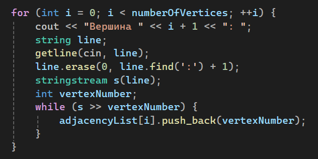

Внутри цикла для каждой вершины (счётчиком выступает 𝑖) программа сначала выводит приглашение ко вводу (например, «Вершина 1: »), после чего считывает полную строку, которая должна содержать номер вершины, двоеточие и далее перечисление всех соседних вершин. В строке ищется символ «:» (методом line.find(':')), а всё, что стоит до двоеточия (включая его), удаляется с помощью line.erase(0, line.find(':') + 1), чтобы оставить только часть строки, где перечислены номера смежных вершин. Затем полученная подстрока превращается в поток (stringstream s(line);), из которого последовательно извлекаются целочисленные значения (номера соседних вершин). При каждом успешном извлечении числа оно добавляется в вектор adjacencyList[i], соответствующий текущей вершине 𝑖. Таким образом, после выполнения цикла программа будет иметь список смежности, где для каждой вершины хранится список номеров тех вершин, в которые из неё ведут рёбра.

### Алгоритм подсчёта входящих и исходящих степеней вершин

На этом этапе алгоритм последовательно определяет, сколько рёбер выходит из каждой вершины и сколько в неё входит. Для каждой вершины определяется общее число соединений (то есть, к скольким вершинам она напрямую ведёт), а затем для каждой из тех вершин, куда идёт связь, фиксируется, что у них есть дополнительное входящее ребро. В результате получается полная картина того, сколько выходящих и входящих рёбер приходится на каждую вершину, что даёт возможность более детально анализировать структуру всего графа.

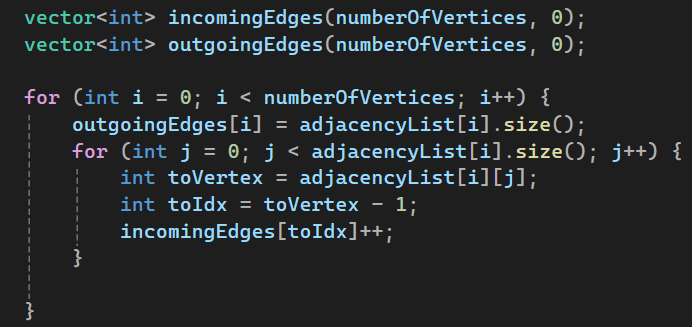

В ходе внешнего цикла перебираются все вершины графа, и для каждой вершины 𝑖 вектор adjacencyList[i] содержит номера тех вершин, в которые из неё ведут рёбра. Число таких рёбер (размер этого вектора) сразу записывается в outgoingEdges[i], показывая, сколько исходящих связей есть у вершины 𝑖. Далее внутренний цикл пробегается по каждому элементу adjacencyList[i], то есть по каждой вершине, куда идёт ребро из 𝑖. Получая индекс вершины назначения toVertex, алгоритм вычитает 1 (поскольку в коде вершины нумеруются с нуля, а в списке смежности — с единицы) и увеличивает счётчик incomingEdges[toIdx], фиксируя, что у вершины toVertex появляется ещё одно входящее ребро. Таким образом, к концу работы обоих циклов каждый элемент outgoingEdges[i] отражает общее число исходящих рёбер у вершины 𝑖, а каждый элемент incomingEdges[i] — общее число входящих рёбер к вершине 𝑖.

## Тесты программы

### Первый тест:

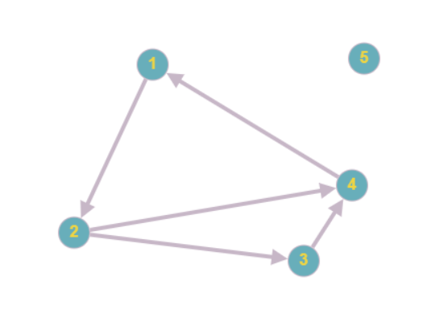

Мой граф задан списком смежности:

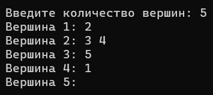

После ввода данных программа выводит окружение орграфа:

### Второй тест:

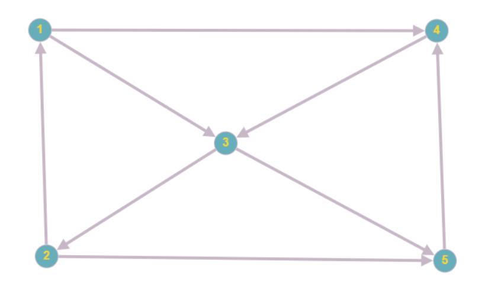

Мой граф задан списком смежности:

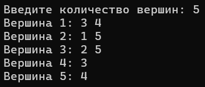

После ввода данных программа выводит окружение орграфа:

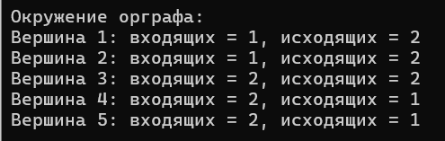

### Третий тест:

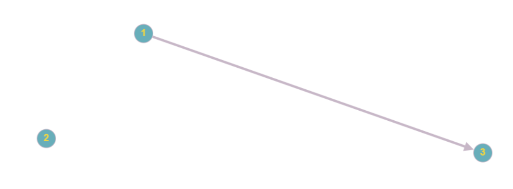

Мой граф задан списком смежности:

После ввода данных программа выводит окружение орграфа:

### Четвертый тест:

Мой граф задан списком смежности:

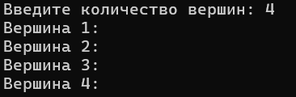

После ввода данных программа выводит окружение орграфа:

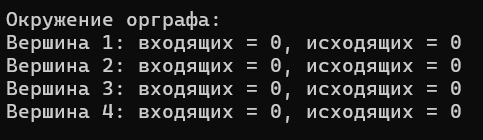

### Пятый тест:

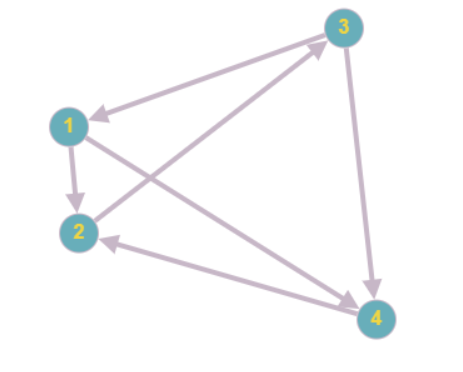

Мой граф задан списком смежности:

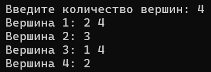

После ввода данных программа выводит окружение орграфа:

# Вывод

В процессе выполнения рассчетной работы я познакомился с такой структурой данных как графы, научился работать с алгоритмомами формирования списка смежности и подсчёта входящих и исходящих степеней вершин, а также реализовал  алгоритм определения окружения орграфа.

## Использованные источники:

### Свободная энциклопедия "Википедия"
- https://ru.m.wikipedia.org/wiki/

### GraphOnline:
- https://graphonline.ru/
