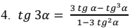
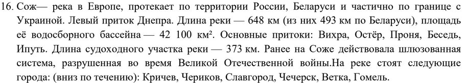
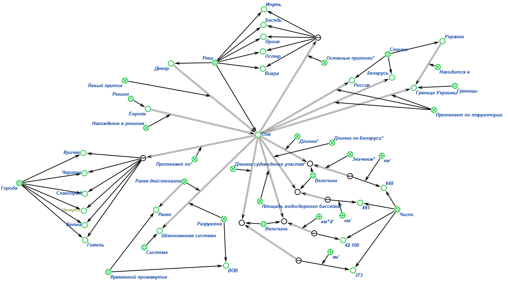
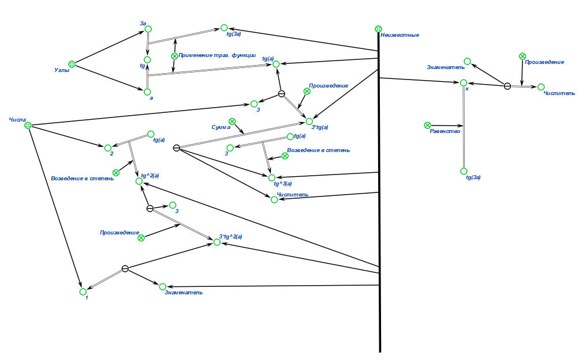

# Самостоятельная работа по ПиОИвИС
***
## Вариант 7
***
# Цель работы:
***
Ознакомится со стандартами технологии **OSTIS**, язык **SCg-code**. Так же познакомиться с работой
в редакторе построения баз данных **Protégé** и формализации **KBE**. Изучить стандарт консорциума **W3C**.
# Задание:
***
1. Дан текст, нужно его формализовать в двух вариантах:
    - При помощи стандарта консорциума W3C, используя редактор **Protégé**.
    - При помощи стандартов технологии **OSTIS**, используя редактор **KBE** и язык **SCg**.

    Сам текст(для **Protégé** вариант *16*, а для **KBE** вариант *16* (это текстовая задача) и вариант *4* (это 
    математическое выражение))

    
    

# Решение:
***
1. Формализация текста:
   - в [**Protégé**](https://github.com/iis-42x70x/RPIIS/blob/%D0%91%D0%B8%D0%B1%D0%BA%D0%BE_%D0%92/sem2/Formalization/Decision/Protege.owx)
   - в [**KBE**](https://github.com/iis-42x70x/RPIIS/blob/%D0%91%D0%B8%D0%B1%D0%BA%D0%BE_%D0%92/sem2/Formalization/Decision/textpioivis.gwf)
   
2. Формализация математического выражения:
   - в [**KBE**](https://github.com/iis-42x70x/RPIIS/blob/%D0%91%D0%B8%D0%B1%D0%BA%D0%BE_%D0%92/sem2/Formalization/Decision/pioivisKBE.gwf) 
   

# Вывод:
***
В ходе работы заданный текст был формализован при помощи стандартов консорциума W3C, используя редактор Protégé, а также
при помощи стандартов технологии OSTIS, используя редактор KBE и язык SCg. Кроме того, при помощи тех же стандартов
технологии OSTIS, используя редактор KBE и язык SCg, было формализовано математическое выражение.

