### Теоретические сведения

Мой вариант задачи в прошлом семестре: Составить алгоритм решения задачи и реализовать его на с++.Задача состояла в нахождении компонентов связности в неориентированном графе.

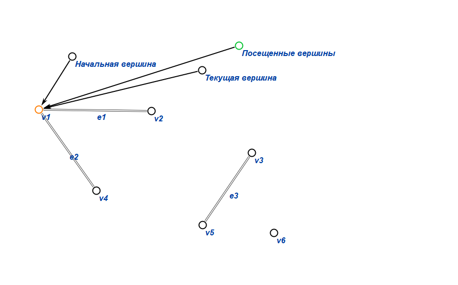
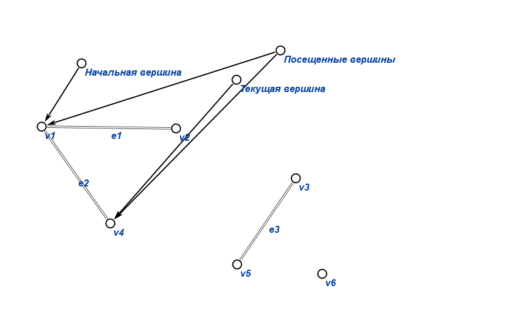
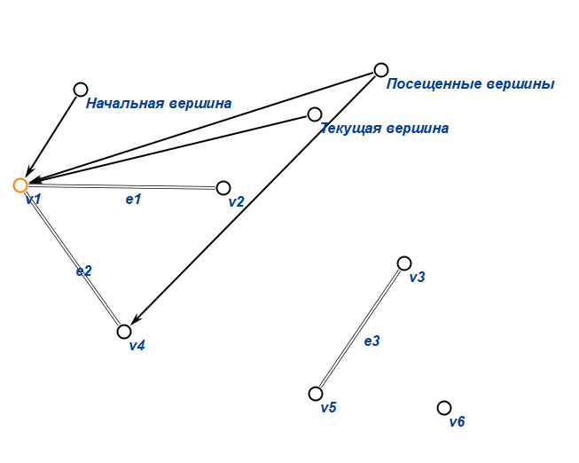
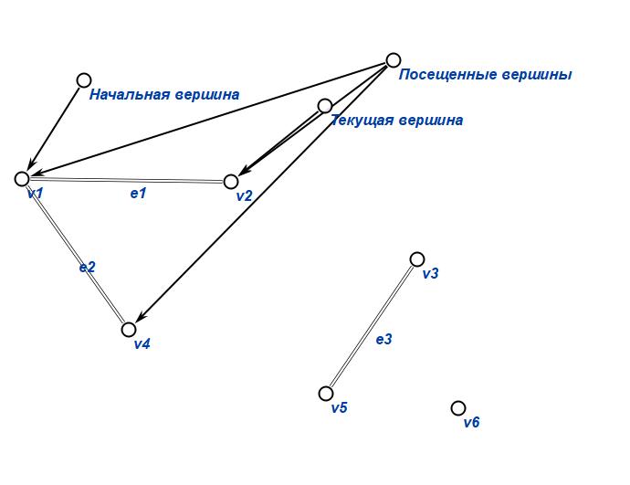
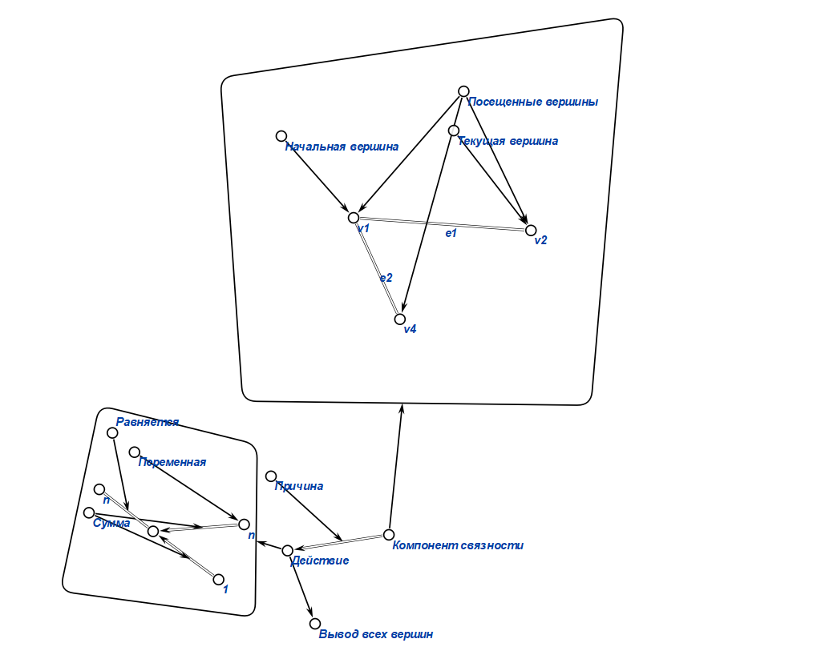
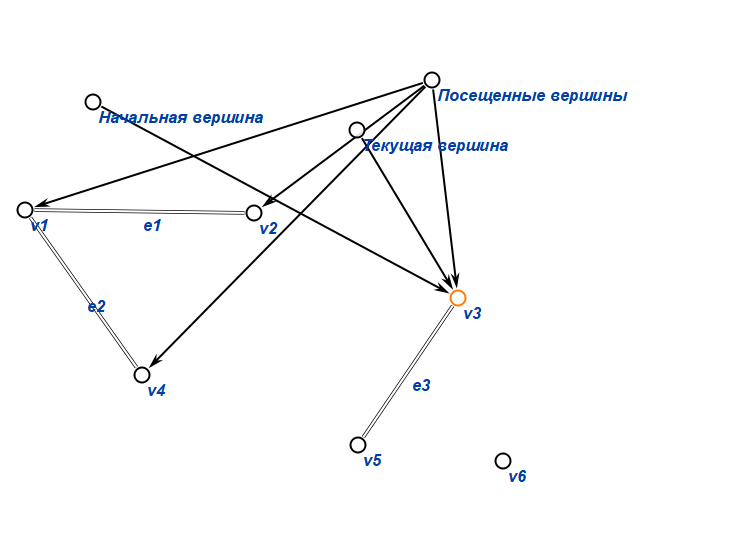
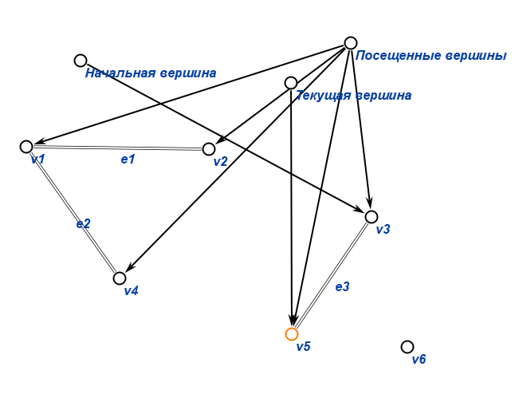
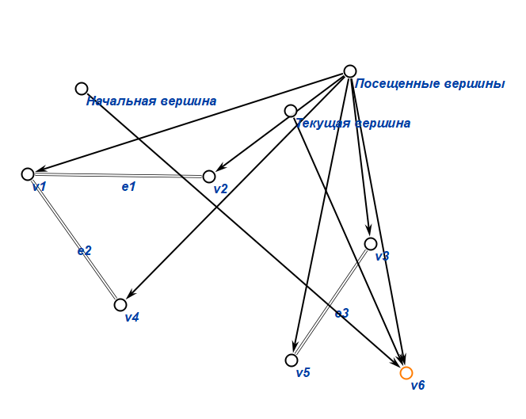
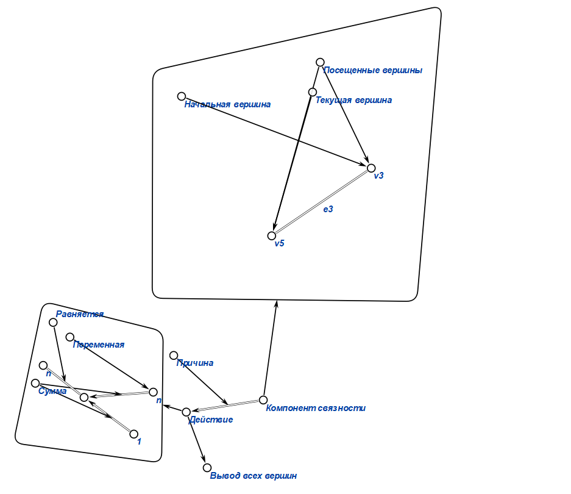
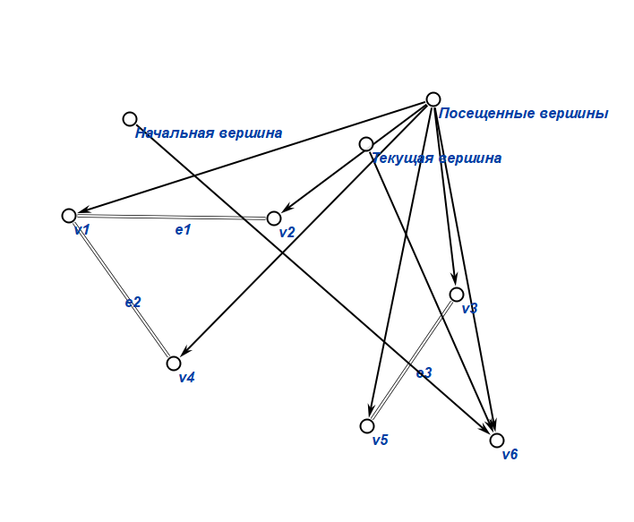
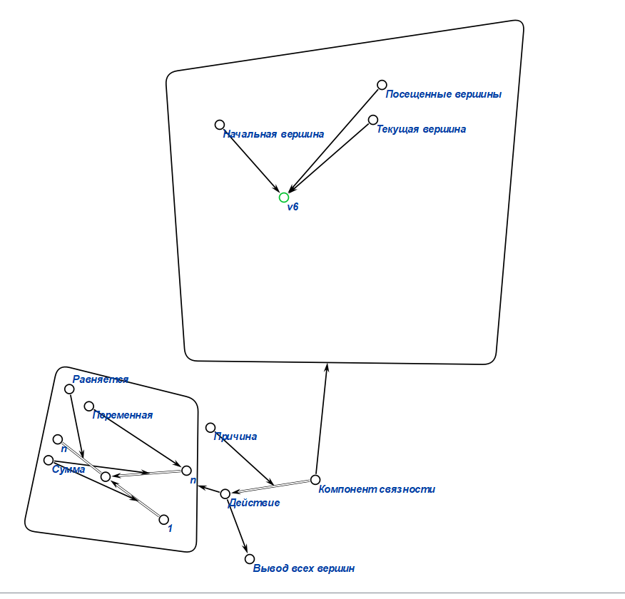
