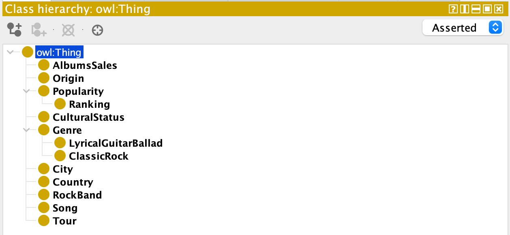
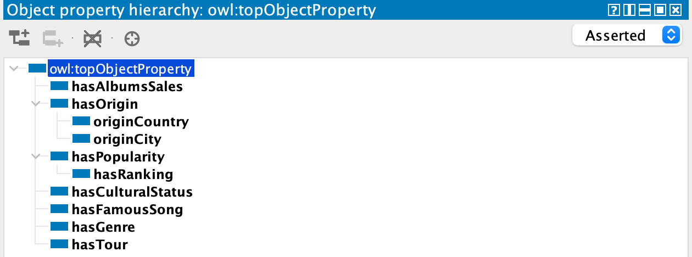
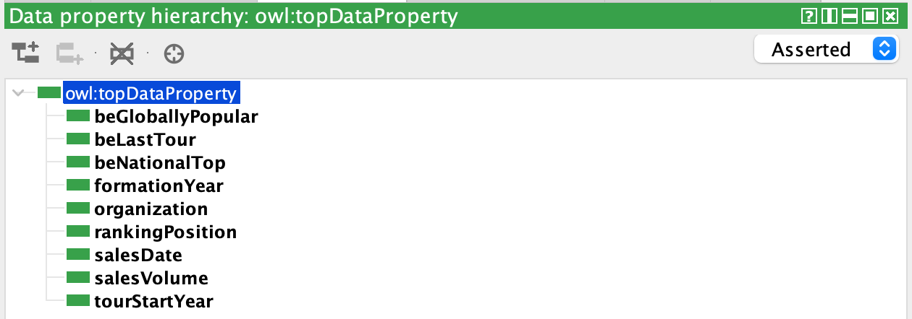
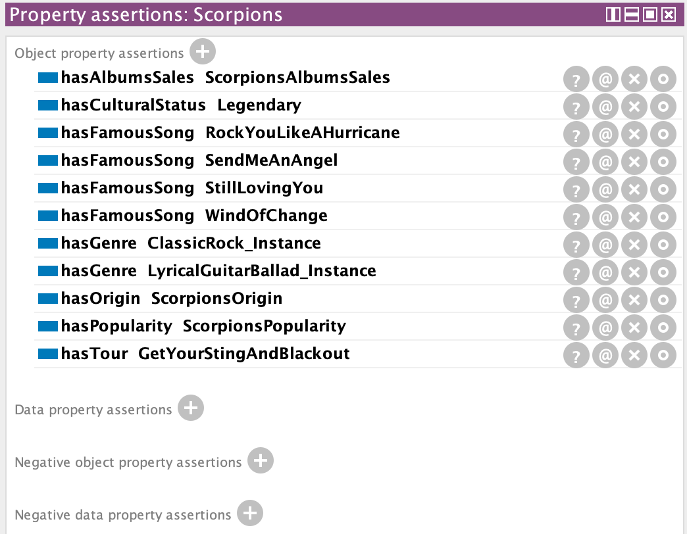
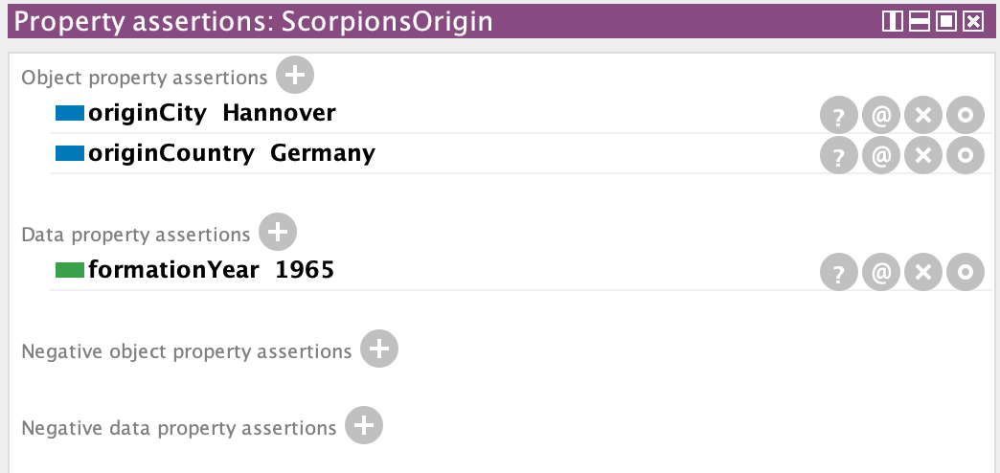
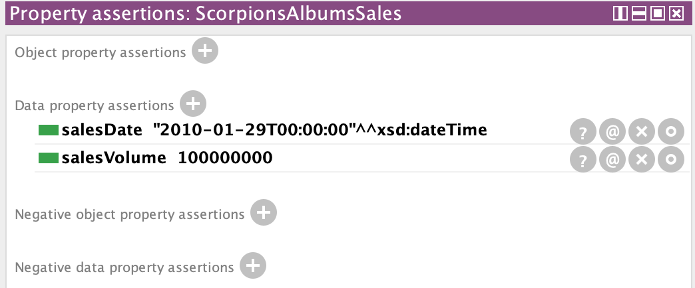
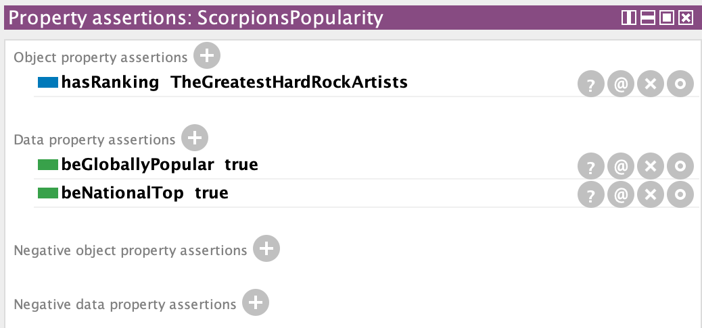
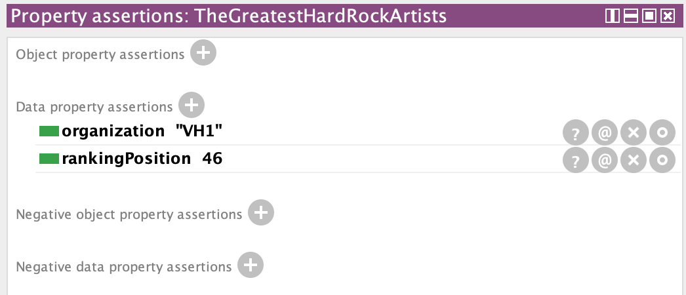
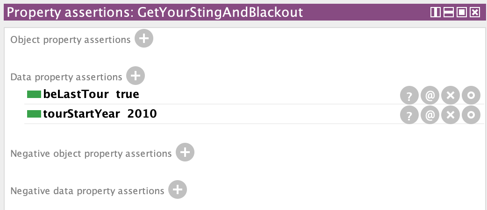

# Самостоятельная работа по предмету "Представление и обработка информации в интеллектуальных системах"

## Задание 1 (вариант 22)
Scorpions — легендарная немецкая рок-группа, основана в 1965 году в Ганновере. Для стиля группы были характерны как классический рок, так и лирические гитарные баллады. Является самой популярной рок-группой Германии и одной из самых известных групп на мировой рок-сцене, продавшей более 100 миллионов копий альбомов (по состоянию на 29 января 2010). Наиболее известными композициями группы считаются: «Still Loving You», «Rock You Like a Hurricane», «Wind of Change» и «Send Me an Angel». Коллектив занимает 46-ю строчку в списке «Величайших артистов хард-рока» по версии VH1. С 2010 года группа гастролирует с прощальным туром «Get Your Sting And Blackout».

### Protégé:
Иерархия классов:

Иерархия свойств объектов:

Иерархия свойств данных:

#### Основные экземпляры онтологии.
1. Scorpions:

2. ScorpionsOrigin:

3. ScorpionsAlbumsSales:

4. ScorpionsPopularity:

5. TheGreatestHardRockArtists:

6. GetYourStingAndBlackout:

## Задание 2.