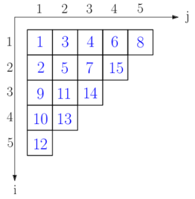

<h1>Лабораторная работа №1</h1>

## Цели:
* Разработать библиотеку для работы с таблицами Юнга
* Изучить основные понятия, связанные с таблицей Юнга
* Научиться использовать осноовные алгоритмы при сортировке, вставке и удалении элемента из таблицы

## Задачи:
* Научиться работать со структурами и классами (в моем случае на языке C++)
* Реализовать решение лабораторной работы

## Вариант
Для выполнения лабораторной работы мне был выдан **12** вариант.

## Определения:
*Таблица Юнга* - структура данных, представляющая собой конечный набор ячеек или клеток, выровненных по левой границе, каждая из которых заполнена натуральными числами. В т.н. стандартной таблице Юнга длина каждой строки не больше предыдущей, числа возрастают в каждой строке и каждом столбце и при этом каждое число встречается в таблице ровно один раз.
Пример


## Описание некоторых функций
initialize(int row_number) проверяет, есть ли в таблице дубликаты, если да, выводит ошибку и завершает выполнение. Очищает текущую таблицу, если она уже содержит элементы. Устанавливает новое количество строк row_number и создаёт row_number пустых строк в таблице

width() возвращает количество строк в таблице, что эквивалентно table.size()

initialize(const std::vector<std::vector<int>>& inputTable) копирует переданную таблицу inputTable в table, затем сортирует каждую строку по возрастанию и обеспечивает порядок в столбцах. Для каждого столбца проверяет, не нарушен ли порядок (следующий элемент внизу должен быть больше или равен текущему). Если нарушение найдено, меняет элементы местами и выполняет "просеивание вниз", пока порядок не восстановится
```C++
void YoungTableau::initialize(int row_number)
{
	if (hasDuplicates()) {
		std::cout << "Ошибка: Таблица содержит дубликаты элементов.\n";
		return;  // Прекращаем инициализацию
	}
	if (!table.empty())
	{
		for (auto& row : table)
			row.clear();
		table.clear();
	}
	this->row_number = row_number; // Инициализация поля row_number
	for (int i = 0; i < row_number; i++)
	{
		table.push_back({});
	}
}
size_t YoungTableau::width()
{
	return table.size();
}

void YoungTableau::initialize(const std::vector<std::vector<int>>& inputTable) {
	table = inputTable;

	// 1. Сортируем каждую строку по возрастанию
	for (auto& row : table) {
		std::sort(row.begin(), row.end());
	}

	// 2. Обеспечиваем порядок в столбцах (просеивание вниз)
	for (int col = 0; col < table[0].size(); ++col) {
		for (int row = 1; row < table.size(); ++row) {
			if (table[row].size() > col && table[row - 1][col] > table[row][col]) {
				std::swap(table[row - 1][col], table[row][col]);

				// Просеивание вниз
				int r = row;
				while (r + 1 < table.size() && table[r + 1].size() > col && table[r + 1][col] < table[r][col]) {
					std::swap(table[r][col], table[r + 1][col]);
					r++;
				}
			}
		}
	}
}
```
add(int line_number, int element) добавляет элемент в указанную строку таблицы. Если номер строки некорректен, выводит ошибку и завершает выполнение. Затем добавляет элемент в конец выбранной строки. После этого выполняет "просеивание вверх" (bubble-up), сравнивая добавленный элемент с его потенциальными родителями в строке и столбце. Если родительский элемент больше, происходит обмен значениями, и процесс продолжается, пока порядок в таблице не будет восстановлен или пока не будет достигнут верхний левый угол таблицы.
```C++
void YoungTableau::add(int line_number, int element)
{
	if (line_number > table.size())
	{
		std::cout << "Ошибка: Недопустимый номер строки.\n";
		return;
	}

	auto& row = table[line_number - 1];
	row.push_back(element);

	// Просеивание вверх (bubble-up)
	int rowIndex = line_number - 1;
	int colIndex = row.size() - 1;

	while (rowIndex > 0 || colIndex > 0)
	{
		int parentRow = rowIndex > 0 ? rowIndex - 1 : rowIndex;
		int parentCol = colIndex > 0 ? colIndex - 1 : colIndex;

		if (table[parentRow][parentCol] > table[rowIndex][colIndex])
		{
			std::swap(table[parentRow][parentCol], table[rowIndex][colIndex]);
			rowIndex = parentRow;
			colIndex = parentCol;
		}
		else
		{
			break;
		}
	}
}
```

##Тестирование библиотеки
###Тестирование добавления элементов в таблицу###
  -#### Тест 1 ####
```
TEST(YoungTableauTest, AddElement)
{
    YoungTableau yt;
    yt.initialize(3);
    yt.add(1, 9);
    yt.add(1, 4);
    yt.add(1, 3);

    std::vector<std::vector<int>> expected = { {3, 4, 9}, {}, {} };
    EXPECT_EQ(yt.getTable(), expected);
}
```
    -#### Тест 2 ####
```
TEST(YoungTableauTest, AddElementToMultipleRows)
{
    YoungTableau yt;
    yt.initialize(3);
    yt.add(1, 5);
    yt.add(1, 2);
    yt.add(1, 1);
    yt.add(2, 9);
    yt.add(2, 4);
    yt.add(3, 3);

    std::vector<std::vector<int>> expected = { {1, 2, 5}, {3, 4}, {9} };
    EXPECT_EQ(yt.getTable(), expected);
}
```
  -#### Тест 3(добавление элементов через инициализацию сразу всех элементов) ####
```
TEST(YoungTableauTest, CheckNewMethod)
{
    YoungTableau yt;
    yt.initialize({ {3, 2, 1}, {5, 4}, {9} });

    std::vector<std::vector<int>> expected = {
        {1, 2, 3},
        {4, 5},
        {9}
    };

    EXPECT_EQ(yt.getTable(), expected);
}
```
  -#### Тест 4 ####
```
TEST(YoungTableauTest, InitializeFullTable1) {
    YoungTableau yt;
    yt.initialize({ {12, 7, 5}, {2, 1}, {8, 3} });

    std::vector<std::vector<int>> expected = {
        {1, 2, 12},
        {3, 7},
        {5, 8}
    };

    EXPECT_EQ(yt.getTable(), expected);
}
```
  -#### Тест 5 проверка на одинаковые элементы в таблице ####
```
TEST(YoungTableauTest, DuplicateCheck) {
    YoungTableau yt;

    // Тест без дубликатов
    yt.initialize({ {1, 2, 3}, {4, 5, 6}, {7, 8, 9} });
    EXPECT_FALSE(yt.hasDuplicates());

    // Тест с дубликатом в одной строке
    yt.initialize({ {1, 2, 2}, {4, 5, 6}, {7, 8, 9} });
    EXPECT_TRUE(yt.hasDuplicates());

    // Тест с дубликатом в одном столбце
    yt.initialize({ {1, 2, 3}, {4, 2, 6}, {7, 8, 9} });
    EXPECT_TRUE(yt.hasDuplicates());

    // Тест с дубликатом в разных строках, но не в одном столбце
    yt.initialize({ {1, 2, 3}, {4, 5, 6}, {7, 8, 2} });
    EXPECT_TRUE(yt.hasDuplicates());
}
```
  -#### Тест 6 проверка на пустую таблицу ####
```
TEST(YoungTableauTest, EmptyTable)
{
    YoungTableau yt;
    EXPECT_TRUE(yt.getTable().empty());
}
```
  -#### Тест 7 на вывод в файл ####
```
TEST(YoungTableauTest, PrintToFile)
{
    YoungTableau yt;
    yt.initialize(2);
    yt.add(1, 10);
    yt.add(1, 5);
    yt.add(2, 2);
    yt.printToFile("test_output.txt");

    std::ifstream file("test_output.txt");
    std::stringstream buffer;
    buffer << file.rdbuf();
    std::string content = buffer.str();

    std::string expected = "Таблица Юнга:\n5 10 \n2 \n";
    EXPECT_EQ(content, expected);
}
```
### Тесты на удаление элементов из таблицы ###
  -#### Тест 8 ####
```
TEST(YoungTableauTest1, RemoveOMElement)
{
    YoungTableau yt;
    yt.initialize(3);
    yt.add(1, 1);
    yt.add(1, 4);
    yt.add(1, 5);
    yt.add(2, 2);
    yt.add(3, 3);

    yt.remove(2, 1);
    std::vector<std::vector<int>> expected = { {1, 4, 5}, {3}, {} };
    EXPECT_EQ(yt.getTable(), expected);
}
```

## Выводы

В ходе выполенния лабораторной работы я:

- Узнал о такой структуре данных как таблица Юнга
- Исследовал её свойства
- Разработал библиотеку алгоритмов для выполнения операций добавления и удаления элемента из таблицы Юнга
- Разработал программу для тестирования библиотеки с использованием GoogleTest
-  Разработал систему тестов, которые продемонстрировали работоспособность реализованной библиотеки. Система тестов отвечает требованиям полноты, адекватности и непротиворечивости. Система тестов учитывает не только корректную работу на правильных данных, но и предусматривает корректное завершение программы в случае некорректных данных.
- Составил отчёт по выполнению работы
