<h1>Лабораторная работа №1</h1>


## Цели:
* Изучить основные понятия, связанные с ориентированными графами
* Научиться правильно использовать ориентриованные графы
* Уметь использовать основные алгоритмы при работе с ориентированными графами 

## Задачи:
* Выполнить свой вариант лабораторной работы 
* Перенести получившееся решение на язык программирования С++
* Реализовать все указанные в задании операции над ориентированным графом

 ## Вариант 
Для выполнения лабораторной работы мне был выдан вариант **17**. Для хранения графа буду использовать списки смежности,  а также граф должен быть ориентированным.

## Ориентированный граф ##
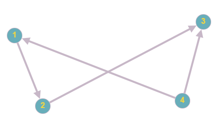

**Ориентированным графом** (англ. directed graph) G
 называется пара G=(V,E)
, где V
 — множество вершин (англ. vertices), а E⊂V×V
 — множество рёбер.


**Дуга** - направленное ребро в ориентированном графе.

**Вершина** — одна из точек, из которых состоит граф

В ходе данной лабораторной работы проект имел 3 основных файла: **header.h**, **main.cpp**, **graph.cpp**.

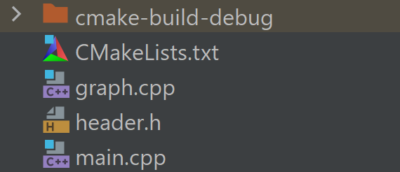

### Удаление вершины  в ориентированном графе ###

```
void delete_element_from_vector(vector<pair<int, int>>& mas_pair, int& siz, int number) {
    if (number >= 0 && number < siz) {  // Изменено с number > 0 на number >= 0
        for (int i = number; i < siz - 1; i++) {
            mas_pair[i] = mas_pair[i + 1];
        }
        mas_pair.pop_back();
        siz--;
    }
}

void delete_vertex(vector<vector<pair<int, int>>>& graph, int& vertex, int& edges) {
    if (vertex <= 0) {  // Добавлена проверка на пустой граф
        cout << "Граф пуст!\n";
        return ;
    }

    int del_ver;
    cout << "Введите номер вершины, которую хотите удалить\n";
    cin >> del_ver;
    if (del_ver <= 0 && del_ver > vertex) {  // Добавлена проверка корректности ввода
        cout << "Некорректный номер вершины!\n";
        return ;
    }
    del_ver--;

    for (int i = 0; i < vertex; i++) {
        int size_of_reber = graph[i].size();
        for (int j = 0; j < size_of_reber; j++) {
            if (graph[i][j].first == del_ver) {
                delete_element_from_vector(graph[i], size_of_reber, j);
                edges--;
                j--;
            }
            else if (graph[i][j].first > del_ver) {
                graph[i][j].first--;
            }
        }
    }

    for (int i = del_ver; i < vertex - 1; i++) {
        graph[i] = graph[i + 1];
    }
    graph.pop_back();
    vertex--;
}
```


### Добавленеие вершины в ориентированном графе ###

```
void insert_data(vector<vector<pair<int, int>>>& graph, int& vertex) {
    graph.push_back(vector<pair<int,int>>());
    vertex++;
    cout << "Вершина"<<" "<<vertex<<" "<<"успешно добавлена";

}
```
### Добавление гового ребра ###

```
void insert_new_edge(vector<vector<pair<int, int>>>& graph, int vertex, int& edges) {
    int number_first_vertex;
    cout << "Введите номер вершины от которой пойдет новая дуга: ";
    cin >> number_first_vertex;
    while (!checking_vvod(number_first_vertex, vertex)) {
        cout << "Неправильный ввод первой вершины!!!!";
        cin >> number_first_vertex;

    }
    number_first_vertex--;

    cout << "Введите номер вершины, в которую будет вести дуга: ";
    int number_second_vertex;
    cin >> number_second_vertex;
    while (!checking_vvod(number_second_vertex, vertex)) {
        cout << "Неправильный ввод второй вершины!!!!";
        cin >> number_second_vertex;

    }
    number_second_vertex--;


    graph[number_first_vertex].push_back({ number_second_vertex, 1 });
    edges++;
}

```

### Удаленеи дуг из ориентированного графа ###

```
void delete_edge(vector<vector<pair<int, int>>>& graph, int vertex, int& edges) {
    int first, second;
    cout << "Введите номер вершины из которой выходит ребро:\n";
    cin >> first;
    while (!checking_vvod(first, vertex)) {
        cout << "Неправильный ввод первой вершины!!!!";
        cin >> first;

    }
    first--;
    cout << "Введите вершину в которую ведет ребро:\n";
    cin >> second;
    while (!checking_vvod(second, vertex)) {
        cout << "Неправильный ввод второй вершины!!!!";
        cin >> second;

    }
    second--;

    int size_of_reber = graph[first].size();
    bool flag = false;
    if (!graph[first].empty()) {
        for (int i = 0; i < size_of_reber; i++) {
            if (graph[first][i].first == second) {
                flag = true;
                delete_element_from_vector(graph[first], size_of_reber, i);
                edges--;
                i--;
            }
        }
    }
    else {
        cout << "у графа нет ребер";
    }
    if (!flag) {
        cout << "такого ребра не сущестувет";
    }

}
```

### Обход в ширину ###

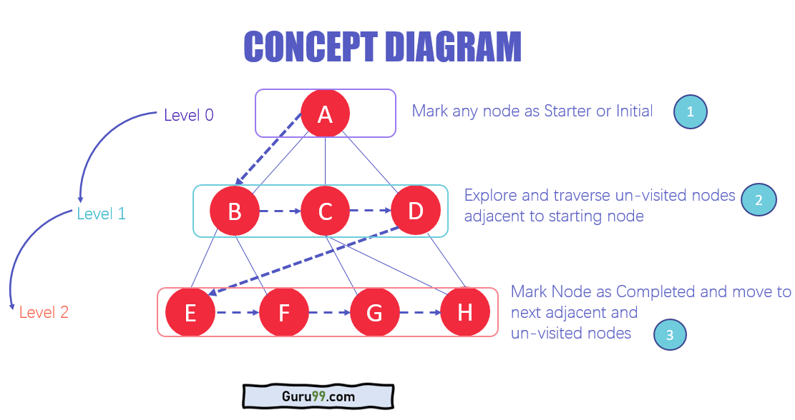


Обход графа требует, чтобы алгоритм посещал, проверял и/или обновлял каждый непосещенный узел в древовидной структуре. Обходы графа классифицируются по порядку, в котором они посещают узлы графа.

Алгоритм BFS запускает операцию с первого или начального узла графа и тщательно его обходит. Как только он успешно пересекает начальный узел, затем посещается и помечается следующая непройденная вершина графа.

```
void BFS(vector<vector<pair<int, int>>> graph) {
    vector<bool> used(graph.size(), false);
    queue<int> q;
    q.push(0);
    used[0] = true;

    while (!q.empty()) {
        int cur = q.front();
        q.pop();
        cout << "BFS находится в вершине " << cur + 1 << endl;

        for (auto neighbor : graph[cur]) {
            if (!used[neighbor.first]) {
                q.push(neighbor.first);
                used[neighbor.first] = true;
            }
        }
    }
}

```
<hr>

## Результаты тестов ##

**Test1**
<p align="center">
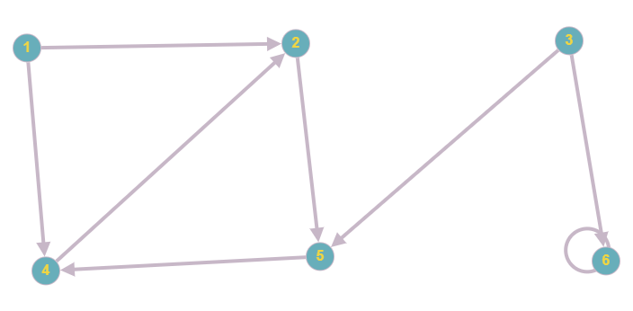
</p>
<p></p>
<p align="center">
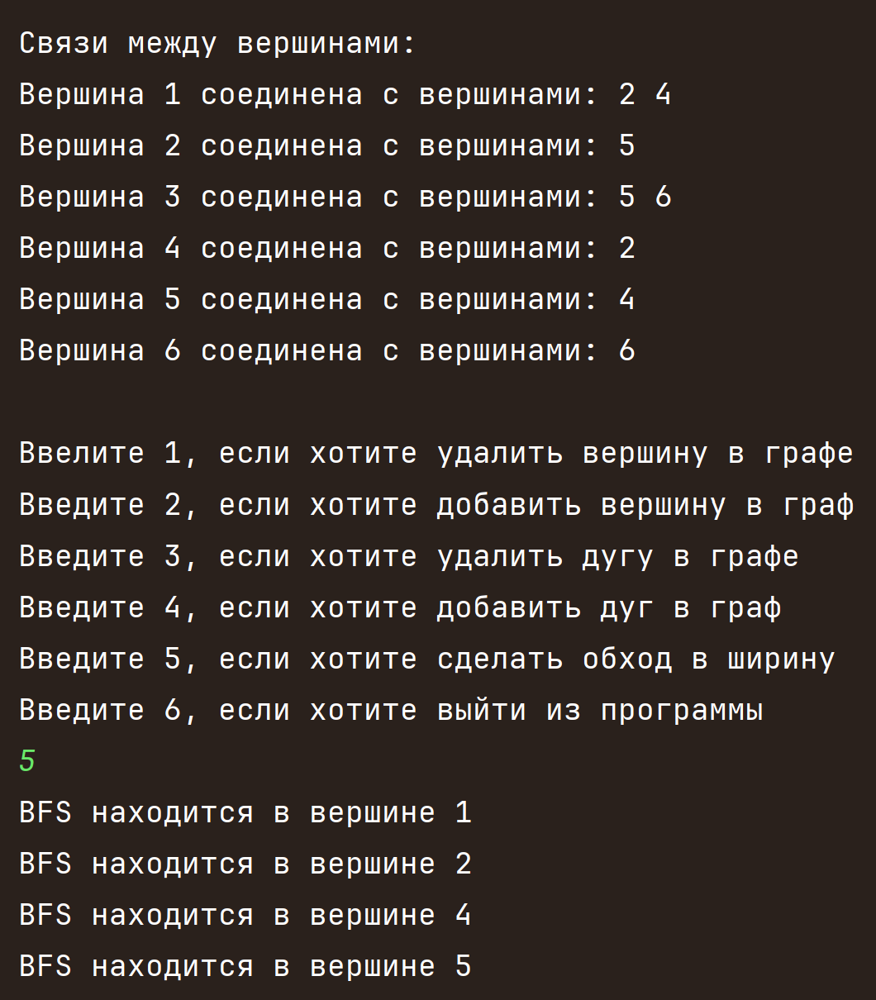
</p>
<hr>

**Test2**

<p align="center">
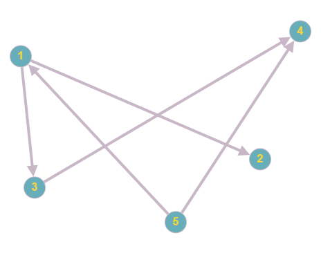
</p>

<p></p>
<p align="center">
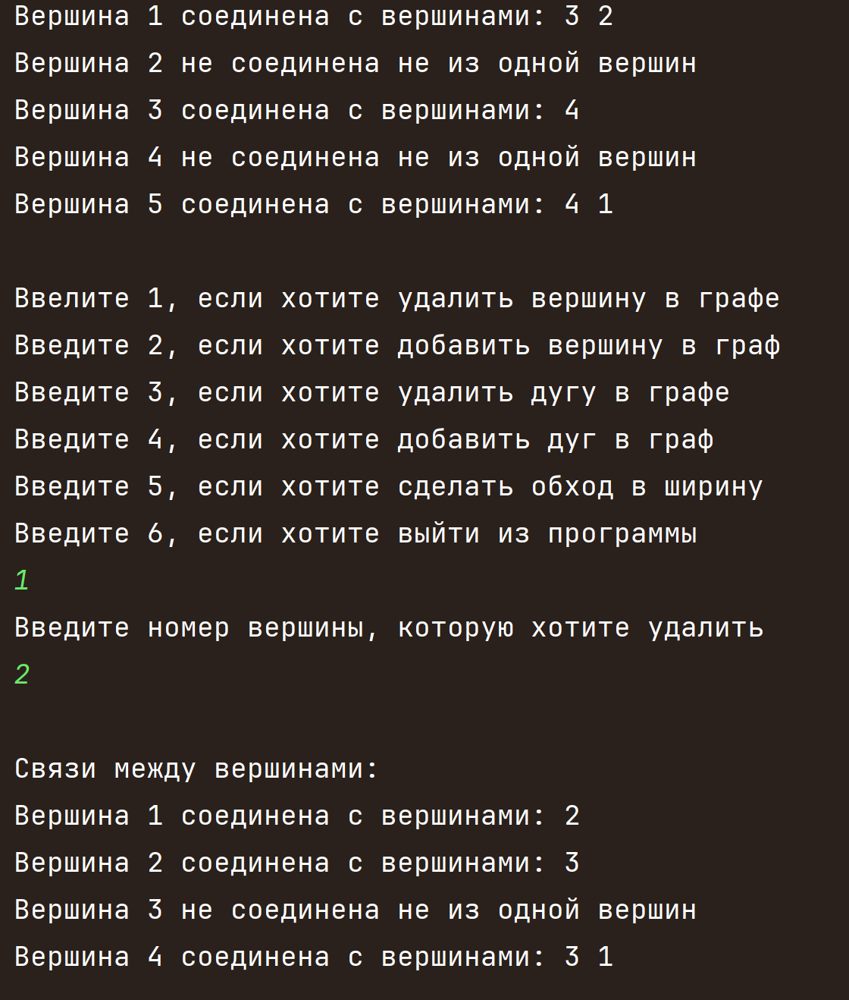
</p>

<hr>

**Test3**

<p align="center">
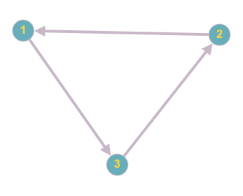
</p>

<p></p>
<p align="center">
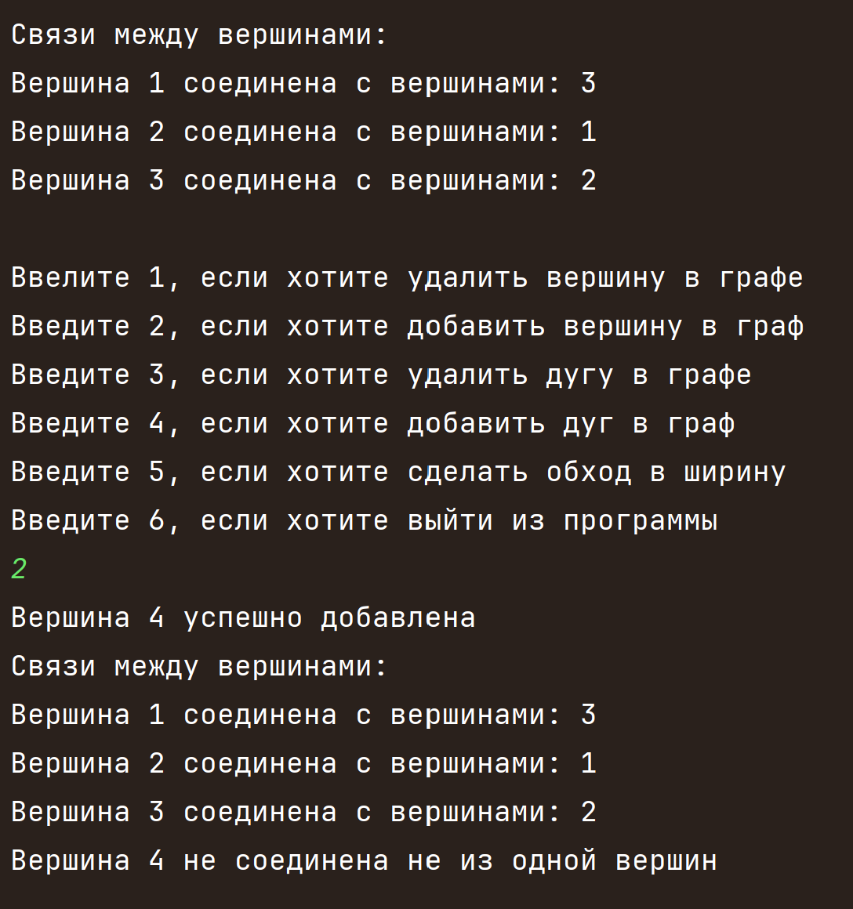
</p>

<hr>

**Test4**

<p align="center">
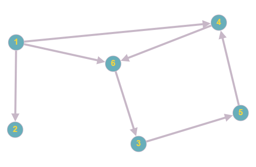
</p>

<p></p>
<p align="center">
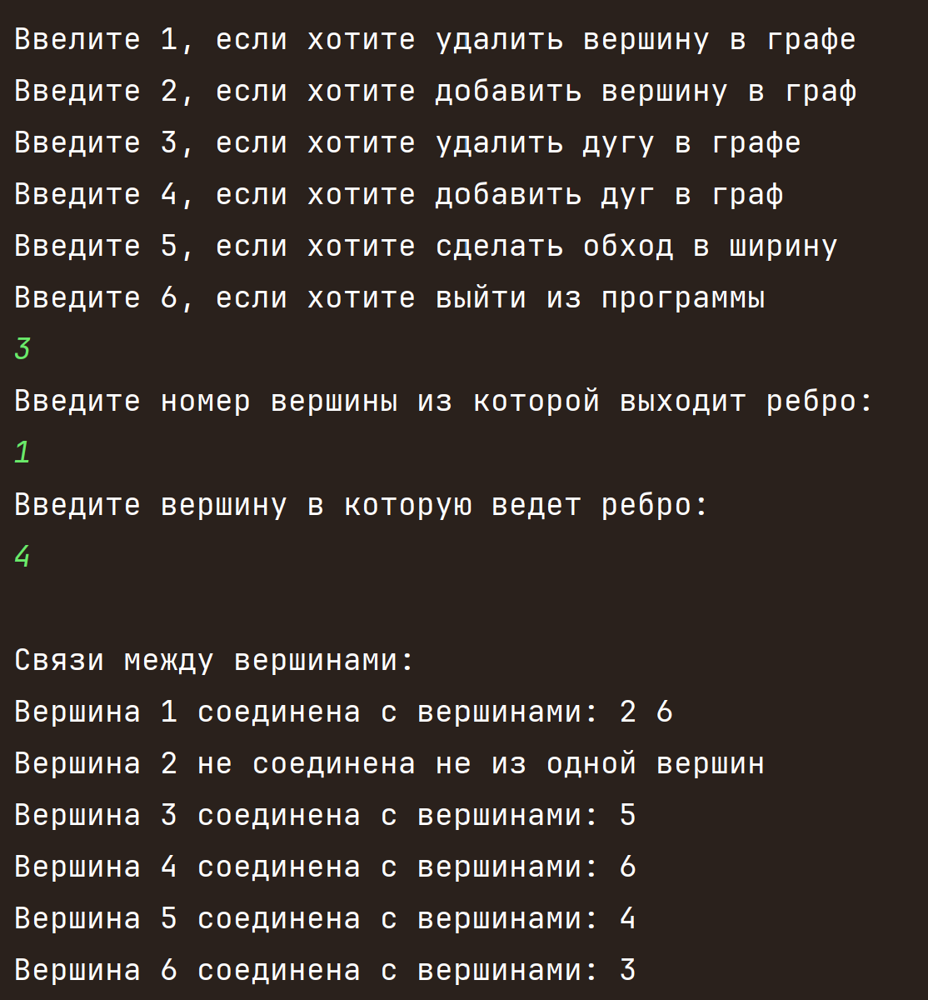
</p>

<hr>

**Test5**

<p align="center">
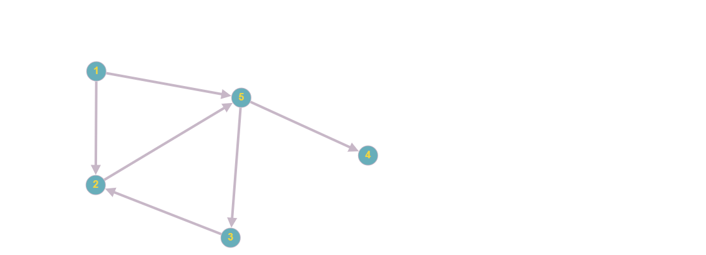
</p>

<p></p>
<p align="center">
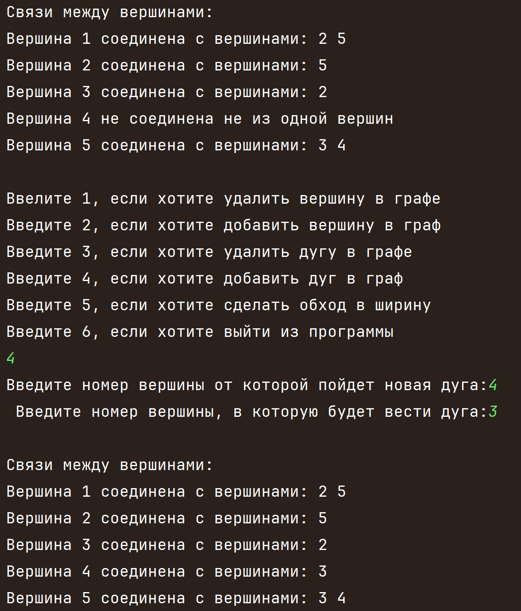
</p>
<hr>

## Вывод:

В результате лабораторной работы:

Ознакомился с понятием  ориентированного графа и всех других определений, связанных с таким видом графов.

Реализовал некоторые операции над ориентированным графом на языке программирования С++. А также на разобрал алгоритм обхода в ширину(BFS).

## Используемые  источники

### Свободная энциклопедия "Википедия" [Электронный ресурс]-Режим доступа

* https://ru.m.wikipedia.org/wiki/

### Сайт "Олимпиадное программирование в Бресте и Беларуси" [Электронный ресурс]- режим доступа:
**Информация о графах и их представлении в памяти компбютера**
* https://brestprog.by/topics/graphs/

**Обход в ширину**
* https://brestprog.by/topics/bfs

* https://www.geeksforgeeks.org/breadth-first-search-or-bfs-for-a-graph/

### Сайт "Skillfactory media" [Электронный ресурс]- режим доступа:

**Ориентриованный граф**

* https://blog.skillfactory.ru/glossary/orientirovannyj-graf/