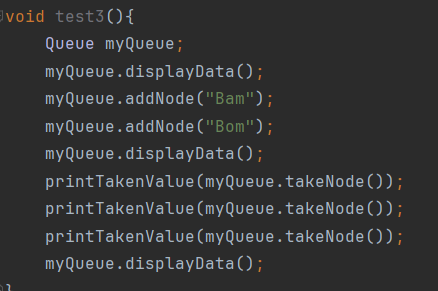
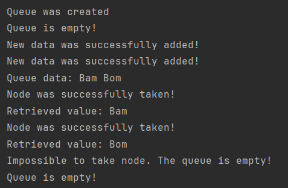

## Лабораторная работа №1
## Вариант 22
### Автор: Шумилов Артем, гр. 421702

## Содержание

- [*Глоссарий*](#глоссарий)
- [*Введение*](#введение)
    - [*1.1 Цели*](#цели)

    - [*1.2 Постановка задачи*](#постановка-задачи)

    - [*1.3 Применение*](#применение)

- [*2 Алгоритм*](#алгоритм)

    - [*2.1 Описание алгоритма*](#описание-алгоритма)
        
    - [*2.2 Реализация алгоритма*](#реализация-алгоритма)

- [*3 Пример работы алгоритма*](#пример-работы-алгоритма)

- [*4 Выводы*](#выводы)

- [*Список литературы*](#список-литературы)


## Глоссарий

- _Очередь (queue)_ – контейнер, который работает по принципу FIFO (first-in first-out или "первый вошел — первым вышел")

- _Структура (struct)_ — это пользовательский тип данных, который позволяет объединять несколько переменных разного типа под одним именем

- _Класс (class)_ — это пользовательский тип данных, который используется для создания объектов. Классы представляют собой совокупность данных и методов, которые работают с этими данными

- _Метод_ — это функция, определенная внутри класса или структуры

- _Конструктор_ – метод, который вызывается при создании объекта класса. Используется для инициализации объектов

- _Указатель_ — это переменная, которая хранит адрес другой переменной

- _Заголовочный файл_ — это файл, который содержит объявления (но не определения) классов, функций, переменных и других сущностей

- _Узел (node)_ — это фундаментальная составляющая структура данных, такой как связанный список, дерево или граф. Узлы содержат данные и ссылки (указатели) на другие узлы

- _Однонаправленный связанный список (singly linked list)_ — это структура данных, состоящая из узлов, где каждый узел содержит данные и указатель на следующий узел в списке

- _Голова списка_ — это начальная точка, с которой начинается обход списка.


## Введение

### Цели

Реализовать очередь на выбранном языке программирования, методы добавления и взятия элемента в/из очереди

### Постановка задачи

В ходе выполнения работы использовать однонаправленный список и структуры данных (или классы), которые должны быть декларированы в header-файлах, а реализованы – в .cpp

Код должен быть хорошо декомпозирован, а его элементы имели наименования согласно общепринятым стандартам

При выполнении лабораторной работы запрещено использовать глобальные переменные

### Применение 

Очередь используется для:
- управления задачами,
- создания сетевых буферов,
- обработки событий,
- алгоритмов обхода графов,
- планировщика задач,
- обработки пиковых нагрузок;

## Алгоритм

### Описание алгоритма

Очередь реализуется при помощи однонаправленных списков, которые состоят из узлов. Каждый узел хранит данные и указатель на следущий узел. 

<p align="center">
<image
  src="https://habrastorage.org/r/w1560/getpro/habr/upload_files/23a/3d4/4a8/23a3d44a885165eaecf080780931c5ca.png"
  caption="Однонаправленный список"
  style="width: 600px; background-color: white">
  <p align="center">Рис. 1</p>
</p>

При добавлении нового элемента в очередь (т.е. добавлении нового узла в список) он становится последним в очереди, а предыдущий узел начинает указывать на него

Если добавленный узел единственный в очереди, то он становится головой списка (т.е не существует другого узла, который бы указывал на него)

При взятии элемента из списка извлекается головной узел (первый добавленный в очередь элемент), а узел, следующий после него, становится новой головой

<p align="center">
<image
  src="https://kvodo.ru/wp-content/uploads/queue.png"
  caption="Добавление и извлечение элемента из очереди"
  style="width: 600px; background-color: white">
  <p align="center">Рис. 2</p>
</p>

### Реализация алгоритма 

Узлы списка реализованы с помощью структуры. При создании нового узла он начинает хранить данные, переданные в него пользователем при создании, а указатель на следующий элемент принимает значение **nullptr**, т.к. узел становится последним в списке

```hpp
    struct Node {
        std::string data;
        Node* next;
        
        Node(std::string newData) 
        : data(newData), next(nullptr){}
    };
```

<br>

Очередь хранит в себе указатель на головной узел и на последний узел списка. Для нее определены методы добавления/взятие узла и вывода данных, хранящихся во всех узлах списка

```hpp
    class Queue{
    private:
        Node* head;
        Node* lastNode;
    public:
        Queue();
        void addNode(std::string newData);
        std::string takeNode();
        void displayData();
};
```
<br>

При добавлении нового элемента он становится последним в очереди. Предыдущий узел списка начинает указывать на него

```cpp
    Node* newNode = new Node(newData);
    lastNode->next = newNode;
    lastNode = newNode;
```

<br>

При взятии элемента данные, располагающиеся в головном узле, сохраняются. После этого головной узел удаляется, а элемент, на который он указывал, становится новой головой списка

```cpp
    Node* nextNode = head->next;
    std::string lastNodeData = head->data; 

    delete head;
    head = nextNode;
```
Метод взятия элемента возвращает данные, которые хранились в изъятом узле

<br>

Для вывода всех данных, хранящихся в очереди, используется цикл, который проходит по всем элементам списка, начиная с головы
```cpp
    while(currentNode != nullptr){
        std::cout << currentNode->data << " ";
        currentNode = currentNode->next;
    }
```

## Пример работы алгоритма 




## Выводы

В результате выполнения работы удалось:
1. реализовать очередь с методами добавления и изъятия элементов на ЯП С++
2. изучить способы работы с однонаправленными списками
3. попрактиковаться в работе с классами

Все поставленные цели были достигнуты, а задачи выполнены

## Список литературы

1. [C++ | Очередь std::queue](https://metanit.com/cpp/tutorial/7.11.php)
2. [Односвязный список - Основы алгоритмов](https://education.yandex.ru/handbook/algorithms/article/odnosvyaznyj-spisok)
3. [Реализация односвязного списка на С++](https://habr.com/ru/sandbox/153128/)
4. [Линейные односвязные списки](https://victor192007.narod.ru/files/cpp_d1.html)
5. [Списки в С++ – Односвязный список](https://otus.ru/nest/post/911/)
6. [Реализация связных списков на С++](https://pro-prof.com/forums/topic/%D1%80%D0%B5%D0%B0%D0%BB%D0%B8%D0%B7%D0%B0%D1%86%D0%B8%D1%8F-%D1%81%D0%B2%D1%8F%D0%B7%D0%BD%D1%8B%D1%85-%D1%81%D0%BF%D0%B8%D1%81%D0%BA%D0%BE%D0%B2-%D0%BD%D0%B0-%D1%81)
7. [Очередь (программирование)](https://ru.wikipedia.org/wiki/%D0%9E%D1%87%D0%B5%D1%80%D0%B5%D0%B4%D1%8C_(%D0%BF%D1%80%D0%BE%D0%B3%D1%80%D0%B0%D0%BC%D0%BC%D0%B8%D1%80%D0%BE%D0%B2%D0%B0%D0%BD%D0%B8%D0%B5))
8. [Структуры](https://metanit.com/cpp/tutorial/5.8.php)
9. [Структуры и классы в С++](https://habr.com/ru/articles/827240/)