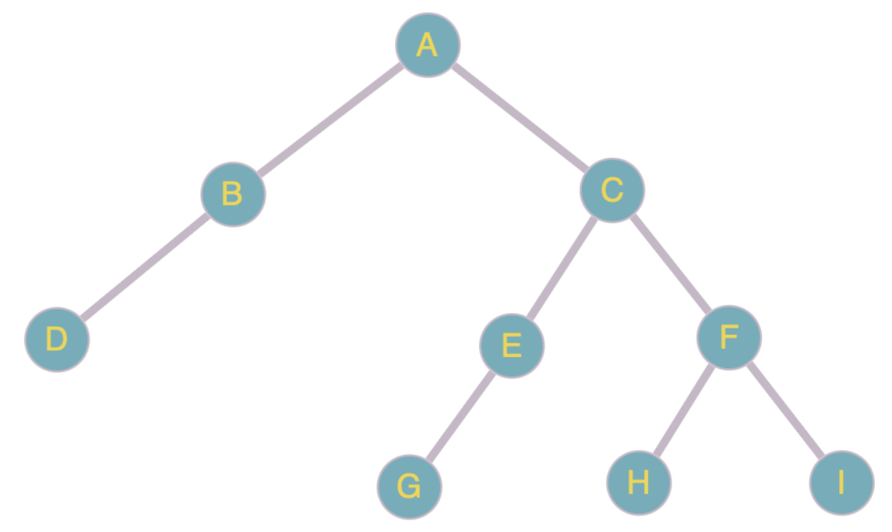

# Лабораторная работа 1. Структуры данных
## Цель работы
- Исследовать свойства структур данных.
- Разработать библиотеку алгоритмов обработки структур данных.
## Задачи
- Разработать библиотеку для работы со структурой данных (в моём варианте – N-арным деревом) на языке программирования C++.
- Разработать тестовую программу, которая демонстрирует работоспособность реализованной библиотеки работы со структурой данных.
- Разработать систему тестов, которые продемонстрировали бы работоспособность реализованной библиотеки.
## Вариант
Мой вариант – вариант 1 [методички](https://drive.google.com/drive/folders/1AyWt3nPYPlhdaGD3Hlfrc33eyXt2OD84). Реализовать библиотеку для работы с N-арным деревом (сделать возможность создания вершины в определённом месте дерева, а также – удаления вершины из какого-либо места в дереве).
## Список используемых при решении задачи понятий
- Дерево – структура данных, представляющая собой древовидную структуру в виде набора связанных узлов. Представляет собой связный (имеющий одну компоненту связности) ациклический (не имеющий циклов – путей, не проходящих по одному ребру дважды, которые начинаются и заканчиваются в одной вершине) граф (см. отчет по РР первого семестра). Пример дерева:

- Узел – вершина графа, представляющего собой дерево.
- Узел-потомок (потомок, сын, дочерний узел) – узел, выходящий из рассматриваемого узла.
- Узел-родитель (предок, родитель, предшественник) – узел, из которого выходит рассматриваемый нами узел.
- Корневой узел (корень) – узел, не имеющий предков (узел 9 на примере).
- Лист, листовой или терминальный узел – узел, не имеющий дочерних элементов (на примере – узлы 2, 5, 10, 13, 15, 18, 21).
- N-арное дерево – дерево, в котором для каждой вершины число потомков не превосходит N.
## Реализация
Для реализации дерева необходимо такое представление, где каждая вершина – отдельный элемент, которому соответствует собственный тип данных. В каждой вершине хранится массив указателей на дочерние вершины и указатель на родительскую вершину.
### Тип данных для представления вершин в дереве
Реализуем тип данных вершины в соответствии с ранее сказанным:
```C++
/*
        T – тип значений вершин.
        ARITY – макс. количество непосредственных потомков вершины.
 */
struct node
{
	T value; // значение вершины
	node *parent; // непосредственный предок (родитель)
	node *children[ARITY]; // массив непосредственных потомков (сыновей)

	explicit node(const T &val = T(), node *par = nullptr)
		: value(val), parent(par)
	{
		for (size_t i = 0; i < ARITY; i++)
		{
                        /*
                                Изначально заполняем массив детей нулевыми указателями,
                                т. к. дочерние вершины ещё не созданы.
                         */
			this->children[i] = nullptr;
		}
	}
}
```
Реализуем сам тип данных дерева. Главной характеристикой дерева является её корневая вершина.
```C++
class Tree
{
private:
        node *m_root = nullptr; // корневой узел дерева.
public:
	explicit Tree(const T &rootVal = T())
		: m_root(new node(rootVal))
	{}
};
```
Основная логика уже написана. Для реализации всех последующих алгоритмов необходимо лишь знать, как обходить дерево.
Для примера создадим метод print для структуры node, который выведет все вершины, начиная с переданной в метод. Метод будет выводить вершину с нужным количеством табуляций (в соответствии её с уровнем вложенности), после чего рекурсивно переходить к потомкам, до тех пор, пока не будут выведены все вершины. Выведенное дерево будет подобно дереву файлов.
```C++
/*
        out - поток вывода.
        current_level - текущий уровень вложенности (изначально 0).
 */
void print(std::ostream &out, size_t current_level = 0) const
{
	for (size_t i = 0; i < current_level; i++) // ставим табуляции
	{
		out << '\t';
	}			
		
        out << this->value << std::endl; // вывод текущей вершины

        for (size_t i = 0; i < ARITY; i++)
	{
		if (this->children[i] != nullptr)
		{
                        /*
                                Рекурсивно запускаемся от дочерней вершины с указанием
                                следующего уровня вложенности.
                         */
			this->children[i]->print(out, current_level + 1);
		}
	}
}
```
Для вывода всего дерева необходимо лишь запустить метод print от корневой вершины.
```C++
void print(std::ostream &out) const
{
	this->m_root->print(out);
}
```
В реализацию дерева необходимо добавить методы добавления и удаления вершины в определённое место. Чтобы реализовать данные методы, можно задать для каждой вершины некоторый ключ – уникальный идентификатор, который позволит быстро получить доступ к определённой вершине. В данной задаче я решил в качестве ключа использовать строку, состоящую из строчных латинских букв 'd' и 'r'. Строка представляет собой путь по дереву от корневой вершины, до текущей, где символ 'd' (от "down") является переходом от текущей вершины к дочерней, а 'r' (от "right") – переходом от текущей вершины к ее следующему брату (следующему ребёнку его родителя). Разумеется, также нужно добавить обработку ситуаций, в которых введённый пользователем путь не является корректным, либо вершины, соответствующей данному пути не существует. Идея с таким представлением вершин взята [отсюда](https://habr.com/ru/articles/482814/).
Рассмотрим вышесказанное на примере добавления вершины в какое-то место дерева:
```C++
/*
        currentStep – текущий символ в строке пути.
        val – значение добавляемой вершины.
        currentBrotherIndex - теущий индекс в массиве детей родительского узла.
        currentNode – текущая вершина.
 */
void insertNode(const char *currentStep, const T &val,
	size_t currentBrotherIndex, node *currentNode)
{
	switch (*currentStep)
	{
		case '\0': // место найдено
			currentNode->insertChild(val); // добавляем вершину
			break;
		case 'd': // вниз (к сыну)
			if (currentNode->children[0] != nullptr)
			{
				this->insertNode(currentStep + 1, val,
				        0, currentNode->children[0]);
				break;
			}
			throw std::domain_error("There is no such node.");
			break;
		case 'r': // вправо (к брату, схема доступа: текущ.->родитель->след. сын)
			if (currentNode->parent != nullptr)
			{
				if (currentNode->parent->children[currentBrotherIndex + 1] != nullptr)
				{
					this->insertNode(currentStep + 1, val,
						currentBrotherIndex + 1,
						currentNode->parent->children[currentBrotherIndex + 1]);
					break;
				}
			}
			throw std::domain_error("There is no such node.");
			break;
		default:
			throw std::invalid_argument("Invalid path.");
			return; // указана некорректная строка в качестве пути
	}
}
```
Чтобы добавить какую-либо вершину, нужно просто добавить потомка найденной вершине. Реализуем метод insertChild для структуры node:
```C++
void insertChild(const T &val)
{
	for (size_t i = 0; i < ARITY; i++)
	{
		if (this->children[i] == nullptr)
		{
			this->children[i] = new node(val, this);
			return;
		}
	}
	throw std::out_of_range("Can\'t insert one more child. The amount of children is already " +
		std::to_string(ARITY) + "!");
}
```
Поиск вершины для удаления вершины выполняется аналогично. Для удаления вершины необходимо удалить всех её потомков, а также саму вершину.
```C++
void removeDescendants()
{
	for (size_t i = 0; i < ARITY; i++)
	{
		if (this->children[i] != nullptr) // если у текущего узла есть потомок
		{
			this->children[i]->removeDescendants();	// перейти к нему	
			delete this->children[i]; // удалить ссылку на этого потомка
			this->children[i] = nullptr;
		}
	}

	this->value.~T(); // удалить сам узел
}

/*
	currentStep – текущий символ в строке пути.
	currentBrotherIndex - теущий индекс в массиве детей родительского узла.
	currentNode – текущая вершина.
 */
void removeNode(const char *currentStep,
	size_t currentBrotherIndex, node *&currentNode)
{
	switch (*currentStep)
        {
	case '\0': // место найдено
		currentNode->removeDescendants(); // удаляем потомков

		delete currentNode; // и саму вершину
		currentNode = nullptr;
		break;
	case 'd': // вниз
		if (currentNode->children[0] != nullptr)
		{
			this->removeNode(currentStep + 1,
			        0, currentNode->children[0]);
			break;
		}
		throw std::domain_error("There is no such node.");
		break;
	case 'r': // вправо
		if (currentNode->parent != nullptr)
		{
			if (currentNode->parent->children[currentBrotherIndex + 1] != nullptr)
			{
				this->removeNode(currentStep + 1, currentBrotherIndex + 1,
				        currentNode->parent->children[currentBrotherIndex + 1]);
				break;
			}
		}
		throw std::domain_error("There is no such node.");
		break;
	default:
		throw std::invalid_argument("Invalid path.");
		return;
	}
}
```
## Пример работы с библиотекой
Продемонстрирую работу библиотеки с помощью такого кода:
```C++
#include <iostream>
#include "Tree/tree.hpp"

int main()
{
	Tree<2, char> t('A');

	t.insertNode("", 'B');
	t.insertNode("", 'C');
	t.insertNode("d", 'D');
	t.insertNode("dr", 'E');
	t.insertNode("dr", 'F');
	t.insertNode("drd", 'G');
	t.insertNode("drdr", 'H');
	t.insertNode("drdr", 'I');

        // t.insertNode("", 'J'); // out_of_range
        // t.insertNode("spcsd", 'K'); // invalid_argument
        // t.insertNode("ddddd", 'L'); // domain_error

        t.insertNode("dd", 'M');
        // t.removeNode("ddddd"); // domain_error
        // t.removeNode("wedded"); // invalid_argument
        t.removeNode("ddd");

	t.print(std::cout);

	return 0;
}
```
Данный код построит следующее дерево:

```
A
        B
                D
                        M
        C
                E
                        G
                F
                        H
                        I
```
Раскомментировав эту строчку (попытавшись добавить к корню ещё одного ребёнка)
```C++
t.insertNode("", 'J'); // out_of_range
```
Получим исключение:
```
libc++abi: terminating due to uncaught exception of type std::out_of_range: Can't insert one more child. The amount of children is already 2!
```
Такое исключение:
```
libc++abi: terminating due to uncaught exception of type std::domain_error: There is no such node.
```
Бросится в случае, если мы попытаемся добавить ребёнка к несуществующей вершине или удалить несуществующую:
```C++
t.insertNode("ddddd", 'L'); // domain_error
```
Или
```C++
t.removeNode("ddddd"); // domain_error
```
Аналогично, если мы в качесте пути укажем некорректную строку:
```C++
t.insertNode("spcsd", 'K'); // invalid_argument
```
Или
```C++
t.removeNode("wedded"); // invalid_argument
```
Бросится исключение:
```
libc++abi: terminating due to uncaught exception of type std::invalid_argument: Invalid path.
```
## Вывод
В ходе выполнения данной лабораторной работы я:
- Изучил принцип работы N-арного дерева.
- Приобрёл навыки разработки библиотек в C++.
- Разработал библиотеку алгоритмов обработки структуры данных N-арного дерева.