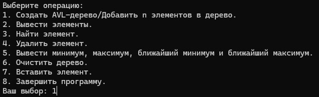
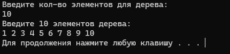
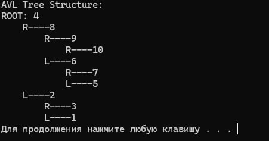
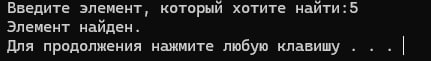
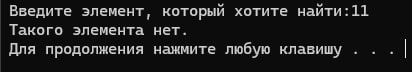
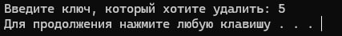
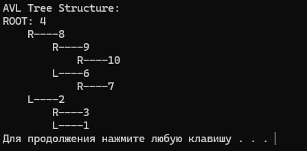
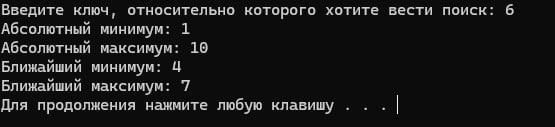

# Лабораторная работа 1. Структуры данных
## Цель работы
- Исследовать свойства структур данных.
- Разработать библиотеку алгоритмов обработки структур данных.

## Задача
- Разработать библиотеку для работы со структурой данных (в моём варианте – AVL-деревом) на языке программирования C++.

## Вариант
Мой вариант – вариант 9 [методички](https://drive.google.com/drive/folders/1AyWt3nPYPlhdaGD3Hlfrc33eyXt2OD84): AVL-дерево. Вставка. Удаление. Поиск. Поиск минимума, максимума,
ближайшего большего и ближайшего меньшего.

## Список используемых при решении задачи понятий
- Дерево – структура данных, представляющая собой древовидную структуру в виде набора связанных узлов. Представляет собой связный (имеющий одну компоненту связности) ациклический (не имеющий циклов – путей, не проходящих по одному ребру дважды, которые начинаются и заканчиваются в одной вершине) граф (см. отчет по РР первого семестра). Пример дерева:

- Узел/нода – вершина графа, представляющего собой дерево.
- Узел-потомок (потомок, сын, дочерний узел) – узел, выходящий из рассматриваемого узла.
- Узел-родитель (предок, родитель, предшественник) – узел, из которого выходит рассматриваемый нами узел.
- Корневой узел (корень) – узел, не имеющий предков (узел 9 на примере).
- Лист, листовой или терминальный узел – узел, не имеющий дочерних элементов (на примере – узлы 2, 5, 10, 13, 15, 18, 21).
- AVL-дерево - бинарное дерево поиска, элементы которого подчиняются правилу Left < ROOT < Right, где ROOT - корень дерева/поддерева, Left - левый узел, Right - правый узел.

## Реализация
Для реализации дерева необходимо такое представление, где каждая вершина – отдельный элемент, которому соответствует собственный тип данных. В каждой вершине хранятся два указателя на дочерние вершины, ключ (значение узла), высота.

### Тип данных для представления вершин в дереве
Реализуем тип данных вершины в соответствии с ранее сказанным:

```C++

class AVL_tree
{
private:
    // Структура для представления узлов дерева 
    struct node
    {
        int key; // Ключ/данные
        unsigned char height; // Высота
        node* left; // Указатели на левый и правый узел соответственно
        node* right;

        node(int k) : key(k), left(nullptr), right(nullptr), height(1) {} // Конструктор узла (ноды)
    };
...

```

## Ключевые алгоритмы

В моем задании требуется реализация вставки, удаления, поиска узлов в дереве. Также требуется поиск минимума, максимума, ближайшего большего и ближайшего меньшего.

### Вставка:

```C++

public:

void AVL_tree::insert(int k)
{
    root = insert(root, k); // Вставка нового ключа
}

private:

AVL_tree::node* AVL_tree::insert(node* p, int k) // Вставка ключа k в дерево с корнем p
{
    if (!p) return new node(k); // Если узел пуст, создаем новый
    else if (k < p->key)
        p->left = insert(p->left, k); // Рекурсивно вставляем в левое поддерево
    else if (k > p->key)
        p->right = insert(p->right, k); // Рекурсивно вставляем в правое поддерево

    return balance(p); // Возвращаем сбалансированный узел
}

```

Для этого метода используется вспомогательный метод "balance" - он нужен для балансировки дерева. Этот метод будет встречаться на протяжении всей реализации дерева.

```C++

// Балансировка узла p
AVL_tree::node* AVL_tree::balance(node* p)
{
    fixheight(p);
    if (bfactor(p) == 2)
    {
        if (bfactor(p->right) < 0)
            p->right = rotateleft(p->right);
        return rotateleft(p);
    }

    if (bfactor(p) == -2)
    {
        if (bfactor(p->left) > 0)
            p->left = rotateright(p->left);
        return rotateright(p);
    }
    return p; // Если балансировка не нужна
}

void AVL_tree::fixheight(node* p)
{
    unsigned char hl = height(p->left);
    unsigned char hr = height(p->right);
    p->height = (hl > hr ? hl : hr) + 1;
}

unsigned char AVL_tree::height(node* p)
{
    return p ? p->height : 0; // Если указатель не нулевой, возвращает высоту; иначе возвращает 0
}

int AVL_tree::bfactor(node* p)
{
    return height(p->right) - height(p->left);
}

```

Метод "balance" использует еще две ключевые функции - левый и правый поворот (rotateleft() и rotateright() соотв.):

```C++

// Правый поворот вокруг p
AVL_tree::node* AVL_tree::rotateright(node* p)
{
    node* q = p->left;
    p->left = q->right;
    q->right = p;
    fixheight(p);
    fixheight(q);
    return q;
}

// Левый поворот вокруг q
AVL_tree::node* AVL_tree::rotateleft(node* q)
{
    node* p = q->right;
    q->right = p->left;
    p->left = q;
    fixheight(q);
    fixheight(p);
    return p;
}

```

### Удаление:

```C++
private:

AVL_tree::node* AVL_tree::removemin(node* p) // удаление узла с минимальным ключом из дерева p
{
    if (p->left == 0)
        return p->right;
    p->left = removemin(p->left);
    return balance(p);
}

AVL_tree::node* AVL_tree::remove(node* p, int k) // удаление ключа k из дерева p
{
    if (!p) return 0;
    if (k < p->key)
        p->left = remove(p->left, k);
    else if (k > p->key)
        p->right = remove(p->right, k);
    else //  k == p->key 
    {
        node* q = p->left;
        node* r = p->right;
        delete p;
        if (!r) return q;
        node* min = findmin(r);
        min->right = removemin(r);
        min->left = q;
        return balance(min);
    }
    return balance(p);
}

public:

void AVL_tree::remove(int k)
{
    root = remove(root, k);
}
```

### Поиск элемента:

```C++
private:

AVL_tree::node* AVL_tree::search_pass(node* p, int k)
{
    if (!p) return nullptr;

    if (p->key == k) return p;

    if (k > p->key)
        search_pass(p->right, k);
    else if (k < p->key)
        search_pass(p->left, k);
}

public:

bool AVL_tree::search(int k)
{
    if (search_pass(root, k) == nullptr)
        return 0;
    else
        return 1;
}
```

### Поиски минимумов и максимумов.

В AVL-дереве абсолютные минимумы и максимумы находятся слева и справа по дереву соответственно, следовательно код для их нахождения - очень простой:

```C++
int AVL_tree::findAbsMax()
{
    node* p = root;

    while (p->right != nullptr)
    {
        p = p->right;
    }

    return p->key;
}

int AVL_tree::findAbsMin()
{
    node* p = root;

    while (p->left != nullptr)
    {
        p = p->left;
    }

    return p->key;
}
```

С ближайшими минимумами (Predecessor) и максимумами (Successor) все сложнее. Их нужно искать относительно определенной вершины:

```C++
int AVL_tree::findPredecessor(int key) // Ближайший минимум
{
    node* current = search_pass(root, key); // Находим узел
    if (!current) return -1; // Узел не найден

    // Случай 1: Есть левое поддерево - ищем максимум в нём
    if (current->left) {
        node* temp = current->left;
        while (temp->right) {
            temp = temp->right;
        }
        return temp->key;
    }
    // Случай 2: Нет левого поддерева - ищем первого меньшего родителя
    else {
        node* predecessor = nullptr;
        node* ancestor = root;
        while (ancestor != current) {
            if (current->key > ancestor->key) {
                predecessor = ancestor;
                ancestor = ancestor->right;
            }
            else {
                ancestor = ancestor->left;
            }
        }
        return predecessor ? predecessor->key : -1; // Если нет предшественника
    }
}

int AVL_tree::findSuccessor(int key) // Ближайший максимум
{   
    node* current = search_pass(root, key); // Находим узел
    if (!current) return -1; // Узел не найден

    // Случай 1: Есть правое поддерево - ищем минимум в нём
    if (current->right) {
        node* temp = current->right;
        while (temp->left) {
            temp = temp->left;
        }
        return temp->key;
    }
    // Случай 2: Нет правого поддерева - ищем первого большего родителя
    else {
        node* successor = nullptr;
        node* ancestor = root;
        while (ancestor != current) {
            if (current->key < ancestor->key) {
                successor = ancestor;
                ancestor = ancestor->left;
            }
            else {
                ancestor = ancestor->right;
            }
        }
        return successor ? successor->key : -1; // Если нет преемника
    }
}
```

## Пример работы программы

Допустим, мы введем дерево из 10 элементов:





Таким образом, структура дерева будет выглядеть так:



Попробуем найти элемент 5:



И элемент 11:



Как видим, программа работает корректно!

Попробуем удалить элемент 5:





Как видим, элемент действительно удален!

Теперь попробуем найти минимумы и максимумы:



Ура, все верно!

## Вывод

В ходе выполнения данной лабораторной работы я:
- Изучил принцип работы AVL-дерева.
- Приобрёл навыки разработки библиотек в C++.
- Разработал библиотеку алгоритмов обработки структуры данных AVL-дерева.