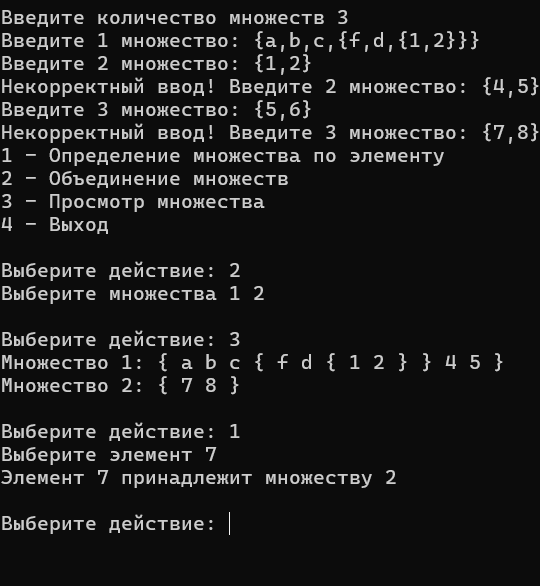

# Система непересекающихся множеств

## Цель

Создать библиотеку для системы непересекающихся множеств, которая будет в себя включать следующие операции:
- Создание множества
- Объединение двух множеств
- Определение множества, которому принадлежит заданный элемент

## Основные понятия

-  Множество (Set)
В DSU множество — это группа элементов, которые объединены и рассматриваются как одно целое. Все множества в DSU являются непересекающимися (disjoint), то есть никакие два множества не могут содержать одинаковые элементы.

-  Элемент множества (Element)
Элемент множества — это объект, который является частью какого-либо множества. В DSU каждый элемент изначально представляет собой отдельное множество.

-  Родитель множества (Parent)
Каждое множество представлено деревом, где каждый элемент ссылается на своего родителя. Корень дерева является представителем множества. Все элементы одного множества имеют одного и того же родителя, то есть принадлежат одному дереву.

-  Представитель множества (Leader/Representative)
Представитель множества — это элемент, который является корнем дерева для данного множества. Операция Find используется для нахождения представителя множества для любого элемента.

## Алгоритмы 

- Объединение (Union) — объединяет два множества в одно.

Мой пример реализации:
```C++

void Union(int a, int b, vector<mnozh>& set) {
    for (char element : set[b - 1].elem) {
        set[a - 1].elem.push_back(element);
    }

    for (mnozh* sub : set[b - 1].podmnozh) {
        set[a - 1].podmnozh.push_back(sub);
    }

    set.erase(set.begin() + b - 1);
  }

```
- Поиск (Find) — определяет, к какому множеству принадлежит элемент.

Мой пример реализации:
```C++

bool find_one(const mnozh* mn,char ch) {
    for (int i = 0; i < mn->elem.size(); i++) {
        if (ch == mn->elem[i]) {
			return true;
        }
    }
    for (int i = 0; i < mn->podmnozh.size(); i++) {
		if (find_one(mn->podmnozh[i], ch)) {
			return true;
		}
    }
    return false;
}

void find(const vector<mnozh>& set,char ch) {
	for (int i = 0; i < set.size(); i++) {
		if (find_one(&set[i], ch)) {
			cout << "Элемент " << ch << " принадлежит множеству " << i + 1 << endl;
            break;
		}
	}

}

```

## Тестирование

Пример работы программы:



## Источники
Algorithmica

- https://ru.algorithmica.org/cs/set-structures/dsu/
