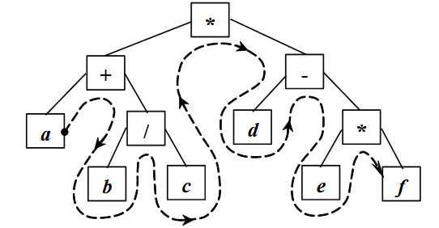
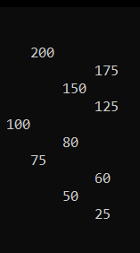
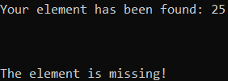
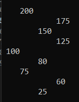
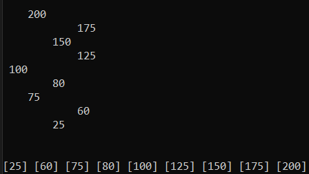
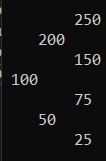

# Лабораторная работа 1. Структуры данных
***
## Цель работы
***
- Исследовать свойства структур данных.
- Разработать библиотеку алгоритмов обработки структур данных.
## Задача
***
- Разработать библиотеку для работы со структурой данных (в моём варианте – бинарным деревом поиска) на языке программирования C++.
### Вариант
В данной лабораторной работе представлен 4 вариант из [методички](https://drive.google.com/drive/folders/1AyWt3nPYPlhdaGD3Hlfrc33eyXt2OD84). Задание, которое он содержит: Бинарное дерево поиска. Поиск узла в дереве. Вставка узла в дерево.
Удаление узла из дерева. Обходы дерева. Построение дерева из
массива.

## Понятия
***
- Дерево – структура данных, представляющая собой древовидную структуру в виде набора связанных узлов. Представляет собой связный (имеющий одну компоненту связности) ациклический (не имеющий циклов – путей, не проходящих по одному ребру дважды, которые начинаются и заканчиваются в одной вершине).
- Узел/нода – вершина графа, представляющего собой дерево.
- Узел-потомок (потомок, сын, дочерний узел) – узел, выходящий из рассматриваемого узла.
- Узел-родитель (предок, родитель, предшественник) – узел, из которого выходит рассматриваемый нами узел.
- Корневой узел (корень) – узел, не имеющий предков (узел 9 на примере).
- Лист, листовой или терминальный узел – узел, не имеющий дочерних элементов (на примере – узлы 2, 5, 10, 13, 15, 18, 21).
- Бинарное дерево дерево поиска — двоичное дерево, для которого выполняются следующие дополнительные условия (свойства дерева поиска):     
    - оба поддерева — левое и правое — являются двоичными деревьями поиска;
    - у всех узлов левого поддерева произвольного узла X значения ключей данных меньше либо равны, нежели значение ключа данных самого узла X;
    - у всех узлов правого поддерева произвольного узла X значения ключей данных больше, нежели значение ключа данных самого узла X.
## Алгоритм:
***
#### Вставка узла в дерево:
```C++
void Tree::insert(int value) {
	Node* a = nullptr, * prev = nullptr;
	bool isTrue = true;
	
	if (root == nullptr) {
		root = Node::Leaf(value);
		return;
	}

	a = root;
	while (a && isTrue) {
		prev = a;
		if (a == nullptr) {
			cout << "\n\nError! Root = nullptr!\n\n";
			exit(EXIT_FAILURE);
		}
		else {
			if (value < a->info) a = a->left;
			else a = a->right;
		}
	}
	if (isTrue) {
		if(Node::Sort(root, value) == true) {
			Node* newNode = Node::Leaf(value);
			if (newNode->info < prev->info) prev->left = newNode;
			else prev->right = newNode;
		}
	}
}
...
```
Для реализации алгоритма вставки элемента я использовал 2 метода:
1. Node::Sort(int value) позволяет опеределить, не является ли элемент, который мы вставляем, повторным.
```C++
bool Node::Sort(Node* root, int value) {
	Node* a = root;
	bool isTrue = true;
	while (a != nullptr && a->info != value) {
		if (value > a->info) a = a->right;
		else a = a->left;
	}
	if (a != nullptr) {
		isTrue = false;
		return isTrue;
	}
	return isTrue;
}
...
```
2. Node::Leaf(int value) реализует создание нового узла дерева.
```C++
Node* Node::Leaf(int value) {
	Node* a = new Node(value);
	a->info = value;
	a->left = a->right = nullptr;
	return a;
}
...
```
#### Удаление узла дерева:
```C++
Node* Node::Pop(Node* root, int value) {
	Node* r = nullptr, * prev_r = nullptr, * del = root, * prev_del = nullptr;

	while (del != nullptr && del->info != value) {
		prev_del = del;
		if (del->info < value) del = del->right;
		else del = del->left;
	}
	if (del == nullptr) {
		cout << "\n\nThe element is missing!\n\n";
		exit(EXIT_FAILURE);
		return root;
	}
	if (del->right == nullptr && del->left != nullptr) r = del->left;
	else if (del->left == nullptr && del->right != nullptr) r = del->right;
	else if (del->left == nullptr && del->right == nullptr) {
		Node* a = del;
		if (del = prev_del->left) {
			delete a;
			prev_del->left = nullptr;
			return root;
		}
		else if (del = prev_del->right) {
			delete a;
			prev_del->right = nullptr;
			return root;
		}
	}
	else {
		prev_r = del;
		r = del->left;
		while (r->right != nullptr) {
			prev_r = r;
			r = r->right;
		}
		if (prev_r == del) r->right = del->right;
		else {
			r->right = del->right;
			prev_r->right = r->left;
			r->left = prev_r;
		}
	}
	if (del == root) root = r;
	else if (del->info < prev_del->info) prev_del->left = r;
	else prev_del->right = r;
	delete del;
	return root;
}
...

void Tree::pop(int value) {
	root = Node::Pop(root, value);
}
...
```
Для реализации удаления узла дерева применяется вспомогательный метод Node::Pop(Node* root, int value). Он удаляет узел в соответствии со св-вами бинарного дерева поиска. В случае, если корень является элементом, который требуется удалить - перезаписывает корень. 

#### Поиск узла в дереве:
```C++
void Tree::search(int value) {
	Node* a = root;
	while (a != nullptr && a->info != value) {
		if (value > a->info) a = a->right;
		else a = a->left;
	}
	if (a == nullptr) {
		cout << "\n\nThe element is missing!\n\n";
		return;
	}
	else cout << "\n\nYour element has been found: " << a->info << "\n\n";
}
...
```
Учитывая то, что значение правого узла больше, чем значение узла-родителя, а значение левого узла меньше, чем значение узла-родителя, мы реализуем функцию поиска элемента.
#### Обход дерева:
```C++
void Node::Bypass(Node* root) {
	Node* a = root;
	if (a == nullptr) return;

	Bypass(a->left);
	cout << "[" << a->info << "]" << " ";
	Bypass(a->right);

	return;
}

...

void Tree::bypass() {
	Node::Bypass(root);
	return;
}
...
```
Обход дерева реализован повредством вспомогательного рекурсивного метогда по принципу left -> root -> right. Описание данного принципа:

#### Построение дерева из массива
```C++
void Tree::build(int arr[], int a) {
	int b = 0;

	if (root != nullptr) {
		root = Node::Delete(root);
	}
	for (int j = 0; j < a; j++) {
		b = arr[j];
		insert(b);
	}
	return;
}
...
```
Алгоритм создания дерева из массива предполагает проверку на то, освободил ли пользователь место под новое дерево. В том случае, если место занято, используется вспомогаетльный метод Node::Delete(Node* root), который позволяет удалить дерево целиком посредством рекурсии: 
```C++
Node* Node::Delete(Node* root) {
	if (root == nullptr) {
		cout << "\n\nThe memory is clear!\n\n";
		return nullptr;
	}

	Delete(root->left); 
	Delete(root->right);  
	delete root;           

	return nullptr;
}
...
```
## Тесты
***
#### Тест 1
Запишем в дерево 10 элементов: 100, 200, 75, 50, 150, 175, 125, 80, 60 25 и выведем дерево на экран:
```C++
int main()
{
	Tree a;
	a.insert(100);
	a.insert(200);
	a.insert(75);
	a.insert(50);
	a.insert(150);
	a.insert(175);
	a.insert(125);
	a.insert(80);
	a.insert(60);
	a.insert(25);
	a.print();
}
```
Наше дерево выглядит следующим образом:

#### Тест 2
Далее попробуем найти существующий и несущестующий узел:
```C++
int main()
{
	Tree a;
	a.insert(100);
	a.insert(200);
	a.insert(75);
	a.insert(50);
	a.insert(150);
	a.insert(175);
	a.insert(125);
	a.insert(80);
	a.insert(60);
	a.insert(25);
	a.print();
	a.search(25);
	a.search(1);
}
```

#### Тест 3
Далее удалим элемент и снова выведем дерево в консоль:
```C++
int main()
{
	Tree a;
	a.insert(100);
	a.insert(200);
	a.insert(75);
	a.insert(50);
	a.insert(150);
	a.insert(175);
	a.insert(125);
	a.insert(80);
	a.insert(60);
	a.insert(25);
	a.print();
	a.search(25);
	a.search(1);
	a.pop(50);
	a.print();
}
```
После удаления наше дерево выглядит следующим образом:

#### Тест 4
Теперь выполним обход дерева:
```C++
int main()
{
	Tree a;
	a.insert(100);
	a.insert(200);
	a.insert(75);
	a.insert(50);
	a.insert(150);
	a.insert(175);
	a.insert(125);
	a.insert(80);
	a.insert(60);
	a.insert(25);
	a.print();
	a.search(25);
	a.search(1);
	a.pop(50);
	a.print();
	a.bypass();
}
```

Как видно из вывода, обход выполняется в соответствии с алгоритмом.
#### Тест 5
Последним действием создадим дерево из массива и выведем его на экран:
```C++
int main()
{
	Tree a;
	int arr[]{ 100, 200, 50, 250, 75, 25, 150 };
	a.insert(100);
	a.insert(200);
	a.insert(75);
	a.insert(50);
	a.insert(150);
	a.insert(175);
	a.insert(125);
	a.insert(80);
	a.insert(60);
	a.insert(25);
	a.print();
	a.search(25);
	a.search(1);
	a.pop(50);
	a.print();
	a.bypass();
	a.build(arr, 7);
	a.print();
}
```
Дерево выглядит следующим образом:

## Вывод
***
В ходе выполнения данной лабораторной работы я:
- Изучил принцип работы бинарного дерева поиска.
- Приобрёл навыки разработки библиотек в C++.
- Разработал библиотеку алгоритмов обработки структуры данных бинарного дерева поиска.