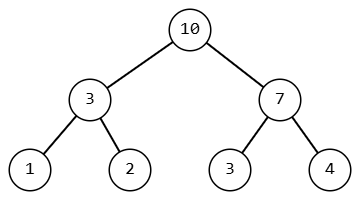
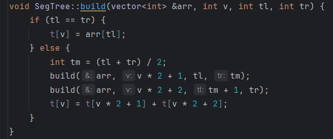
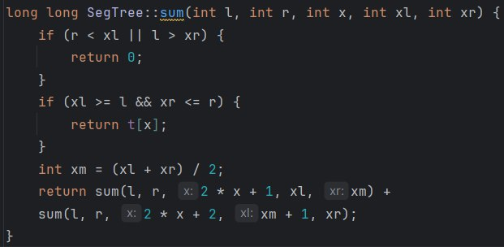
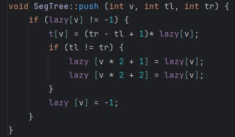
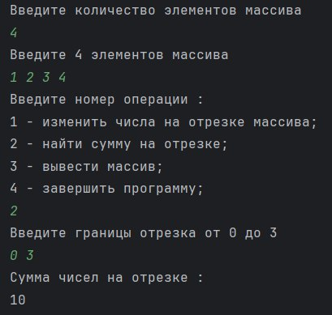
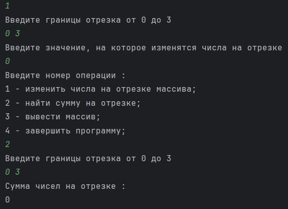

# Лабораторная работа №1
## Цель
* Разработать и реализовать эффективную структуру данных (дерево отрезков) для выполнения операций нал массивом :
	- Вычисление суммы чисел на отрезке массива;
	- Изменение всех чисел на отрезке массива на какое - то значение.
## Задачи
* Изучить основные понятия, связанные с древовидными структурами.
* Спроектировать структуру данных в виде класса.
* Реализовать операции построения дерева, запроса суммы чисел на отрезке и обновления всех чисел на отрезке.
## Вариант
Для выполнения лабораторной работы мне был выдан **20** выриант. Дерево будет реализовано ввиде класса, который будет включать методы для построения дерева, обновления данных и вычисления суммы на отрезке. Будет использовано ленивое обновление для ускорения массовых изменений.

### Дерево сумм

 

**Дерево сумм (или дерево отрезков)** — это структура данных, которая используется для эффективного вычисления суммы элементов на отрезке массива и для обновления значений в массиве. Это дерево представляет собой бинарное дерево, где каждый узел хранит информацию о сумме дочерних элементов.

#### Структура дерева
Дерево отрезков для этой задачи выглядит так :

* листы дерева (то есть узлы без потомков) - это изначальный массив чисел

* каждый узел, который не является листом - это сумма двух его потомков 

Для хранения дерева используется обычный массив длиной 4n. Элементы распледеляются сверху вниз, слева направо. Тогда корневой узел имеет индекс 0, его дети 1 и 2 и так далее вниз. Более формально это можно описать так: `left of i = 2*i + 1 и right of i = 2*i + 2`.

Алгоритм построения дерева :

* Принимается массив, на основе которого строится дерево, текущая вершина (индекс вершины) и левая и правая границы;

* Если левая и правая границы сжались до одного элемента, то устанавливается этот элемент;

* Иначе, находится середина и рекурсивно запускается алгоритм заново :

	- Первый запуск - левые дети;

	- Второй запуск - правые дети;

* Обновляется значение в текущей вершине. 

 

#### Поиск суммы
Поиск суммы начинается с входными данными границ отрезка, элемента замены и границами массива xl = 0, xr = n. В какой - то момент в функции может быть три варианта границы :

1. Граница вышла за отрезок. В этом случае необходимо выйти из функции, потому что вниз невозможно спуститься так, чтобы границы вошли в отрезок.

2. Граница полностью внутри отрезка. В этом случае возвращается значение вершины.

3. Граница частично внутри отрезка. В этом случае границы делятся на две части и функция рекурсивно отправляется в левого и правого ребёнка. После возвращается итоговая сумма этих двух частей.

#### Обновление элементов
Для обновления элементов программа "красит" некоторые вершины и их детей в какое - то число. Для получения корректных данных из узлов создана функция push, которая будет производить "проталкивание" информации из покрашенной вершины в обоих её сыновей. По-английски эта техника называется lazy propagation. Это техника оптимизации, используемая в структуре данных для того, чтобы избежать повторных вычислений при обновлениях элементов массива на отрезке. 

### Пример выполнения программы
Входные данные :

* Количество элементов в массиве (N = 4)
* Ввод элементов массива (1, 2, 3, 4)
* Выбор операции (2 - для поиска суммы элементов отрезка массива)
* Ввод границ отрезка (0, 3) 

 

Далее :
* Выбор операции (1 - для изменения элементов отрезка)
* Ввод границ отрезка (0, 3)
* Ввод значения на этом отрезке (0)
* Поиск суммы на отрезке с границами (0, 3)
 

## Вывод
В ходе выполнения лабораторной работы было реализовано и исследовано дерево сумм или дерево отрезков для выполнения операций поиска суммы. В частности, были рассмотрены следующие задачи :

* Построение дерева – разработан алгоритм, позволяющий эффективно формировать структуру данных для хранения промежуточных сумм.

* Вычисление суммы элементов на заданном отрезке – реализован метод быстрого нахождения суммы элементов массива в диапазоне, что значительно ускоряет вычисления по сравнению с другими подходами.

* Обновление значений на отрезке – обеспечена возможность изменения значений элементов в заданном диапазоне с соответствующим обновлением структуры дерева. По оканчанию лабораторной работы свормировано три файла :

	- SegTree.hpp - для объявления класса SegTree, его методов и конструктора.

	- SegTree.cpp - для реализации методов и конструктора, принадлежащих классу SegTree.

	- main.cpp - для основнй логики программы и тестирования работы класса SegTree.

## Источники

1. [Дерево отрезков - Википедия](https://ru.wikipedia.org/wiki/Дерево_отрезков)
2. [Дерево отрезков. Построение - Викиконспекты](https://neerc.ifmo.ru/wiki/index.php?title=Дерево_отрезков._Построение)
3. [Дерево отрезков - Алгоритмика](https://algorithmica.org/ru/segtree)
4. [Дерево отрезков | структуры данных и алгоритмя](https://www.youtube.com/watch?v=LEkEPE_BKQY)
5. [Густокашин лекция 6](https://drive.google.com/drive/folders/1MFyd-nNpZEfcVqXH8__40RcDHRMkGKvT)
