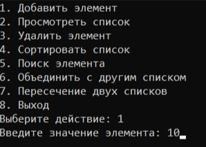
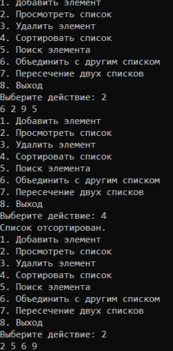
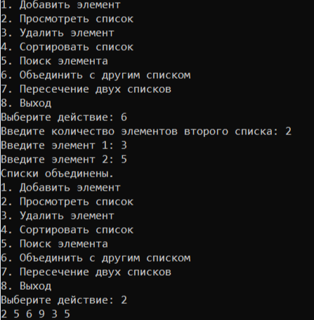
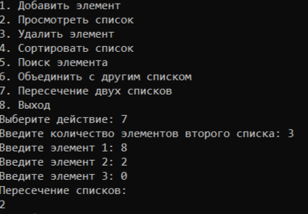

# 
Лабораторная работа №1

## 
Вариант 27

Однонаправленный список. Вставка элемента в список. Удаление
элемента из списка. Сортировка списка. Поиск элемента в списке.
Объединение двух списков. Пересечение двух списков. 

## 
Цели лабораторной работы:

1. Разработать библиотеку для работы с однонаправленным список на выбранном императивном языке программирования.
2. Создать тестовую программу для демонстрации функциональности разработанной библиотеки.
3. Разработать систему тестов для проверки работоспособности и корректности библиотеки, учитывая требования полноты, адекватности и непротиворечивости.
4. Обеспечить обработку некорректных данных, предусмотрев корректное завершение программы при возникновении ошибок.
5. Составить отчет по выполнению лабораторной работы.
   
 ## 
Список используемых понятий:

- Односвязный список (иногда «связный список») — базовая структура данных, представляющая собой соединённые узлы с однотипными данными. Каждый узел состоит из элемента и ссылки на следующий элемент.
- Массив — структура данных, хранящая набор значений, идентифицируемых по индексу или набору индексов, принимающих целые значения из некоторого заданного непрерывного диапазона.
- Одномерный массив — это линейная структура данных на языке программирования C, состоящая из фиксированного числа элементов одного типа данных, хранящихся в смежных ячейках памяти.

  ## 
Описание функций:

1. ### 
Добавление элемента в конец списка :

~~~c++
void SinglyLinkedList::insert(int value) {
    Node* newNode = new Node(value);
    if (head == nullptr) {
        head = newNode;
    } else {
        Node* temp = head;
        while (temp->next != nullptr) {
            temp = temp->next;
        }
        temp->next = newNode;
    }
}
~~~

2. ### 
Удаление элемента:

~~~c++
void SinglyLinkedList::remove(int value) {
    if (head == nullptr) return;
    
    if (head->data == value) {
        Node* temp = head;
        head = head->next;
        delete temp;
        return;
    }
    
    Node* current = head;
    while (current->next != nullptr && current->next->data != value) {
        current = current->next;
    }
    
    if (current->next != nullptr) {
        Node* temp = current->next;
        current->next = current->next->next;
        delete temp;
    }
}
~~~
3. ### 
Сортировка элеменов списка:

~~~c++
void SinglyLinkedList::sort() {
    if (head == nullptr || head->next == nullptr) return;
    
    // Преобразование списка в вектор для сортировки
    vector<int> values;
    Node* current = head;
    while (current != nullptr) {
        values.push_back(current->data);
        current = current->next;
    }
    
    // Сортировка вектора
    std::sort(values.begin(), values.end());
    
    // Восстановление списка из отсортированного вектора
    current = head;
    for (int val : values) {
        current->data = val;
        current = current->next;
    }
}
~~~
4. ### 
Поиск элемента списка:

~~~c++
Node* SinglyLinkedList::search(int value) {
    Node* current = head;
    while (current != nullptr) {
        if (current->data == value) {
            return current;
        }
        current = current->next;
    }
    return nullptr;
}
~~~
5. ### 
Объединение изночального списка с новым:

~~~c++
void SinglyLinkedList::merge(SinglyLinkedList& other) {
    if (other.head == nullptr) return;
    
    if (head == nullptr) {
        head = other.head;
    } else {
        Node* current = head;
        while (current->next != nullptr) {
            current = current->next;
        }
        current->next = other.head;
    }
    
    other.head = nullptr; // Предотвращаем удаление узлов при уничтожении other
}
~~~
6. ### 
Пересечение изночального списка с новым:

~~~c++
SinglyLinkedList SinglyLinkedList::intersect(SinglyLinkedList& other) {
    SinglyLinkedList result;
    
    // Преобразуем оба списка в векторы для удобства поиска
    vector<int> thisValues;
    Node* current = head;
    while (current != nullptr) {
        thisValues.push_back(current->data);
        current = current->next;
    }
    
    vector<int> otherValues;
    current = other.head;
    while (current != nullptr) {
        otherValues.push_back(current->data);
        current = current->next;
    }
    
    // Находим пересечение значений
    for (int val : thisValues) {
        if (find(otherValues.begin(), otherValues.end(), val) != otherValues.end() &&
            find(result.begin(), result.end(), val) == result.end()) {
            result.insert(val);
        }
    }
    
    return result;
}
~~~
7. ### 
Вывод на дисплей:

~~~c++
void SinglyLinkedList::display() const {
    Node* current = head;
    while (current != nullptr) {
        cout << current->data << " ";
        current = current->next;
    }
    cout << endl;
}
~~~

 ## 
Пример работы функций:

### 
Добавление элемента в конец списка :

### 
Сортировка элеменов списка:

### 
Объединение изночального списка с новым:

### 
Пересечение изночального списка с новым:

## 
Вывод

В ходе работы я освоила создание библиотек на C++, изучила принцип разделения кода: реализацию в `.cpp`-файлах и объявления в `.hpp`-файлах. Я разработала библиотеку для работы с односвязным списком.

## 
Используемые источники и материалы:

- https://www.youtube.com/watch?v=SajrPhE6FoQ (Реализация односвязного списка c++. Видио урок)
- https://habr.com/en/sandbox/153128/ (Habr)
