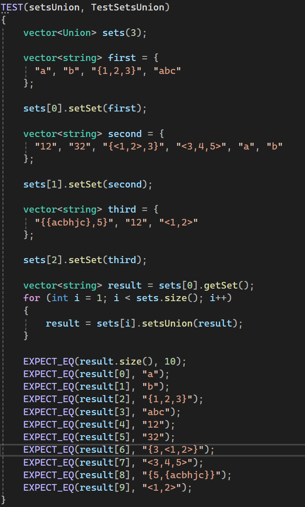
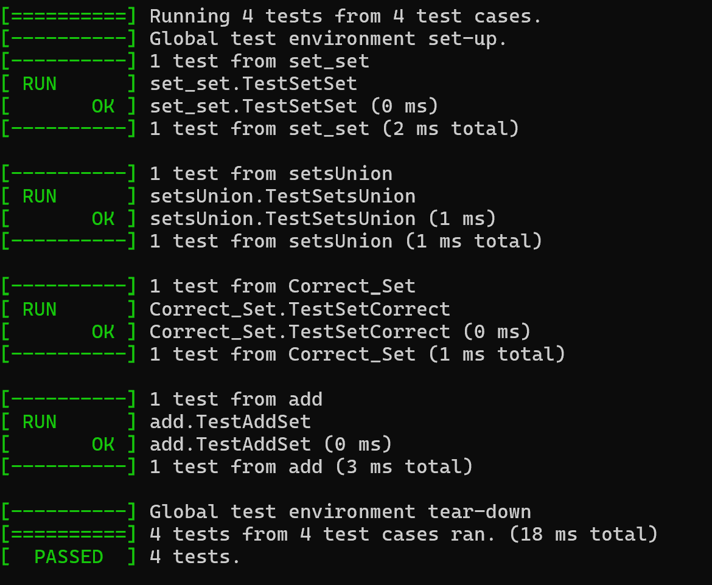

<h1>Лабораторная работа №2</h1>


## Цели:
* Изучить основные понятия, связанные  с множествами
* Выполнить операции над множествами согласно поставленной задаче
* Уметь использовать основные свойства множеств

## Задачи:
* Выполнить свой вариант лабораторной работы 
* Перенести получившееся решение на язык программирования С++


 ## Вариант 
Для выполнения лабораторной работы мне был выдан вариант **1**:

    Реализовать программу, формирующую множество равное объединению произвольного
    количества исходных множеств (без учёта кратных вхождений элементов).


## Множество 

**Множество** – простейшая информационная конструкция и математическая структура,
позволяющая рассматривать какие-то объекты как целое, связывая их. Объекты, связываемые
некоторым множеством, называются элементами этого множества. Если объект связан
некоторым множеством, то говорят, что существует вхождение объекта в это множество, а
объект принадлежит этому множеству.

Ключевые блоки программы:

**1)** Проверка правильности скобок в множестве
```C++
bool Union::Breckets_Check(string& str)
{
	stack<char> stack;
	map<char, char> breckets = { { '{', '}' }, { '<', '>' } };
	for (char c : str)
	{
		if (c == '{' || c == '<')
		{
			stack.push(c);
		}
		else if (c == '}' || c == '>')
		{
			if (stack.empty() || breckets[stack.top()] != c)
				return false;
			stack.pop();
		}
	}

	return stack.empty();
}
```
**2)** Удаление повторяющихся элементов

```C++
void Union::removeDuplicates(vector<string>& set)
{
	if (set.empty()) return;

	vector<string> unique;
	for (int i = 0; i < set.size(); i++)
	{
		bool flag = true;
		for (int j = 0; j < unique.size(); j++)
		{
			if (set[i] == unique[j])
			{
				flag = false;
				break;
			}
		}

		if (flag)
		{
			unique.push_back(set[i]);
		}
	}

	set = unique;
}
```

**3)** Парсинг строки для получения отдельного элемента множества
```C++
vector <string> Union::parseSet(string str)
{
	vector<string> result;

	str = removeSpaces(str);
	if (str.empty())
	{
		cout << "Строка пуста!" << endl;
		return result;
	}

	if (str[0] != '{' && str[str.size() - 1] != '}')
	{
		cout << "Множество должно быть в фигурных скобках!" << endl;
		return result;
	}

	if (!Breckets_Check(str))
	{
		cout << "Неверная структура скобок!" << endl;
		return result;
	}

	if (!Checking_Set(str))
	{
		return result;
	}

	str = str.substr(1, str.length() - 2);

	if (str.empty())
		return result;

	string current;
	int breckets_count = 0;
	for (int i = 0; i < str.length(); i++)
	{
		char c = str[i];
		if (c == '{' || c == '<') breckets_count++;
		else if (c == '}' || c == '>') breckets_count--;

		if (c == ',' && breckets_count == 0)
		{
			if(!current.empty())
			{
				if (ValidElement(current))
				{
					result.push_back(current);
				}
				else
				{
					cout << "Неверный элемент!" << endl;
					return vector<string>();
				}
				current.clear();
			}
		}
		else
		{
			current += c;
		}
	}

	if (!current.empty())
	{
		if (ValidElement(current))
		{
			result.push_back(current);
		}
		else
		{
			cout << "Неверный элемент!" << endl;
			return vector<string>();
		}
	}
	removeDuplicates(result);
	return result;
}
```


## Тестирование
Тестирование функции объединения множеств:
<p></p>



 **Тесты в консоли**
 <p></p>
 

 #### Вывод:

Во время выполнения рассчетной работы проделал вот такую работу:

**1)** Повторил основные понятия теории множеств 

**2)** Реализовал объединение n-ого количества множеств в виде программы на языке С+

**3)** Научился тестировать свою программу

#### Используемые  источники

#### Свободная энциклопедия "Википедия" [Электронный ресурс]-Режим доступа

* https://ru.m.wikipedia.org/wiki/


### Google Disk 
* https://drive.google.com/drive/folders/1_xy849HXgTDetxSMlFd0KikTBo8-xalN