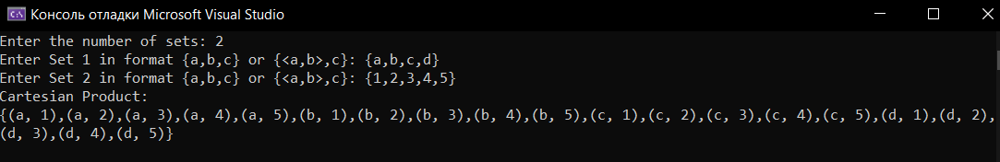

### 1. Введение
Декартово произведение множеств — это множество всех возможных упорядоченных комбинаций элементов исходных множеств. Например, для множеств A = {1, 2} и B = {'a', 'b'} декартово произведение будет:

~~~
A × B = {(1, 'a'), (1, 'b'), (2, 'a'), (2, 'b')}.

~~~
В данном отчёте рассматривается реализация вычисления декартова произведения для неограниченного количества множеств на языке C++ с использованием рекурсии

### 2. Постановка задачи
Требуется написать функцию на C++, которая:

Принимает на вход произвольное количество множеств (разных или одинаковых типов).

Возвращает декартово произведение этих множеств в виде вектора кортежей

### 3. Реализация

В представленном коде все входные данные являются типом данных: "string".
Выполняется проверка на недостующие запятые,а также на лишние.
Все пробелы игнорируются,путем удаления после всех проверок.

### 4. Заключение
Реализация демонстрирует мощь шаблонов и рекурсии в C++ для работы с произвольными количествами множеств. Код легко расширяется для поддержки новых типов и оптимизации.

Где применить:

Генерация тестовых данных.

Комбинаторные задачи в математике и ML.

Конфигурационные пространства в разработке ПО.
### Вывод Программы

### 5. Ключевые книги и учебники
Страуструп Б. Язык программирования C++ (4-е издание). — М.: Диалектика, 2022.

Основы шаблонов, рекурсии и работы с STL (главы 12, 23, 28).

Josuttis N. The C++ Standard Library: A Tutorial and Reference (2nd Edition). — Addison-Wesley, 2012.

Подробно о std::tuple, std::vector, итераторах (главы 5, 7).

Vandevoorde D., Josuttis N., Gregor D. C++ Templates: The Complete Guide (2nd Edition). — Addison-Wesley, 2017.

Продвинутые техники метапрограммирования для рекурсивных шаблонов (главы 4, 6).

### 6. Научные статьи и стандарты
ISO/IEC 14882:2020 Programming Languages — C++.

Официальная спецификация возможностей C++20, включая работу с кортежами и variadic templates.

Knuth D.E. The Art of Computer Programming. Volume 4A: Combinatorial Algorithms. — Addison-Wesley, 2011.

Математическая база для алгоритмов комбинаторики, включая декартово произведение (раздел 7.2.1.3).

### 7. Онлайн-ресурсы и документация
CppReference

std::tuple

Variadic templates.

Stack Overflow

Обсуждения оптимизации декартова произведения:

Efficient Cartesian Product Algorithm.

Boost.Hana Library

Документация — для расширенной работы с гетерогенными коллекциями.

### 8. Дополнительные материалы
Grimm R. Modern C++ Programming Cookbook. — Packt, 2022.

Рецепты по работе с шаблонами и рекурсией (рецепт 2.4).

YouTube-лекции

C++ Advanced Topics: Variadic Templates (канал CppCon).

