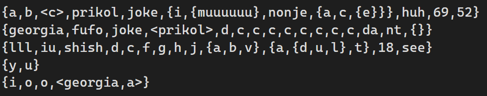
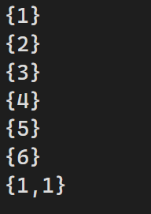

# Лабораторная работа №2
## Условие задания (Вариант 10)
Реализовать программу, формирующую множество равное объединению произвольного количества исходных множеств (с учётом кратных вхождений элементов).

----

**Цель:** Получить множество, которое будет содержать все элементы из всех исходных множеств с учётом кратных вхождений элементов.

**Задача:** Получить произвольное количество исходных множеств. Объединить все исходные множества в одно множество с учётом кратных вхождений элементов. Вывести полученное множество в консоль.

----

# Список понятий:

`Множество` - простейшая информационная конструкция и математическая структура, позволяющая рассматривать какие-то объекты как целое, связывая их. Объекты, связываемые некоторым множеством, называются элементами этого множества.

`Множеством с кратными вхождениями элементов` - множество S тогда и только тогда, когда существует x такой, что истинно S|x| > 1.

`Объединением неориентированных множеств A и B с учётом кратных вхождений элементов` – неориентированное множество S тогда и только тогда, когда для любого x истинно S|x| = max{A|x|, B|x|}.

----

# Алгоритм 

### 1. Основная функция (main)
   - Отображает пользователю список файлов для выбора.
   - Считывает выбор пользователя.
   - Запускает функцию open_and_sets.
   - Запускает функцию set_element_count.
   - Запускает функцию final_set_count.

### 2. Функция run_testcase
   - Открывает выбранный файл.
   - Проверяет наличие файла.
   - Очистка переданного вектора sets.
   - Чтение файла построчно(Для каждой строки):
     - Пропуск строк длиной < 2 символов.
     - Удаление первой открывающей скобки `{` и последней закрывающей скобки `}` символа строки/
     - Замена всех запятых на пробелы для упрощения парсинга.
 - Парсинг строки:
     - Используется `istringstream` для разбиения строки на элементы.
     - Обработка элементов с учетом вложенных структур.
     - Обычные элементы добавляются в текущий уровень вложенности.
     - Добавление в стек.
 - Закрытие файла.
### 3. Функция set_element_count
   - Принимает вектор множеств.
   - Для каждого множества подсчитывает кратности вхождения элементов.
   - Возвращает вектор векторов пар (элемент, кратность вхождения) для каждого множества.

### 4. Функция final_set_count
   - Принимает вектор векторов пар (элемент, кратность вхождения).
   - Находит максимальные кратности вхождения для каждого элемента во всех множествах.
   - Возвращает вектор пар (элемент, максимальная кратность вхождения).

### 5. Функция output
   - Выводит на экран объединение множеств с максимальными кратностями вхождения.
 ----
 
# Примеры тестирования программы 

#### Тест1

#### Тест2

#### Тест3

----

# Источники
[Написание GTests](https://habr.com/ru/articles/667880/)

[Использование библиотеки STL vector](https://learn.microsoft.com/ru-ru/cpp/standard-library/vector-class?view=msvc-170)

[Использование библиотеки STL pair](https://informatics.msk.ru/mod/book/view.php?id=492&chapterid=206)

----

# Вывод
Реализовала в C++ программу для нахождения объединения множеств.
