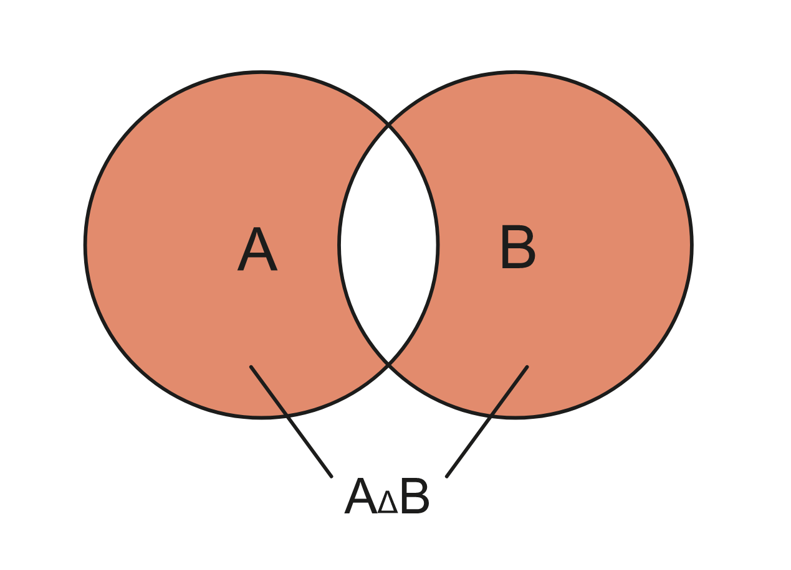
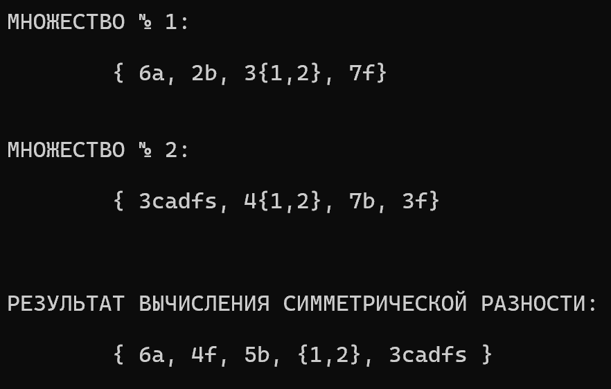
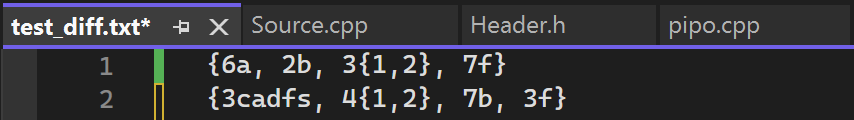
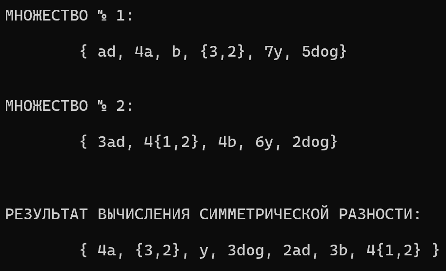
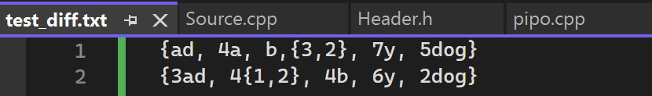
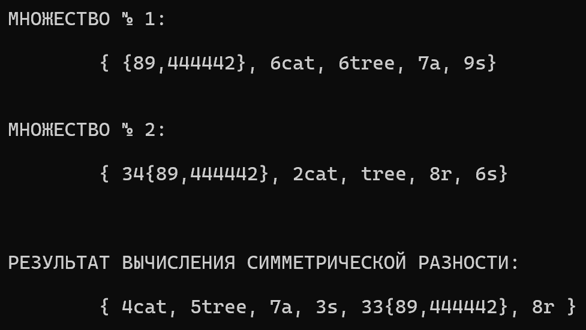
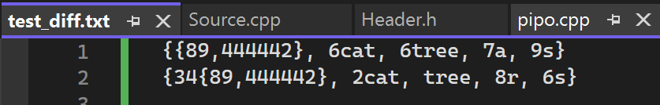
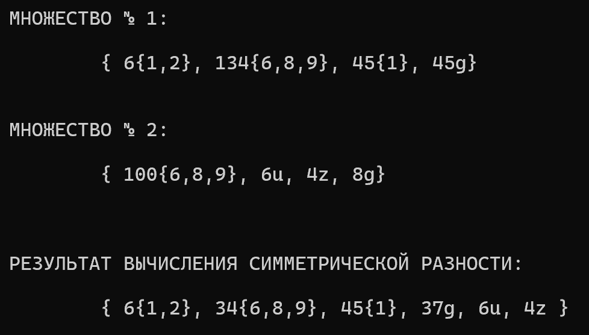
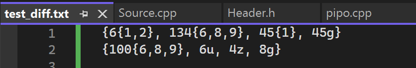
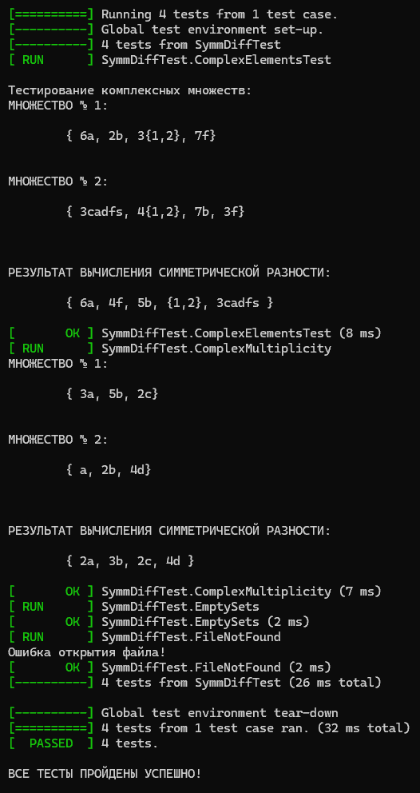

<h1 align="center">Лабораторная работа №2</h1>

## Вариант №12
_**Реализовать программу, формирующую множество равное симметрической разности
произвольного количества исходных множеств (с учётом кратных вхождений элементов).**_

* ## Цели лабораторной работы:

1. Исследовать свойства структур данных и разработать библиотеку алгоритмов обработки структур данных.
2. Изучение и реализация алгоритма формирования множества, равного симметрической разности произвольного количества исходных множеств.

* ## Задачи лабораторной работы

1. Изучить теоретические аспекты работы с множествами и операцией симметрической разности.
2. Разработать алгоритм формирования множества, равного симметрической разности произвольного количества исходных множеств.
3. Провести тестирование программы на различных наборах исходных данных для проверки корректности кода.
4. Проанализировать полученные результаты, сравнить результаты работы программы с ожидаемыми значениями.
5. Разработать GoogleTests, которые проверяют успешное выполнение всех функций.

## Список используемых понятий:

- **`Множество`** — простейшая информационная конструкция и математическая структура,
позволяющая рассматривать какие-то объекты как целое, связывая их.

- **`Элементы множества`** — объекты, связываемые некоторым множеством.

- **`Симметрической разностью`** неориентированных множеств A и B с учётом кратных
вхождений элементов будем называть неориентированное множество S тогда и только тогда,
когда для любого x истинно _S|x| = max{A|x|-B|x|, B|x|-A|x|}._
- **`Пересечением множеств А и В`** — множество, состоящее из всех элементов, принадлежащих одновременно каждому из множеств А и В.

- Множеством с **`кратными`** вхождениями элементов называют множество S тогда и только
тогда, когда существует x такой, что истинно _S|x| > 1_.

- **`Мультимножество (множество с учётом кратных вхождений элементов)`** 
 модификация понятия множества, допускающая включение одного и того же элемента в совокупность по нескольку раз. Число элементов в мультимножестве, с учётом повторяющихся элементов, называется его размером или мощностью (различаются не более, чем на единицу).



## Описание алгоритмов над мультимножествами:

### Алгоритм добавления элемента:

* _При некорректном указании файла или его отсутствии выводится сообщение "Ошибка открытия файла!", после чего выполнение программы прекращается (это связано с функцией запуска программы, описанной ниже)._
- _В противном случае файл считывается по символам, причем первое мультимножество сохраняется в `MultiSet[0]`, а второе — в `MultiSet[1]`._
     - _В зависимости от типа считанного символа (цифра, фигурная скобка, запятая, пробел, переменная и т.д.), он помещается в соответствующее поле мультимножества, будь то элемент, кратность или просто счетчик скобок, который служит для определения начала и конца другого мультимножества или подмножества внутри него._
```c++
void Sets(Set MultiSet[], string path) {
    ifstream file;
    file.open(path);

    if (!file.is_open()) {
        throw runtime_error("Ошибка открытия файла!");
    }

    int curr_brackets_count = 0;
    char ch;
    int m = -1;
    MultiSet[0].set_count = m + 1;
    int elem_in_set = 0;

    while (file.get(ch)) {
        if (ch == '{') {
            if (curr_brackets_count > 0) {
                MultiSet[m].Elem[elem_in_set].element.push_back(ch);
                MultiSet[m].Elem[elem_in_set].code_num += ch;
                curr_brackets_count++;
            }
            else {
                m++;
                MultiSet[0].set_count = m + 1;
                elem_in_set = 0;
                curr_brackets_count++;
            }
        }
        else if (ch == ',') {
            if (curr_brackets_count == 1) {
                elem_in_set++;
            }
            else {
                MultiSet[m].Elem[elem_in_set].element.push_back(ch);
                MultiSet[m].Elem[elem_in_set].code_num += ch;
            }
        }
        else if (isdigit(ch)) {
            if (curr_brackets_count == 1) {
                if (MultiSet[m].Elem[elem_in_set].multiplicity == 1 && !MultiSet[m].Elem[elem_in_set].IsAlone) {
                    MultiSet[m].Elem[elem_in_set].multiplicity = (ch - '0');
                    MultiSet[m].Elem[elem_in_set].IsAlone = true;
                }
                else {
                    MultiSet[m].Elem[elem_in_set].multiplicity = MultiSet[m].Elem[elem_in_set].multiplicity * 10 + (ch - '0');
                }
            }
            else {
                MultiSet[m].Elem[elem_in_set].element.push_back(ch);
                MultiSet[m].Elem[elem_in_set].code_num += ch;
            }
        }
        else if (ch == '}') {
            if (curr_brackets_count > 1) {
                MultiSet[m].Elem[elem_in_set].element.push_back(ch);
                MultiSet[m].Elem[elem_in_set].code_num += ch;
                curr_brackets_count--;
            }
            else {
                MultiSet[m].elem_count = elem_in_set + 1;
                curr_brackets_count--;
            }
        }
        else if (ch == ' ' || ch == '\n') {
            // Пропускаем пробелы и переносы строк
        }
        else {
            MultiSet[m].Elem[elem_in_set].element.push_back(ch);
            MultiSet[m].Elem[elem_in_set].code_num += ch;
        }
    }
    MultiSet[0].brackets_count = curr_brackets_count;
    file.close();
}
```
### Отображение мультимножеств из файла в консоль.

- _Каждое мультимножество выводится поэлементно, включая кратность элементов и сами элементы, при этом разделяя их запятыми._

```c++
void ViewSets(Set MultiSet[]) {
    for (int i = 0; i < MultiSet[0].set_count; i++) {
        cout << "МНОЖЕСТВО № " << i + 1 << ": \n\n\t{ ";
        for (int j = 0; j < MultiSet[i].elem_count; j++) {
            if (MultiSet[i].Elem[j].multiplicity == 1) {
                if (j != MultiSet[i].elem_count - 1) {
                    cout << MultiSet[i].Elem[j].element << ", ";
                }
                else {
                    cout << MultiSet[i].Elem[j].element;
                }
            }
            else {
                if (j != MultiSet[i].elem_count - 1) {
                    cout << MultiSet[i].Elem[j].multiplicity << MultiSet[i].Elem[j].element << ", ";
                }
                else {
                    cout << MultiSet[i].Elem[j].multiplicity << MultiSet[i].Elem[j].element;
                }
            }
        }
        cout << "} \n\n\n";
    }
}
```
### Приведение считанных мультимножеств к стандартному типу

* _Все муьтимножества типа `{а,а,а,d,d,а,а,с,в}` к стандартному виду `{5а,2d,c,в}`_
     - _Производится обход всех элементов мультимножества._
     - _В случае обнаружения одинаковых элементов их кратности суммируются, после чего результат записывается в один элемент. Количество элементов в мультимножестве уменьшается._
     - _В противном случае элемент остается без изменений в исходном виде._

```c++
void OneType(Set MultiSet[]) {
    for (int i = 0; i < MultiSet[0].set_count; i++) {
        for (int j = 0; j < MultiSet[i].elem_count; j++) {
            for (int k = j + 1; k < MultiSet[i].elem_count; k++) {
                if (((MultiSet[i].Elem[j].element == MultiSet[i].Elem[k].element) &&
                    ((MultiSet[i].Elem[j].multiplicity != MultiSet[i].Elem[k].multiplicity) ||
                        (MultiSet[i].Elem[j].multiplicity == 1 && MultiSet[i].Elem[k].multiplicity == 1))) ||
                    (MultiSet[i].Elem[j].code_num == MultiSet[i].Elem[k].code_num)) {
                    MultiSet[i].Elem[j].multiplicity += MultiSet[i].Elem[k].multiplicity;
                    for (int t = k; t < MultiSet[i].elem_count - 1; t++) {
                        MultiSet[i].Elem[t] = MultiSet[i].Elem[t + 1];
                    }
                    MultiSet[i].elem_count--;
                    k--;
                }
            }
        }
    }
}
```

### Функция симметрической разности
  
- _При сравнении элементов двух множеств необходимо следовать определенному алгоритму:_ 
     - _В случае нахождения одинаковых элементов, мы вычисляем разность их кратностей:_

       ■ _Если кратность равна нулю, то эти элементы уничтожаются и не включаются в результат симметрической разности._

       ■ _Если кратность больше нуля, записываем элемент с новой кратностью, равной разнице между кратностями элементов из двух множеств._

       ■ _В случае кратности меньше нуля, умножаем ее на -1 и также записываем элемент с новой кратностью, определяемой разностью кратностей элементов из обоих множеств._

     - _Если одинаковых элементов не найдено, то в результат включаются элементы только из первого множества._ 
- _После этого необходимо сравнить элементы второго множества с элементами первого._ 
     - _При обнаружении одинаковых элементов их не рассматриваем повторно, так как они уже были учтены в разности элементов множеств._
     - _Если же элементы из второго множества отсутствуют в первом, то они включаются в разность `В_А`._

- _В итоге объединяем разности `А_В` и `В_А`, и результат записываем как `АВ`._
  
```c++
void SymDif(Set MultiSet[]) {
    Set A = MultiSet[0];
    if (MultiSet[0].brackets_count == 0) {
        int n = 1;
        while (n < MultiSet[0].set_count) {
            Set A_B, B_A, AB;
            A_B.elem_count = 0;
            B_A.elem_count = 0;
            AB.elem_count = 0;
            int a_b = 0, b_a = 0, ab = 0;

            for (int i = 0; i < A.elem_count; i++) {
                bool the_same = false;
                for (int j = 0; j < MultiSet[n].elem_count; j++) {
                    if ((A.Elem[i].element == MultiSet[n].Elem[j].element) ||
                        (A.Elem[i].code_num == MultiSet[n].Elem[j].code_num)) {
                        int mcy = A.Elem[i].multiplicity - MultiSet[n].Elem[j].multiplicity;
                        if (mcy == 0) {
                            // Элементы полностью совпадают
                        }
                        else if (mcy > 0) {
                            A_B.Elem[a_b] = A.Elem[i];
                            A_B.Elem[a_b].multiplicity = mcy;
                            a_b++;
                            A_B.elem_count++;
                        }
                        else {
                            mcy *= -1;
                            B_A.Elem[b_a] = MultiSet[n].Elem[j];
                            B_A.Elem[b_a].multiplicity = mcy;
                            b_a++;
                            B_A.elem_count++;
                        }
                        the_same = true;
                        break;
                    }
                }
                if (!the_same) {
                    A_B.Elem[a_b] = A.Elem[i];
                    a_b++;
                    A_B.elem_count++;
                }
            }

            for (int i = 0; i < MultiSet[n].elem_count; i++) {
                bool the_same = false;
                for (int j = 0; j < A.elem_count; j++) {
                    if ((A.Elem[j].element == MultiSet[n].Elem[i].element) ||
                        (A.Elem[j].code_num == MultiSet[n].Elem[i].code_num)) {
                        the_same = true;
                        break;
                    }
                }
                if (!the_same) {
                    B_A.Elem[b_a] = MultiSet[n].Elem[i];
                    b_a++;
                    B_A.elem_count++;
                }
            }

            // Объединяем A_B и B_A в AB
            for (int i = 0; i < A_B.elem_count; i++) {
                AB.Elem[ab] = A_B.Elem[i];
                ab++;
                AB.elem_count++;
            }
            for (int i = 0; i < B_A.elem_count; i++) {
                AB.Elem[ab] = B_A.Elem[i];
                ab++;
                AB.elem_count++;
            }

            A = AB;
            n++;
        }

        cout << "\nРЕЗУЛЬТАТ ВЫЧИСЛЕНИЯ СИММЕТРИЧЕСКОЙ РАЗНОСТИ:\n\n\t{ ";
        for (int j = 0; j < A.elem_count; j++) {
            if (A.Elem[j].multiplicity == 1) {
                if (j != A.elem_count - 1) {
                    cout << A.Elem[j].element << ", ";
                }
                else {
                    cout << A.Elem[j].element;
                }
            }
            else {
                if (j != A.elem_count - 1) {
                    cout << A.Elem[j].multiplicity << A.Elem[j].element << ", ";
                }
                else {
                    cout << A.Elem[j].multiplicity << A.Elem[j].element;
                }
            }
        }
        cout << " }\n";
        MultiSet[0] = A;
    }
    else {
        cout << "Некорректный ввод!\n";
    }
}
```

### Запуск всех функций с обработкой исключений:
- _Функция `Perform_SymDif` пытается выполнить функцию `Sets`, которая выдает ошибку, если файл введен некорректно. 
Если возникает проблема с файлом, `Perform_SymDif` перехватывает исключение и выводит сообщение об ошибке в консоль, что приводит к остановке выполнения всей программы. 
В противном случае продолжается выполнение остальных функций._
  
```c++
void Perform_SymDif(Set MultiSet[], string path) {
    try {
        GetSets(MultiSet, path);
    }
    catch (const exception& e) {
        cerr << e.what() << endl;
        return;
    }

    OneType(MultiSet);
    ViewSets(MultiSet);
    SymDif(MultiSet);
}
```

<h1 align="center">Примеры реализации программы</h1>

* ### Тест №1 



* ### Тест №2 



* ### Тест №3 



* ### Тест №4 



* ### Google Test 


<h1 align="center">Вывод:</h1>

В процессе лабораторной работы был создан алгоритм для формирования множества, которое соответствует симметрической разности произвольного количества исходных множеств с учетом кратных вхождений элементов.


## Используемые источники:

* [Задание](https://drive.google.com/drive/folders/1_xy849HXgTDetxSMlFd0KikTBo8-xalN)
* [Понятие мультимножества](https://ru.wikipedia.org/wiki/Мультимножество)
* [Исключение и обработка ошибок](https://learn.microsoft.com/ru-ru/cpp/cpp/errors-and-exception-handling-modern-cpp?view=msvc-170)
* [Работа с файлами в C++](https://purecodecpp.com/archives/2751)
* [GoogleTests](https://github.com/google/googletest/blob/main/docs/primer.md)
