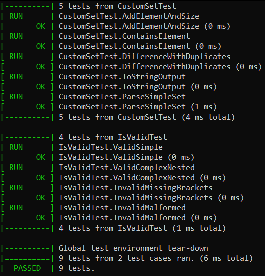

# Лабораторная работа №2. Множества

## Цель работы
- Научиться работать с множествами.
- Научиться разрабатывать алгоритмы выполнения операций над множествами.

## Задачи
- Разработать алгоритм одной из операций над множествами.
- Разработать систему тестов, которые продемонстрировали бы работоспособность реализованного алгоритма.
## Вариант
Мой вариант – вариант 13 [методички](https://drive.google.com/drive/folders/1_xy849HXgTDetxSMlFd0KikTBo8-xalN). Нужно реализовать программу, формирующую множество равное разности двух исходных множеств (с учётом кратных вхождений элементов).
## Определения
- Множество - это совокупность (набор, собрание, семейство, …) некоторых объектов, объединенных по какому-то признаку.
- Элементы множества - это объекты, которые образуют множество, называют элементами множества.
- Разность множеств - это множество, состоящее в точности из тех эле- ментов, которые принадлежат множеству A, но не принадлежат множеству B (Обозначение A \ B).
- Кратное вхождение элементов - это повторное появление одного и того же элемента в некотором множестве или последовательности.
## Реализация
### Контейнеры хранения данных
Для хранения элементов был использован псевдоним типа на основе std::variant:, который может содержать в себе несколько вариантов типов данных:
```C++
using SetElement = std::variant<
    int,
    std::string,
    std::vector<int>,
    std::unordered_set<std::string>
>;
```
### Пользовательские функции
#### Реализация решения задачи
Функция, реализующая решение поставленной задачи посредством вспомогательных:
```C++
void solution(const std::string& filepath, bool isConst) {
    ifstream input(filepath);
    if (!input) {
        cerr << "Не удалось открыть файл: " << filepath << endl;
        return;
    }

    vector<string> lines;
    string line;

    while (getline(input, line)) {
        if (line.find_first_not_of(" \t\r\n") != string::npos) {
            lines.push_back(line);
        }
    }

    if (isConst) {
        if (lines.size() < 2) {
            cerr << "Недостаточно строк в файле для выбора двух разных множеств." << endl;
            return;
        }

        random_device rd;
        mt19937 gen(rd());
        uniform_int_distribution<> dis(0, static_cast<int>(lines.size() - 1));

        int idx1 = dis(gen);
        int idx2;
        do {
            idx2 = dis(gen);
        } while (idx2 == idx1);

        try {
            CustomSet set1 = CustomSet::parseFromString(lines[idx1]);
            CustomSet set2 = CustomSet::parseFromString(lines[idx2]);

            cout << "Выбранные множества из файла:\n\n";
            cout << "\tПервое множество (строка " << idx1 + 1 << "): " << set1.toString() << endl;
            cout << "\tВторое множество (строка " << idx2 + 1 << "): " << set2.toString() << endl;

            CustomSet diff = set1.difference(set2);
            cout << "\tРазность множеств: " << diff.toString() << endl;
        }
        catch (const std::exception& e) {
            cerr << "Ошибка при разборе множеств: " << e.what() << endl;
        }

    }
    else {
        if (lines.size() < 2) {
            cerr << "Файл должен содержать как минимум две непустые строки." << endl;
            return;
        }

        const std::string& line1 = lines[0];
        const std::string& line2 = lines[1];

        if (!isValid(line1) || !isValid(line2)) {
            cerr << "Ошибка: один или оба множества содержат недопустимые элементы.\n";
            cerr << "Формат должен быть: {числа, <1, 2>, {1, 2}}, без вложенных структур.\n\n";
            return;
        }

        try {
            CustomSet set1 = CustomSet::parseFromString(line1);
            CustomSet set2 = CustomSet::parseFromString(line2);

            cout << "Множества, указанные пользователем:\n\n";
            cout << "\tПервое множество: " << set1.toString() << endl;
            cout << "\tВторое множество: " << set2.toString() << endl;
            

            CustomSet diff = set1.difference(set2);
            cout << "\tРазность множеств: " << diff.toString() << endl;
        }
        catch (const std::exception& e) {
            cerr << "Ошибка при разборе множеств: " << e.what() << endl;
        }
    }
}
```
В данном случае я рассматриваю два варианта работы с множествами:

1) Выборка 2-х множеств из файла с заранее заготовленными множествами (файл input_const.txt)
2) Работы с двумя пользовательскими множествами (файл input_user.txt)
#### Добавление, поиск и размерность
Данный блок функция отвечает за задачи, указанные в заголовке:
```C++
void CustomSet::addElement(const SetElement& element) {
    elements.push_back(element);
}

bool CustomSet::contains(const SetElement& element) const {
    return find(elements.begin(), elements.end(), element) != elements.end();
}

size_t CustomSet::size() const {
    return elements.size();
}
```
#### Разность множеств
Данная функция отвечает за реализация разности множеств:
```C++
CustomSet CustomSet::difference(const CustomSet& other) const {
    CustomSet result;
    unordered_map<string, int> countMap;

    for (const auto& elem : elements) {
        countMap[elementToString(elem)]++;
    }

    for (const auto& elem : other.elements) {
        string key = elementToString(elem);
        if (countMap.find(key) != countMap.end()) {
            countMap[key]--;
            if (countMap[key] == 0) {
                countMap.erase(key);
            }
        }
    }

    for (const auto& elem : elements) {
        string key = elementToString(elem);
        if (countMap.find(key) != countMap.end() && countMap[key] > 0) {
            result.addElement(elem);
            countMap[key]--;
        }
    }

    return result;
}
```
#### Преобразование множества в строку 
Данная функция преобразовывает множество, полученное из файла, в строку:
```C++
string CustomSet::elementToString(const SetElement& element) {
    return std::visit([](auto&& arg) -> std::string {
        using T = decay_t<decltype(arg)>;
        if constexpr (is_same_v<T, int>) {
            return to_string(arg);
        }
        else if constexpr (is_same_v<T, string>) {
            return arg;
        }
        else if constexpr (is_same_v<T, vector<int>>) {
            stringstream ss;
            ss << "<";
            for (size_t i = 0; i < arg.size(); ++i) {
                ss << arg[i];
                if (i != arg.size() - 1) ss << ", ";
            }
            ss << ">";
            return ss.str();
        }
        else if constexpr (is_same_v<T, unordered_set<string>>) {
            vector<string> sorted(arg.begin(), arg.end());
            sort(sorted.begin(), sorted.end());
            stringstream ss;
            ss << "{";
            for (size_t i = 0; i < sorted.size(); ++i) {
                ss << sorted[i];
                if (i != sorted.size() - 1) ss << ", ";
            }
            ss << "}";
            return ss.str();
        }
        return "";
        }, element);
}
```
#### Парсер
Данная функция является парсером строки, содержащей в себе множество:
```C++
CustomSet CustomSet::parseFromString(const string& str) {
    CustomSet result;
    regex element_regex(R"((\{\s*[a-zA-Z_]\w*(\s*,\s*[a-zA-Z_]\w*)*\s*\}|<\s*\d+(\s*,\s*\d+)*\s*>|\d+))");
    sregex_iterator it(str.begin(), str.end(), element_regex);
    sregex_iterator end;

    while (it != end) {
        string token = it->str();
        if (token == "{}") {
            result.addElement(unordered_set<string>());
        }
        else if (token == "<>") {
            result.addElement(vector<int>());
        }
        else if (token[0] == '{') {
            unordered_set<string> inner_set;
            string inner = token.substr(1, token.size() - 2); 
            stringstream ss(inner);
            string item;
            while (getline(ss, item, ',')) {
                item = regex_replace(item, regex(R"(^\s+|\s+$)"), ""); 
                if (!item.empty()) {
                    inner_set.insert(item);
                }
            }
            result.addElement(inner_set);
        }
        else if (token[0] == '<') {
            vector<int> tuple;
            regex num_regex(R"(\d+)");
            sregex_iterator num_it(token.begin(), token.end(), num_regex);
            while (num_it != end) {
                tuple.push_back(stoi(num_it->str()));
                ++num_it;
            }
            result.addElement(tuple);
        }
        else {
            try {
                int num = stoi(token);
                result.addElement(num);
            }
            catch (...) {
                result.addElement(token);
            }
        }
        ++it;
    }

    return result;
}
```
#### Проверка на ввод
Данная функция реализует проверку на корректность введённого множества
посредством регулярных выражений:
```C++
bool isValid(const std::string& str) {
    if (str.empty()) return false;

    std::stack<char> bracketStack;
    bool lastWasComma = false;
    bool expectElement = true;
    int balance = 0;

    for (size_t i = 0; i < str.size(); ++i) {
        char ch = str[i];

        if (ch == '{' || ch == '<') {
            bracketStack.push(ch);
            expectElement = true;
            lastWasComma = false;
        }
        else if (ch == '}' || ch == '>') {
            if (bracketStack.empty()) return false;
            char open = bracketStack.top();
            if ((ch == '}' && open != '{') || (ch == '>' && open != '<'))
                return false;
            bracketStack.pop();
            expectElement = false;
        }
        else if (ch == ',') {
            if (lastWasComma || expectElement) return false;
            lastWasComma = true;
            expectElement = true;
        }
        else if (!isspace(ch)) {
            lastWasComma = false;
            expectElement = false;
        }
    }

    return bracketStack.empty() && !expectElement;
}
```
## Тестирование
Для тестирования функции я использовал GoogleTests.
Код, реализованный для тестирования функции:
```C++
TEST(CustomSetTest, AddElementAndSize) {
    CustomSet set;
    set.addElement(5);
    set.addElement(std::string("abc"));
    EXPECT_EQ(set.size(), 2);
}

TEST(CustomSetTest, ContainsElement) {
    CustomSet set;
    set.addElement(42);
    set.addElement(std::string("xyz"));
    EXPECT_TRUE(set.contains(42));
    EXPECT_FALSE(set.contains(17));
    EXPECT_TRUE(set.contains(std::string("xyz")));
}

TEST(CustomSetTest, DifferenceWithDuplicates) {
    CustomSet set1;
    set1.addElement(1);
    set1.addElement(2);
    set1.addElement(2);
    set1.addElement(3);

    CustomSet set2;
    set2.addElement(2);

    CustomSet diff = set1.difference(set2);
    EXPECT_EQ(diff.size(), 3);
    EXPECT_TRUE(diff.contains(1));
    EXPECT_TRUE(diff.contains(2)); 
    EXPECT_TRUE(diff.contains(3));
}

TEST(CustomSetTest, ToStringOutput) {
    CustomSet set;
    set.addElement(1);
    set.addElement(std::string("abc"));
    set.addElement(std::vector<int>{1, 2});
    set.addElement(std::unordered_set<std::string>{"a", "b"});

    std::string result = set.toString();
    EXPECT_TRUE(result.find("1") != std::string::npos);
    EXPECT_TRUE(result.find("abc") != std::string::npos);
    EXPECT_TRUE(result.find("<1, 2>") != std::string::npos);
    EXPECT_TRUE(result.find("{a, b}") != std::string::npos || result.find("{b, a}") != std::string::npos);
}

TEST(CustomSetTest, ParseSimpleSet) {
    std::string input = "{1, 2, <3, 4>, {a, b}}";
    CustomSet set = CustomSet::parseFromString(input);
    EXPECT_EQ(set.size(), 4);
}

TEST(IsValidTest, ValidSimple) {
    EXPECT_TRUE(isValid("{1, 2, 3}"));
    EXPECT_TRUE(isValid("{1, {2, 3}, <4, 5>}"));
    EXPECT_TRUE(isValid("{{1, 2}, {3, <4>}}"));
    EXPECT_TRUE(isValid("{<1, 2>, {}, 3}"));
}

TEST(IsValidTest, ValidComplexNested) {
    EXPECT_TRUE(isValid("{1, 2, 3, 56, {}, {3, <34, 28>}, {4, 5}, <>, <1, 2>, <8, 9>, 1, 2, 3, 56, {}}"));
    EXPECT_TRUE(isValid("{1, 1, 2, 2, 3, 3, 56, {}, {3, <34, 28>}, {4, 5}, <>, <1, 2>, <8, 9>, 56, {}}"));
}

TEST(IsValidTest, InvalidMissingBrackets) {
    EXPECT_FALSE(isValid("{1, 2, 3"));
    EXPECT_FALSE(isValid("1, 2, 3}"));
    EXPECT_FALSE(isValid("{{1, 2}, {3, 4}")); 
}

TEST(IsValidTest, InvalidMalformed) {
    EXPECT_FALSE(isValid("{<}>"));          
    EXPECT_FALSE(isValid("{1,,2}"));     
}
```
В итоге были протестированы все функции программы и все они успешно прошли 
проверку:

## Выводы
В процессе выполнения лабораторной работы я улучшил свои навыки программирования на языке C++
и научился работать в библиотеке std::variant. Также научился обрабатывать ошибки 
пользовательского ввода