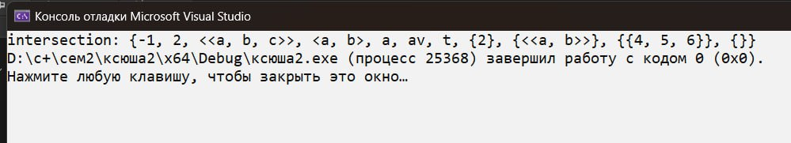
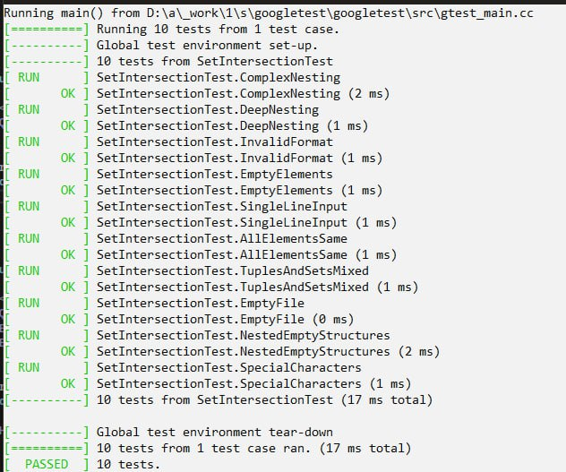

# Лабораторная работа №2

- `Цель` - нахождение пересечения множеств(без учета кратных вхождений)
- `Задача` - реализовать алгоритм пересечения исходных множеств
- `Вариант` - 2

## Список ключевых понятий (определения)

- `Пересечение множеств` - это множество, которому принадлежат те и только те элементы, которые одновременно принадлежат всем данным множествам.

- `Элментом множества` может являться число, кортеж, отдельное множество, сочетание буквы и числа.
- `Множество` - простейшая информационная конструкция и математическая структура,
позволяющая рассматривать какие-то объекты как целое, связывая их.
- `Неориентированное множество` - множество, в ктором порядок элементов не важен.
- `Ориентированное множество` - множество, в ктором порядок элементов важен.
## Пояснение работы

Принцип работы этой программы заключается в том, чтобы все элементы множеств представить в одном единственным виде, а потом поочередно их сравнить.

Суть заключается в том, что перед тем, как сравнить два элемента, являющегося неориентированными множествами, мы их формируем таким образом, что вначале идут все некартежи и неподмножества, затем картежи и вконце подмножества. 

## Основные функции

### `intersectionSets`
Возвращает пересечение двух множеств.

### `differenceSets`
Возвращает разность двух множеств (элементы a, которых нет в b).

### `unionSets`
Возвращает объединение двух множеств

---
*Примечание:*
Все выше перечисленные функции применяются для каждого найденного неориентированного множества в строке.

## Тесты 
1. Возьмем два множества A и B. 
+ A={{2}, a, 2, {<<a,b>>}, t, 5, <a,b>, -1, <<a,b,c>>, av, {{4, 5, 6}}, {} }
+ B={{2}, a, 2, {<<a,b>>}, t, <a,b>, -1, <<a,b,c>>, av, {{5, 4, 6}}, {} }

**Результат выполнения**

**Результат работы тестов**

## Вывод

Реализовала программу, которая выполняет их пересечение и возвращает итоговое пересечение.
