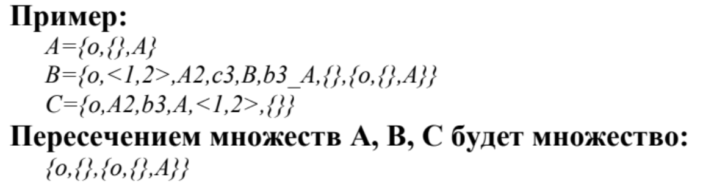

# Лабораторная работа №2

## Цели:
* Изучить основные понятия, связанные  с множествами
* Научиться правильно выполять операции над множествами
* Уметь использовать основные свойства множеств

## Задачи:
* Выполнить свой вариант лабораторной работы 
* Перенести получившееся решение на язык программирования С++

## Вариант 
Для выполнения лабораторной работы мне был выдан вариант **2**. Для работы с множествами буду использовать библиотеки **vector** и **string**

## Множество 

**Множество** – простейшая информационная конструкция и математическая структура,
позволяющая рассматривать какие-то объекты как целое, связывая их. Объекты, связываемые
некоторым множеством, называются элементами этого множества. Если объект связан
некоторым множеством, то говорят, что существует вхождение объекта в это множество, а
объект принадлежит этому множеству.
---

---
### Особенности программы:
* Не учитываются кратные вхождения элементов
* Элементом множества может быть другое уже ранее записаное множество
---

---
### Основные функции: 
1. Преобразование строки, в которую записано множество, в массив строк, каждый элемент которого является отдельным элементом множества 
```
vector<string> getElements(string str) {
	string temp = "";
	int depth = 0;
	int bracket = 0;
	vector<string>elements;
	int i = 0;
	while (str[i] != '{' && str[i] != '<')
		i++;
	i++;
	for (;i < str.length() - 1;i++) {
		if (str[i] == '{') {
			temp += str[i];
			i++;
			depth++;
			while (depth != 0) {
				if (str[i] == '{')
					depth++;
				if (str[i] == '}')
					depth--;
				temp += str[i];
				if (depth == 0)
					break;
				i++;
			}
			elements.push_back(temp);
			temp.clear();
		}
		else if (str[i] == '<') {
			temp += str[i];
			i++;
			bracket++;
			while (bracket != 0) {
				if (str[i] == '<')
					bracket++;
				if (str[i] == '>')
					bracket--;
				temp += str[i];
				if (bracket == 0)
					break;
				i++;
			}
			elements.push_back(temp);
			temp.clear();
		}
		else if (str[i] != ',' || str[i] != ' ') {
			if (depth > 0 || bracket > 0) {
				temp += str[i];
			}
			else if (depth == 0) {
				while (str[i] != ',' && str[i] != ' ' && str[i] != '}' && str[i] != '>' && i < str.length()) {
					temp += str[i];
					i++;
				}
				if (!temp.empty()) {
					elements.push_back(temp);
				}
				temp.clear();
			}
		}
	}
	return elements;
}
```
2. Проверка на уникальность элемента в множестве
```
bool uniqueElement(vector <string> elements, string temp) {
	bool unique = true;
	bool check = false;
	for (int i = 0;i < elements.size();i++) {
		if (elements[i][0] == '{' && temp[0] == '{') {
			check = equivalentSet(elements[i], temp);
		}
		else if (elements[i][0] == '<' && temp[0] == '<') {
			check = equivalenTuple(elements[i], temp);
		}
		else if (temp == elements[i])
			unique = false;
		if (!unique || check)
			break;
	}
	if (unique && !check)
		return true;
	else return false;
}
```
3. Проверка на эквивалентность множеств
```
bool equivalentSet(string str1, string str2) {
	if (str1 == "{}" && str2 == "{}")
		return true;
	if (str1 == "{}" || str2 == "{}")
		return false;
	vector<string> temp1 = getElements(str1);
	vector<string> temp2 = getElements(str2);
	if (temp1.size() != temp2.size())
		return false;
	for (int i = 0;i < temp1.size();i++) {
		bool check1 = false;
		for (int j = 0;j < temp2.size();j++) {
			check1 = true;
			if (temp1[i][0] == '{' && temp2[j][0] == '{') {
				check1 = equivalentSet(temp1[i], temp2[j]);
				if (check1) {
					temp1.erase(temp1.begin() + i);
					temp2.erase(temp2.begin() + j);
					i--;j--;
				}
			}
			else if (temp1[i][0] == '<' && temp2[j][0] == '<') {
				check1 = equivalenTuple(temp1[i], temp2[j]);
				if (check1) {
					temp1.erase(temp1.begin() + i);
					temp2.erase(temp2.begin() + j);
					i--;j--;
				}
			}
			else {
				if (temp1[i].length() != temp2[j].length()) {
					check1 = false;
					continue;
				}
				for (int k = 0;k < temp1[i].length();k++) {
					if (temp1[i][k] != temp2[j][k]) {
						check1 = false;
						break;
					}
				}
				if (check1) {
					temp1.erase(temp1.begin() + i);
					temp2.erase(temp2.begin() + j);
					i--;j--;
				}
			}
			if (check1)
				break;
		}
		if (!check1)
			return false;
	}
	return true;
}
```
4. Проверка на эквивалентность ориентированных множеств
```
bool equivalenTuple(string str1, string str2) {
	if (str1 == "<>" && str2 == "<>")
		return true;
	if (str1 == "<>" || str2 == "<>")
		return false;

	vector<string> temp1 = getElements(str1);
	vector<string> temp2 = getElements(str2);

	if (temp1.size() != temp2.size())
		return false;

	for (int i = 0;i < temp1.size();i++) {
		bool check1 = true;
		if (temp1[i][0] == '{' && temp2[i][0] == '{') {
			check1 = equivalentSet(temp1[i], temp2[i]);
		}
		else if (temp1[i][0] == '<' && temp2[i][0] == '<') {
			check1 = equivalenTuple(temp1[i], temp2[i]);
		}
		else {
			if (temp1[i].length() != temp2[i].length()) {
				check1 = false;
				continue;
			}
			for (int k = 0;k < temp1[i].length();k++) {
				if (temp1[i][k] != temp2[i][k]) {
					check1 = false;
					break;
				}
			}
		}
		if (!check1)
			return false;
	}
	return true;
}
```
### Пример работы программы:
---


#### Вывод:

Во время выполнения рассчетной работы проделал вот такую работу:
1. Повторил основные понятия теории множеств
2. Изучил основные операции над множествами
3. Реализовал пересечение n-ого количества множеств в виде программы на языке С+
