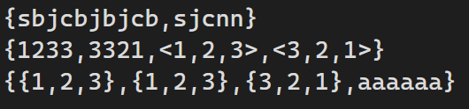
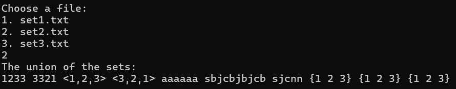

# Лабораторная работа №2
## Условие задания (вариант 10)
Реализовать программу, формирующую множество равное объединению произвольного количества исходных множеств (с учётом кратных вхождений элементов).

**Цель:** Создать множество, которое будет содержать все элементы из всех исходных множеств, включая повторяющиеся элементы.

**Задача:** Принять произвольное количество исходных множеств.Объединить все исходные множества в одно множество, учитывая кратные вхождения элементов. Вывести полученное множество на экран.

----

# Список понятий:

`Множество` – простейшая информационная конструкция и математическая структура, позволяющая рассматривать какие-то объекты как целое, связывая их.
Объекты, связываемые некоторым множеством, называются `элементами` этого множества.

`Объединением` неориентированных множеств A и B `с учётом кратных вхождений` элементов будем называть неориентированное множество S тогда и только тогда, когда для любого x истинно S|x| = max{A|x|, B|x|}.

# Алгоритм

### 1. Главная функция (main)
   - Выводит меню выбора файла (set1.txt, set2.txt, set3.txt).
   - Считывает выбор пользователя.
   - Вызывает функцию оpen_and_sets() - чтение и парсинг файла.
   - Вызывает функцию set_element_count() - подсчет элементов.
   - Вызывает функцию final_set_count() - объединение результатов.
   - Вызывает функцию output() - вывод итоговых данных.

### 2. Функция split_elements()
   - Инициализация пустого вектора результатов и буфера.
   - Посимвольная обработка.
   - При обнаружении < - активирует режим "внутри угловых скобок".
   - При обнаружении > - деактивирует режим и сохраняет элемент.
   - Запятые вне угловых скобок - разделители элементов.
   - Пробелы игнорируются.
   - Добавление последнего накопленного элемента.
   - Возврат вектора элементов.

### 3. Функция process_line()
   - Инициализация стека для хранения уровней вложенности.
   - Посимвольная обработка.
   - { - создает новый уровень вложенности.
   - } - завершает текущий уровень, форматирует содержимое.
   - <...> - обрабатывает как единый элемент.
   - Рекурсивная обработка вложенных структур.
   - Возврат элементов верхнего уровня

### 4. Функция open_and_sets()
   - Открытие файла, проверка успешности.
   - Построчное чтение.
   - Удаление внешних фигурных скобок.
   - Пропуск пустых строк.
   - Обработка каждой строки через process_line().
   - Сохранение результатов в вектор множеств.
   - Закрытие файла.

### 5. Функция set_element_count()
   - Создание вектора для результатов.
   - Обработка каждого множества.
   - Создание словаря для подсчета.
   - Подсчет встречаемости каждого элемента.
   - Преобразование результатов в пары (элемент-количество).
   - Возврат вектора результатов.

### 6. Функция final_set_count()
   - Создание словаря для максимальных значений.
   - Обработка каждого множестваб, обновление максимальных количеств для элементов.
   - Преобразование в отсортированный вектор.
   - Возврат итоговых данных.

### 7. Функция output()
   - Вывод заголовка.
   - Вывод каждого элемента N раз (согласно его количеству).
  
# Тестирование работы программы с помощью GTests

## Описание каждого теста

### Тест SplitElementsTest (BasicSplit)
- **Описание**: Этот тест проверяет корректность разбора простых элементов.
- **Ожидаемый результат**: Набор элементов: "a", "b", "с".
- **Проверка**: Проверяется, что количество считанных элементов строки соответствует ожидаемому количеству, и каждый считанный элемент совпадает с ожидаемым.

### Тест SplitElementsTest (AngleBrackets)
- **Описание**: Этот тест проверяет обработку случая, когда строка содержит угловые скобки.
- **Ожидаемый результат**: Набор элементов: "a", "<b, c>", "d".
- **Проверка**: Проверяется, что количество считанных элементов строки соответствует ожидаемому количеству и присутствие правильно обработанных угловых скобок.

### Тест SplitElementsTest (EmptyString)
- **Описание**: Этот тест проверяет обработку случая, когда строка пустая.
- **Ожидаемый результат**: В результате ничего не добавляется.
- **Проверка**: Проверяется, что результат пуст.

### Тест ProcessLineTest (SimpleSet)
- **Описание**: Этот тест проверяет добавление элементов строки в вектор result.
- **Ожидаемый результат**: Набор элементов вектора result: "a", "b", "с".
- **Проверка**: Проверяется, что вектор result содержит ожидаемые элементы.

### Тест ProcessLineTest (NestedSet)
- **Описание**: Этот тест проверяет парсинг вложенных множеств.
- **Ожидаемый результат**: Набор элементов: "a", "{b, c}".
Пары (элемент, максимальная кратность вхождения): {"a", 1}, {"b", 2}, {"c", 1}.
- **Проверка**: Проверяется, что вектор result содержит ожидаемые элементы, и происходит правильный парсинг вложенных множеств.

### Тест SetElementCountTest (BasicCount)
- **Описание**: Этот тест проверяет подсчет повторяющихся элементов множества.
- **Ожидаемый результат**: Пары (элемент, кратность вхождения): {"a", 2}, {"b", 1}.
- **Проверка**: Проверяется, что результат подсчета кратных элементов соответствует ожидаемому.

### Тест FileInputTest (ReadsCorrectly)
- **Описание**: Этот тест проверяет правильность считывания множеств с файла.
- **Ожидаемый результат**: Наборы элементов: {"a", "b"}, {"с", "d"}.
- **Проверка**: Проверяется, что количество считанных наборов строки соответствует ожидаемому количеству, и каждый набор содержит ожидаемые элементы.

# Результаты тестирования

Приведем пример выполнения программы для файла set2.txt.

# Источники
[Написание GTests](https://habr.com/ru/articles/667880/)

[Использование библиотеки STL vector](https://learn.microsoft.com/ru-ru/cpp/standard-library/vector-class?view=msvc-170)

[Использование библиотеки STL pair](https://informatics.msk.ru/mod/book/view.php?id=492&chapterid=206)

# Вывод
Реализовал в C++ программу для нахождения объединения множеств.