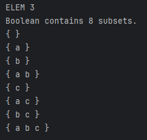

# Лабораторная рабоат №2
***
## Цель:
Изучить основы работы с множествами и основы теории множеств.
***
## Задача: 
**Реализовать программу, формирующую множество равное булеану исходного множества**

**Изучить основы теории множеств**
***
## Основные понятия
1. Булеан - это множество неориентированного множества A, которое является множеством без кратных
   вхождений элементов, называют неориентированное множество S тогда и только тогда, когда
   для любого x истинно S|x| < 2 и ((S|x|=1) &hArr; (x &sube; A)).
2. Множество - одно из ключевых понятий математики, представляющее собой набор, совокупность каких-либо (вообще говоря любых) объектов — элементов этого множества
3. Элемент множества - Объекты, из которых состоит множество, называют элементами множества или точками множества.
***
## Описание используемых алгоритмов
Код разбит на три файла **[main.cpp](https://github.com/iis-42x70x/RPIIS/blob/%D0%91%D0%B8%D0%B1%D0%BA%D0%BE_%D0%92/sem2/lab2/code/main.cpp)** **[boolean.cpp](https://github.com/iis-42x70x/RPIIS/blob/%D0%91%D0%B8%D0%B1%D0%BA%D0%BE_%D0%92/sem2/lab2/code/boolean.cpp)** **[boolean.h](https://github.com/iis-42x70x/RPIIS/blob/%D0%91%D0%B8%D0%B1%D0%BA%D0%BE_%D0%92/sem2/lab2/code/boolean.h)**
разберем каждый.

### ***Файл **[boolean.h](https://github.com/iis-42x70x/RPIIS/blob/%D0%91%D0%B8%D0%B1%D0%BA%D0%BE_%D0%92/sem2/lab2/code/boolean.h)**:***
1. **Основные библиотеки:**
```cpp
#include <vector>    // для работы с динамическими массивами (vector).
#include <fstream>   // для чтения и записи файлов (instream, ofstream).
#include <iostream>  // для ввода и вывода в консоль(cin, cout).
#include <cstring>   // для работы со строками (strlen, strncpy).
using namespace std; // пространство имен.
```
2. **Структура класса** 
```cpp
class boolean {
private:
  static const int max_length = 100;  // Максимальная длина одного элемента
  static const int max_element = 100; // Максимальное количество элементов
  char inputSet[max_element][max_length]; // Массив для хранения элементов
  int elementCount; // Текущее количество элементов
  vector<vector<int>> powerSet; // Вектор подмножеств (булеан)
  bool checkelement(const char* element); // Проверка корректности элемента
public:
  boolean(); // Конструктор
  bool readInputFromFile(const char* filename); // Чтение данных из файла
  void generateBoolean(); // Генерация булеана
  void printResult() const; // Вывод результата в консоль
  bool writeOutputFile(const char* filename) const; // Запись результата в файл
};
```
### ***Файл **[boolean.cpp](https://github.com/iis-42x70x/RPIIS/blob/%D0%91%D0%B8%D0%B1%D0%BA%D0%BE_%D0%92/sem2/lab2/code/boolean.cpp)*****
1. **Конструктор boolean** 
```cpp
boolean :: boolean() : elementCount(0){
  for(int i = 0; i < max_element; i++){
    inputSet[i][0] = '\0'; // Заполняем массив пустыми строками
  }
}
```
2. **Функция проверки элементов**
```cpp
bool boolean :: checkelement(const char* element){
  if(element[0] == '\0'){                             // Проверка на пустоту
    cout << "Error! Empty element on data!" << endl;
    return false;
  }
  if(strlen(element) > max_length){ // В данном случае мы сипользуем strlen для проверки превышения длинны                   
    cout << "Error: Maximum length exceeded!" << endl;
    return false;
  }
  return true;
}
```
3. **Функция для проверки содержания мнножества(проверка на { } и < >)**
```cpp
void boolean::extractElements(const char* input) {
    char temp[max_length];
    strncpy(temp, input, max_length - 1);
    temp[max_length - 1] = '\0';

    int braceLevel = 0;
    int angleBracketLevel = 0;
    int startPos = 0;
    bool inElement = false;

    for (int i = 0; temp[i] != '\0' && elementCount < max_element; i++) {
        if (temp[i] == '{') {
            braceLevel++;
            if (braceLevel == 1 && angleBracketLevel == 0) {
                startPos = i;
                inElement = true;
            }
        }
        else if (temp[i] == '}') {
            braceLevel--;
            if (braceLevel == 0 && angleBracketLevel == 0 && inElement) {
                strncpy(inputSet[elementCount], temp + startPos, i - startPos + 1);
                inputSet[elementCount][i - startPos + 1] = '\0';
                elementCount++;
                inElement = false;
            }
        }
        else if (temp[i] == '<') {
            angleBracketLevel++;
            if (angleBracketLevel == 1 && braceLevel == 0) {
                startPos = i;
                inElement = true;
            }
        }
        else if (temp[i] == '>') {
            angleBracketLevel--;
            if (angleBracketLevel == 0 && braceLevel == 0 && inElement) {
                strncpy(inputSet[elementCount], temp + startPos, i - startPos + 1);
                inputSet[elementCount][i - startPos + 1] = '\0';
                elementCount++;
                inElement = false;
            }
        }
        else if (temp[i] == ',' && braceLevel == 0 && angleBracketLevel == 0) {
            continue;
        }
        else if (braceLevel == 0 && angleBracketLevel == 0 && !inElement && temp[i] != ' ') {
            startPos = i;
            while (temp[i] != '\0' && temp[i] != ',' && temp[i] != ' ' &&
                   temp[i] != '{' && temp[i] != '<') {
                i++;
            }
            strncpy(inputSet[elementCount], temp + startPos, i - startPos);
            inputSet[elementCount][i - startPos] = '\0';
            elementCount++;
            if (temp[i] == '\0') break;
            i--; // компенсируем инкремент в цикле for
        }
    }
}
```
4. **Функция чтения из файла**
```cpp
bool boolean :: readInputFromFile(const char* filename){
  ifstream inputFile(filename); // Используем ifstream для чтения однобайтовых символов.
  if(!inputFile.is_open()){     // Проверка на открытие
    cout << "Error! Can't open file!" << filename << endl;
    return false;
  }
  char element[max_length];
  elementCount = 0; // ВАЖНО, используем тут член класса, а не локальную переменную

  while (inputFile >> element && elementCount < max_element){ // Считываем элементы до конца файла или до максимального количества
    if(!checkelement(element)){
      inputFile.close();
      return false;
    }
    strncpy(inputSet[elementCount], element, max_element - 1);
    inputSet[elementCount][max_length - 1] = '\0'; // Гарантируем корректное завершение строки
    elementCount++;
  }
  inputFile.close(); // Закрытие файла
  return true;
}
```
5. **Генерация булеана**
```cpp
void boolean :: generateBoolean(){
  powerSet.clear();
  if (elementCount == 0) {  // Если элементов нет
    cout << "NON DATA" << endl;
    return;
  }
  int totalSubSets = 1 << elementCount;
  for(int i = 0; i < totalSubSets; i++){
    vector<int> indexSubSets;
    for(int j = 0; j < elementCount; j++){
      if(i & (1 << j)){
        indexSubSets.push_back(j);
      }
    }
    powerSet.push_back(indexSubSets);
  }
}
```
Здесь из интересного можно выделить побитовую операцию ***int totalSubSets = 1 << elementCount;***
в данной строке можно выделить побитовую операцию **"<<"** в данной строке она эквивалентна возведению в степень
*1 << n* == *2^n*, после в цикле **for** мы проходимся от 0 до количества всех вохможных битовых значений. В качестве примера
можно взять **n = 3** тогда то количество множеств в булеане будет равно 2^3 = 8. После мы перебираем все возможные биты
i = 0 - 7(000,001,...,111). И исходя их этого будет выводиться множество всех подмножеств, то есть булеан.

6. **Функция для вывода результата(в консоль)**
```cpp
void boolean :: printResult() const{
  cout << "ELEM " << elementCount << endl; // Количество элементов
  cout << "Boolean contains " << powerSet.size() << " subsets." << endl; // Количество подмножеств
  for(size_t i = 0; i < powerSet.size(); i++){
    const vector<int>& indexSubSets = powerSet[i];
    cout << "{ ";
    for (size_t j = 0; j < indexSubSets.size(); j++){
      cout << inputSet[indexSubSets[j]] << " "; // Выводит содержимое каждого множества
    }
    cout << "}" << endl;
  }
}
```
7. **Функция для записи в файл**
```cpp
bool boolean :: writeOutputFile(const char* filename) const{
  ofstream outputFile(filename); // ofstream используется для записи данных в файл
  if(!outputFile.is_open()){
    cout << "Error: Can't create file!" << filename << endl;
    return false;
  }

  outputFile << powerSet.size() << endl; // Количество подмножеств
  for(size_t i = 0; i < powerSet.size(); i++){
    const vector<int>& indexSubSets = powerSet[i];
    for (size_t j = 0; j < indexSubSets.size(); j++){
      int Index = indexSubSets[j];
      outputFile << inputSet[indexSubSets[j]] << " "; // Для каждого подмножества элементы записываются через пробел
    }
    outputFile << endl;
  }
  outputFile.close(); // Закрытие файла
  return true;
}
```
### ***Файл **[main.cpp](https://github.com/iis-42x70x/RPIIS/blob/%D0%91%D0%B8%D0%B1%D0%BA%D0%BE_%D0%92/sem2/lab2/code/main.cpp)*****
```cpp
#include "boolean.h"

int main() {
    boolean generator; // Создаем объект класса boolean
    if (!generator.readInputFromFile("input.txt")) {
        cout << "Error reading input file" << endl;
        return 1;
    }

    //cout << "Loaded " << generator.elementCount << " elements" << endl; // Проверка на запись элементов

    generator.generateBoolean(); // Генератор булеана
    generator.printResult(); // Вывод в консоль

    if (!generator.writeOutputFile("output.txt")) {
        cout << "Error writing output file" << endl; // Запись в файл
        return 1;
    }
    return 0;
}
```
## Примеры работы программы:
1. Нужно задать множество в ***input.txt***


2. После в консоли вы сможете увидеть результат выполнения вашего кода:



3. Так же будет записана информация согласно коду в ***output.txt***


## Вывод:
В результате выполнения данной работы были получены следующие практические навыки:
Работа с множествами, написание библиотеки для работы с ними, а именно для создания булеана!

