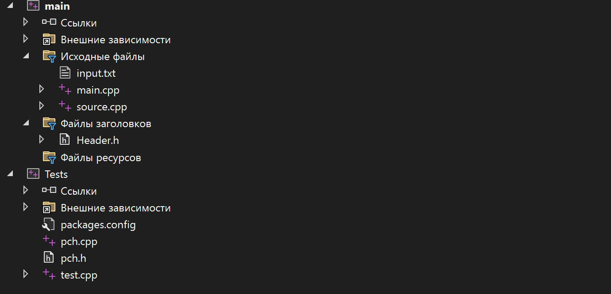
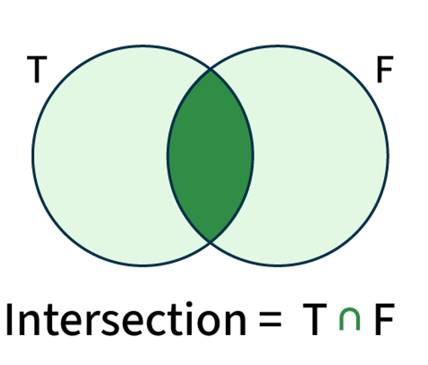
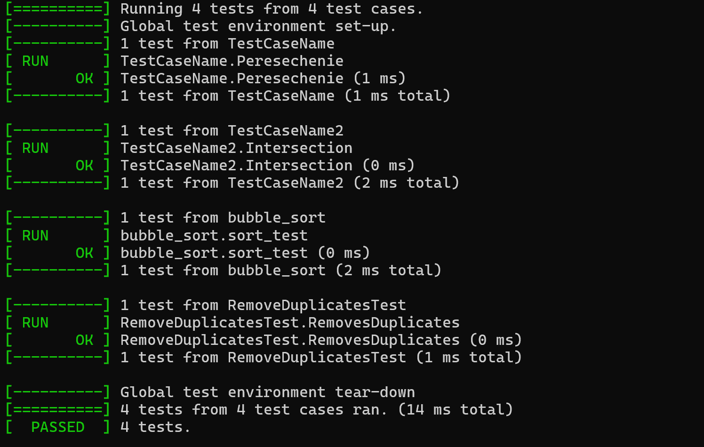

<h1>Лабораторная работа №2</h1>


## Цели:
* Изучить основные понятия, связанные  с множествами
* Научиться правильно выполять операции над множествами
* Уметь использовать основные свойства множеств

## Задачи:
* Выполнить свой вариант лабораторной работы 
* Перенести получившееся решение на язык программирования С++


 ## Вариант 
Для выполнения лабораторной работы мне был выдан вариант **2**. Для работы с множествами буду использовать библиотеки  **vector** и **string**

## Структура проекта
<p align="center"></p>

## Множество 

**Множество** – простейшая информационная конструкция и математическая структура,
позволяющая рассматривать какие-то объекты как целое, связывая их. Объекты, связываемые
некоторым множеством, называются элементами этого множества. Если объект связан
некоторым множеством, то говорят, что существует вхождение объекта в это множество, а
объект принадлежит этому множеству.

<p align="center"></p>

<p></p>
Данная программа рассчитана на то, что множество может быть элементом множества
<p></p>

<p align="center"></p>

Основные части программы:

**1)** Сортировка
```C++
void bubble_sort(vector<string>& elements) {
    for (size_t i = 0; i < elements.size(); i++) {
        for (size_t j = 0; j < elements.size() - 1 - i; j++) {
            if (!compare_strings(elements[j], elements[j + 1])) {
                string temp = elements[j];
                elements[j] = elements[j + 1];
                elements[j + 1] = temp;
            }
        }
    }
}
```
**2)** Удаление повторяющихся элементов

```C++
void remove_duplicates(vector<string>& elements) {
    if (elements.empty()) return;
    vector <string> unique;
    for (int i = 0; i < elements.size(); i++) {
        bool flag = false;
        for (int j = 0; j < unique.size(); j++) {
            if (elements[i] == unique[j]) {
                flag = true;
                break;
            }
        }
        if (!flag) {
            unique.push_back(elements[i]);
        }
    }
    elements = unique;
}

```

**3)** Формирование множеств и разбиение
```C++
vector<string> get_elements(string& set) {
    vector<string> elements;
    string current;
    int bracket_count = 0;
    int bracket_count_treug = 0;

    for (int i = 1; i < set.length() - 1; i++) {
        char c = set[i];

        if (c == bracket1) {
            bracket_count++;
            current += c;
        }
        else if (c == bracket2) {
            bracket_count--;
            current += c;
            if (bracket_count == 0 && bracket_count_treug == 0) {
                elements.push_back(current);
                current.clear();
            }
        }
        else if (c == bracket3) {
            bracket_count_treug++;
            current += c;
        }
        else if (c == bracket4) {
            bracket_count_treug--;
            current += c;
            if (bracket_count == 0 && bracket_count_treug == 0) {
                elements.push_back(current);
                current.clear();
            }
        }
        else if ((c == ',' || c == ' ') && bracket_count == 0 && bracket_count_treug == 0) {
            if (!current.empty()) {
                elements.push_back(current);
                current.clear();
            }

        }
        else {
            current += c;
        }
    }

    if (!current.empty()) {
        elements.push_back(current);
    }

    return elements;
}

string sort_set(string& str) {
    if (is_tupple(str)) {
        vector<string> elements = get_elements(str);
        for (auto& element : elements) {
            if (is_set(element) || is_tupple(element)) {
                element = sort_set(element);
            }
        }
        string result = "<";
        for (size_t i = 0; i < elements.size(); i++) {
            if (i > 0) result += ",";
            result += elements[i];
        }
        result += ">";
        return result;
    }

    if (is_set(str)) {
        vector<string> elements = get_elements(str);
        for (auto& element : elements) {
            if (is_set(element) || is_tupple(element)) {
                element = sort_set(element);
            }
        }
        bubble_sort(elements);
        remove_duplicates(elements);
        string result = "{";
        for (size_t i = 0; i < elements.size(); i++) {
            if (i > 0) result += ",";
            result += elements[i];
        }
        result += "}";
        return result;
    }

    return str;
}
```


## Тестирование

**Использование  Google test**

Пример тестирования сортировки
<p></p>


### Код для тестирования функции сортировки ###

```C++
TEST(RemoveDuplicatesTest, RemovesDuplicates) {
	std::vector<std::string> test_unique = {
		"a","b","d","c","s","d","e","d","a","s","d","f","s","d","s","g"
	};

	remove_duplicates(test_unique);


	EXPECT_EQ(test_unique.size(), 8);

	EXPECT_EQ(test_unique[0], "a");
	EXPECT_EQ(test_unique[1], "b");
	EXPECT_EQ(test_unique[2], "d");
	EXPECT_EQ(test_unique[3], "c");
	EXPECT_EQ(test_unique[4], "s");
	EXPECT_EQ(test_unique[5], "e");
	EXPECT_EQ(test_unique[6], "f");
	EXPECT_EQ(test_unique[7], "g");


	std::vector<std::string> expected = { "a", "b", "d", "c", "s", "e", "f", "g" };
	EXPECT_EQ(test_unique, expected);
}
```

### Результат выполнения всех сортировок ###

<p></p>



 ### **Тесты в консоли** ###
 <p></p>
 <p align="center"></p>

 ## Вывод:

Во время выполнения рассчетной работы проделал вот такую работу:
**1)** Повторил основные понятия теории множеств;
**2)** Изучил основные операции над множествами; 
**3** Реализовал пересечение n-ого количества множеств в виде программы на языке С++;


## Используемые  источники

### Свободная энциклопедия "Википедия" [Электронный ресурс]-Режим доступа

* https://ru.m.wikipedia.org/wiki/


### Google Disk 
* https://drive.google.com/drive/folders/1_xy849HXgTDetxSMlFd0KikTBo8-xalN

