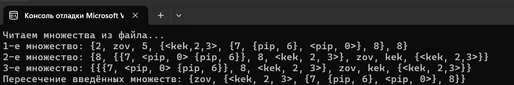

# Лабораторная работа №2

## Цель работы:  
* Исследовать свойства структуры данных “множество” и разработать библиотеку для выполнения операции над множеством
* Разработать тестовую программу и систему тестов, демонстрирующие работоспособность реализованной библиотеки работы со структурой данных.
* Разработать программу, выполняющую основные операций над множествами, на языке программирования (C++).

## Задание:
Реализовать программу, формирующую множество равное пересечению произвольного количества исходных множеств (без учёта кратных вхождений элементов).

## Ключевые понятия:
Множество – простейшая информационная конструкция и математическая структура,
позволяющая рассматривать какие-то объекты как целое, связывая их. Объекты, связываемые
некоторым множеством, называются элементами этого множества. Если объект связан
некоторым множеством, то говорят, что существует вхождение объекта в это множество, а
объект принадлежит этому множеству. Допускается неограниченное количество вхождений
одного объекта в какое-либо множество. Допускаются множества, каждое из которых имеет
только одно вхождение какого-либо единственного элемента этого множества, а также
допускается множество, не имеющее вхождений, – пустое множество. Среди множеств
выделяют ориентированные множества и неориентированные множества. Множество может
быть задано с помощью механизма, процедуры. Если некоторая процедура даёт ответ для
любого объекта: является он или нет элементом некоторого множества, то такая процедура
называется разрешающей процедурой для такого множества. Если же некоторая процедура
позволяет получить любой новый элемент некоторого множества, отличный от известных
или выданных ранее элементов этого множества, то такая процедура называется
порождающей процедурой для такого множества. 

Неориентированное множество можно представить, например, в следующем виде
S = {a, b, a, a, c}, а ориентированное множество – S = <a, b, a, c>. Два
ориентированных множества равны тогда и только тогда, когда все их элементы входят в
одинаковом порядке. Для неориентированных множеств порядок же не важен.

Пересечением неориентированных множеств A и B без учёта кратных вхождений элементов будем называть неориентированное множество S тогда и только тогда, когда для любого x истинно S|x| = min{A|x|, B|x|, 1}.

## Тип данных element
Программа использует структуру element, которая может представлять один из двух видов данных:
* Это структура, представляющая элемент множества. У элемента есть:
* Тип (ElementType): строка (STRING), множество (SET) или ориентированное множество (ORSET).
* Значение строки (value), если элемент является строкой.
* Подмножество (setik), если элемент является множеством или ориентированным множеством.

## Основные функции:
### Функции проверки символов
* space: проверяется, является ли символ пробельным (пробел, перевод строки, табуляция и т.п.).
* digit: проверяет, является ли символ цифрой.
  letter: проверяет, является ли символ латинской буквой (регистр не важен).
### Функция ElementCompare
Сравнивает два элемента структурно:
Если элементы имеют разные типы, возвращает false.
Если типы одинаковы:
Для типа переменная/число сравниваются значения строк.
Для типов множеств сравниваются вложенные элементы рекурсивно. Для неорентированного проверяется равенство элементов в произвольном порядке, а для ориентированного — в заданной последовательности. Возвращает: true, если элементы идентичны, и false в противном случае.
## ElementCompare
Сравнивает два элемента на структурное равенство:
- Проверяет совпадение типов (элементы, множества или ориентированные множества).
- Для элементов сравнивает строковые значения.
- Для множества проверяет наличие и совпадение всех элементов, без учёта порядка.
- Для ориентированных множеств сравнивает элементы строго по порядку.

## intersection
Вычисляет пересечение двух объектов (множества или ориентированного множества):
- Для множества включает все элементы, которые присутствуют в обоих множествах.
- Для ориентированного множества включает элементы с одинаковыми индексами, если они структурно равны.

## ElementCout
Выводит объект (элемент, множество или ориентированное множество) на консоль:
- Для элемента выводит строковое значение.
- Для множества элементы заключаются в фигурные скобки `{}` и разделяются запятыми.
- Для ориентированного множества элементы заключаются в угловые скобки `< >` и также разделяются запятыми.

## StringToElement
Разбирает строку, представляющую множество или ориентированное множество, и преобразует её в структуру объекта:
- Определяет тип объекта (множество или ориентированное множество) по начальной скобке `{` или `<`.
- Извлекает вложенные элементы, которые могут быть строками, числами, множествами или ориентированными множествами.
- Рекурсивно обрабатывает вложенные множества и ориентированные множества.

## SetUniqueCheck
Проверяет, являются ли все элементы множества уникальными:
- Для множества сравнивает элементы друг с другом, чтобы исключить дублирование.
- Для ориентированного множества рекурсивно проверяет уникальность во вложенных структурах.

## StringCheck
Проверяет, является ли строка корректным представлением множества или ориентированного множества:
- Проверяет, что строка начинается с `{` или `<` и заканчивается `}` или `>`.
- Удаляет лишние пробелы и проверяет наличие недопустимых символов (например, двойных запятых, пустых имен).
- Проверяет сбалансированность скобок и правильность вложений.

### Ввод данных
* Пользователь вводит количество множеств, а затем сами множества в формате {...} или <...>.
* Программа проверяет ввод на корректность (например, сбалансированные скобки, недопустимые символы).
### Вывод результата
Программа выводит пересечение множеств в соответствующем формате ({...} для обычных множеств, <...> для ориентированных).

## Вывод:
В результате этой работы я изучил ориентированные и неориентированные множества, а также разработал программу в C++, формирующую множество равное пересечению  произвольного количества исходных множеств (без учёта кратных вхождений элементов).

## Литература:
https://drive.google.com/file/d/1j-PsJSuN9RiMik3-pWwBjYyqLicLuCfG/view?usp=drive_link
