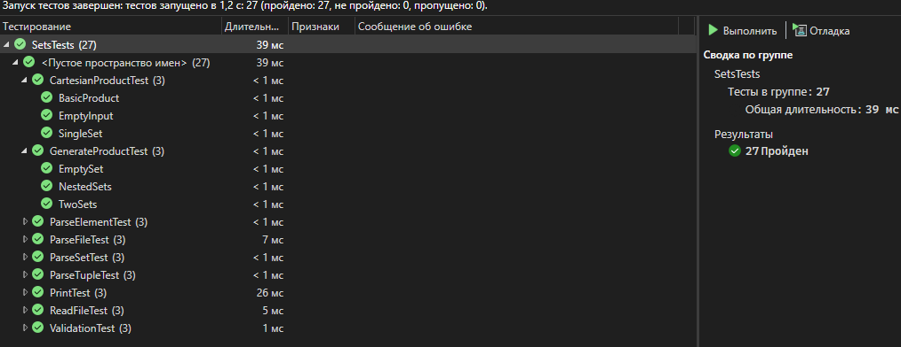
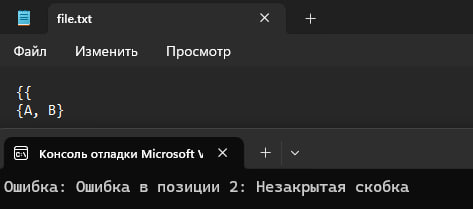
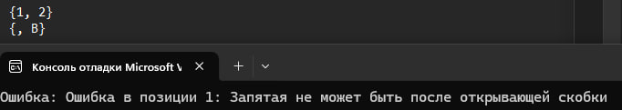
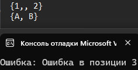
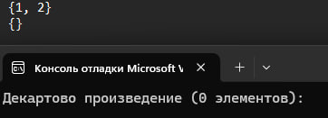
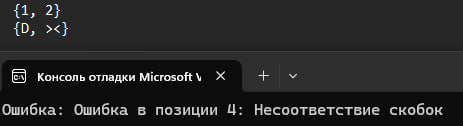

# Лабораторная работа №2. Множества

## Цель работы
- Научиться работать с множествами.
- Научиться разрабатывать алгоритмы выполнения операций над множествами.

## Задачи
- Разработать алгоритм одной из операций над множествами.
- Разработать систему тестов, которые продемонстрировали бы работоспособность реализованного алгоритма.

## Вариант
Мой вариант – вариант 6 [методички](https://drive.google.com/drive/folders/1_xy849HXgTDetxSMlFd0KikTBo8-xalN). Нужно Реализовать программу, формирующую множество равное декартовому произведению произвольного количества исходных множеств.
произвольного количества исходных множеств.
## Список используемых при решении задачи понятий
- Множество – одно из ключевых понятий математики, представляющее собой набор, совокупность объектов любой природы.
- Элементы множества – объекты, составляющие множество.
- Объект принадлежит множеству тогда и только тогда, когда он является его элементом.
- Говорят, что если объект принадлежит множеству, то существует вхождение этого элемента в множество. Допускается неограниченное количество вхождений
одного объекта в какое-либо множество.
- Например, есть множество _S = {a, b, a, a, c}_. В нём элементы _a_, _b_ и _c_ принадлежат множеству _S_, причём множество _S_ имеет три вхождения элемента _a_ (_S|a|_ = 3) и по одному вхождению элементов _b_ и _c_ (_S|b|_ = _S|c|_ = 1).
- Множеством с кратными вхождениями элементов называют множество _S_ тогда и только тогда, когда существует _x_ такой, что истинно _S|x|_ > 1.
- __Декартовое произведение__ множеств _A_, _B_, _.._ — это множество всех возможных упорядоченных кортежей, где каждый элемент кортежа принадлежит соответствующему исходному множеству.

## Реализация

### Контейнеры хранения данных
Поскольку множество может содержать в себе не только обычные элементы, а еще и другие множества, а также кортежи (упорядоченные множества), я создал структуру __Tuple__ – кортеж, по сути _std::vector_ (кортеж также может содержать в себе элементы, множества или другие кортежи).

Для множества в его привычном понимании я создал структуру __Set__, которая по сути является стандартным классом _std::set_.

Для реализации вариативности элементов множеств и кортежей я использовал объявление __SetElement__, которое было создано с помощью _std::variant_. Таким образом, __SetElement__ может быть:
- int-переменной;
- string-строкой из символов;
- указателем на __Set__;
- указателем на __Tuple__;

Далее, код:

```C++
// Элемент множества может быть: числом, строкой, множеством или кортежем
using SetElement = std::variant<
    int,
    string,
    shared_ptr<Set>,
    shared_ptr<Tuple>
>;

// Кортеж (упорядоченные элементы)
struct Tuple {
    std::vector<SetElement> elements;
};

// Множество
struct Set {
    std::set<SetElement> elements;  // Хранит элементы
};
```

### Пользовательские функции

#### Работа с файлами

Для того, чтобы считывать входящие множества я решил использовать файлы формата _".txt"_, пример содержания файла:

```text
{1, {2, 3}, 5}
{A, <B, C>}
{<X, Z>, 7, 8}
...
```
Для того, чтобы считывать текстовую информацию и проверять ее на валидность я использовал следующие функции:

```C++
// Для считывания
string readFile(const std::string& path);
vector<Set> ParseFile(const std::string& path);

// Для проверки
void validateInput(const std::string& input);
```

Код функции __readFile(...)__ и __ParseFile(...)__:

```C++

// Функция для чтения файла
string readFile(const string& path) {
    ifstream file(path);
    if (!file.is_open()) throw runtime_error("Файл не найден!"); // В случае ошибки открытия файла выбрасывает исключение
    stringstream buffer;
    buffer << file.rdbuf();
    return buffer.str();
}

// Функция для парсинга файла
vector<Set> ParseFile(const string& path) {
    string data = readFile(path);
    stringstream ss(data);
    string line;
    vector<Set> sets;

    while (getline(ss, line)) {
        validateInput(line); // Проверка входных данных
        line.erase(remove_if(line.begin(), line.end(), ::isspace), line.end());
        if (!line.empty()) sets.push_back(parseSet(line));
    }
    return sets;
}

// Функция проверки ввода
void validateInput(const std::string& input) {
    std::stack<char> brackets; // Стек для хранения скобок
    bool expectElement = true; // Ожидаем элемент (true) или разделитель (false)
    size_t pos = 0;

    auto throwError = [&](const std::string& msg) {
        throw std::runtime_error("Ошибка в позиции " + std::to_string(pos) + ": " + msg);
        };

    while (pos < input.size()) {
        char c = input[pos];

        // Пропускаем пробелы
        if (std::isspace(c)) {
            pos++;
            continue;
        }

        // Обработка открывающих скобок
        if (c == '{' || c == '<') {
            brackets.push(c);
            expectElement = true; // После скобки может быть элемент или закрывающая скобка
            pos++;
            continue;
        }

        // Обработка закрывающих скобок
        if (c == '}' || c == '>') {
            if (brackets.empty()) throwError("Лишняя закрывающая скобка");
            char expected = (c == '}') ? '{' : '<';
            if (brackets.top() != expected) throwError("Несоответствие скобок");
            brackets.pop();
            expectElement = false; // После скобки может быть запятая или конец
            pos++;
            continue;
        }

        // Обработка запятых
        if (c == ',') {
            if (expectElement) throwError("Запятая не может быть после открывающей скобки");
            expectElement = true; // После запятой ожидается элемент
            pos++;
            continue;
        }

        // Обработка элементов (числа, строки, вложенные структуры)
        if (expectElement) {
            // Пропускаем символы элемента до разделителя
            while (pos < input.size()) {
                c = input[pos];
                if (c == '{' || c == '<') break; // Начало вложенной структуры
                if (std::isspace(c) || c == ',' || c == '>' || c == '}') break;
                pos++;
            }
            expectElement = false; // Элемент обработан
        }
        else {
            throwError("Ожидалась запятая или закрывающая скобка");
        }
    }

    // Проверка незакрытых скобок
    if (!brackets.empty()) throwError("Незакрытая скобка");
}
```

#### Парсинг данных

После проверки входных данных можно приступать к парсингу данных, чтобы потом обрабатывать их в соответствующих контейнерах.

Для парсинга я использовал следующие функции:

```C++

// Рекурсивный парсер токенов с учетом вложенности,
// необходим для корректного парсинга с учетом скобок.
pair<string, string> parseNextToken(const string& str); 

// Преобразует строковый токен в элемент множества SetElement,
// определяет тип элемента.
SetElement parseElement(const string& token);

// Парсит строку формата "{элементы}" в структуру Set.
Set parseSet(const string& str);

// Парсит строку формата "<элементы>" в структуру Tuple.
Tuple parseTuple(const string& str);

```

Функции реализованы следующим образом:

```C++

pair<string, string> parseNextToken(const string& str) {
    stack<char> brackets;
    int pos = 0;
    bool inString = false;

    for (; pos < str.size(); ++pos) {
        char c = str[pos];
        if (c == '"' && (pos == 0 || str[pos - 1] != '\\'))
            inString = !inString;

        if (!inString) {
            if (c == '{' || c == '<') brackets.push(c);
            else if (c == '}' && !brackets.empty() && brackets.top() == '{') brackets.pop();
            else if (c == '>' && !brackets.empty() && brackets.top() == '<') brackets.pop();
        }

        if (brackets.empty() && c == ',' && !inString)
            break;
    }

    string token = str.substr(0, pos);
    string rest = (pos < str.size()) ? str.substr(pos + 1) : "";
    return { token, rest };
}

SetElement parseElement(const string& token) {
    if (token.empty()) throw invalid_argument("Empty token");

    if (token[0] == '{') return make_shared<Set>(parseSet(token));
    if (token[0] == '<') return make_shared<Tuple>(parseTuple(token));
    if (isdigit(token[0])) return stoi(token);
    return token; // Строка
}

Set parseSet(const string& str) {
    Set s;
    string content = str.substr(1, str.size() - 2);
    string rest = content;

    while (!rest.empty()) {
        auto [token, remaining] = parseNextToken(rest);
        token.erase(remove_if(token.begin(), token.end(), ::isspace), token.end());
        if (!token.empty())
            s.elements.insert(parseElement(token));
        rest = remaining;
    }
    return s;
}

Tuple parseTuple(const string& str) {
    Tuple t;
    string content = str.substr(1, str.size() - 2);
    string rest = content;

    while (!rest.empty()) {
        auto [token, remaining] = parseNextToken(rest);
        token.erase(remove_if(token.begin(), token.end(), ::isspace), token.end());
        if (!token.empty())
            t.elements.push_back(parseElement(token));
        rest = remaining;
    }
    return t;
}

```

#### Декартовое произведение

Теперь, когда у нас есть все входные данные, а именно __vector<Set>__ из __Set__, можно переходить к вычислению самого декартового произведения.

Для этого я разработал две следующие функции:

```C++

// Главная функция, которая запускает процесс генерации декартова произведения.
// Вызывает generateProduct, передавая начальные параметры, а также возвращает итоговое
// произведение.
Set DecartProduct(const vector<Set>& sets);

// Рекурсивно генерирует все возможные комбинации элементов из переданных множеств.
void generateProduct(const vector<Set>& sets, int index, Tuple current, Set& result);

```

Их реализация:

```C++

Set DecartProduct(const vector<Set>& sets) {
    Set result;
    generateProduct(sets, 0, {}, result);
    return result;
}

void generateProduct(const vector<Set>& sets, int index, Tuple current, Set& result) {
    if (index == sets.size()) {
        result.elements.insert(make_shared<Tuple>(current));
        return;
    }
    for (const auto& elem : sets[index].elements) {
        Tuple next = current;
        next.elements.push_back(elem);
        generateProduct(sets, index + 1, next, result);
    }
}

```


#### Вывод данных

Теперь у нас есть итоговое множество, равное декартовому произведению. Осталось вывести его в консоль, чтобы пользователь мог получить результат.

Для этого используется следующий блок кода из __main()__ и следующая функция:

```C++
// ...

cout << "Декартово произведение (" << product.elements.size() << " элементов):\n";
for (const auto& elem : product.elements) {
    cout << "   ";
    printElement(elem);
    cout << endl;
}

// ... 

// Печатает множество в консоль, расставляя скобки и запятые.
// Рекурсивно обрабатывает Set и Tuple.
void printElement(const SetElement& elem);

```

Реализация функции __printElement(...)__:

```C++

void printElement(const SetElement& elem) {
    if (auto* p = get_if<int>(&elem)) {
        cout << *p;
    }
    else if (auto* p = get_if<string>(&elem)) {
        cout << *p;
    }
    else if (auto* p = get_if<shared_ptr<Set>>(&elem)) {
        cout << "{";
        bool first = true;
        for (const auto& e : (*p)->elements) {
            if (!first) cout << ", ";
            printElement(e);
            first = false;
        }
        cout << "}";
    }
    else if (auto* p = get_if<shared_ptr<Tuple>>(&elem)) {
        cout << "<";
        bool first = true;
        for (const auto& e : (*p)->elements) {
            if (!first) cout << ", ";
            printElement(e);
            first = false;
        }
        cout << ">";
    }
}

```

#### Функция main

Стоит также показать, как работает головная функция программы:

```C++

int main() {
    setlocale(LC_ALL, "RU");
    const string files_path = "tests/file.txt"; // Используется для указания директории файла с исходными множествами

	// try-catch используется для того, чтобы ловить исключения из функций и выводить их в консоль.
    try {
        vector<Set> sets = ParseFile(files_path);
        Set product = DecartProduct(sets);

        cout << "Декартово произведение (" << product.elements.size() << " элементов):\n";
        for (const auto& elem : product.elements) {
            cout << "   ";
            printElement(elem);
            cout << endl;
        }
    }
    catch (const exception& e) {
        cerr << "Ошибка: " << e.what() << endl;
    }

    return 0;
}

```

## Тестирование
Я тестировал программу при помощи GoogleTest. Для реализации тестов был написан следующий код:

```C++

//==================== printElement ====================
TEST(PrintTest, PrintInt) {
    SetElement elem = 42;
    std::stringstream ss;
    testing::internal::CaptureStdout();
    printElement(elem);
    std::string output = testing::internal::GetCapturedStdout();
    EXPECT_EQ(output, "42");
}

TEST(PrintTest, PrintString) {
    SetElement elem = "hello";
    testing::internal::CaptureStdout();
    printElement(elem);
    std::string output = testing::internal::GetCapturedStdout();
    EXPECT_EQ(output, "hello");
}

TEST(PrintTest, PrintNestedSet) {
    Set innerSet = parseSet("{1, 2}");
    SetElement elem = make_shared<Set>(innerSet);
    testing::internal::CaptureStdout();
    printElement(elem);
    std::string output = testing::internal::GetCapturedStdout();
    EXPECT_EQ(output, "{1, 2}");
}

//==================== validateInput ====================
TEST(ValidationTest, ValidNestedSet) {
    EXPECT_NO_THROW(validateInput("{1, {2, <3, 4>}, 5}"));
}

TEST(ValidationTest, InvalidBrackets) {
    EXPECT_THROW(validateInput("{1, 2}}"), std::runtime_error);
}

TEST(ValidationTest, InvalidComma) {
    EXPECT_THROW(validateInput("{, b, c}"), std::runtime_error);
}

//==================== generateProduct ====================
TEST(GenerateProductTest, TwoSets) {
    Set setA = parseSet("{a, b}");
    Set setB = parseSet("{1, 2}");
    Set result;
    generateProduct({ setA, setB }, 0, {}, result);
    EXPECT_EQ(result.elements.size(), 4);
}

TEST(GenerateProductTest, EmptySet) {
    Set emptySet = parseSet("{}");
    Set result;
    generateProduct({ emptySet }, 0, {}, result);
    EXPECT_TRUE(result.elements.empty());
}

TEST(GenerateProductTest, NestedSets) {
    Set setA = parseSet("{<1, 2>}");
    Set setB = parseSet("{x}");
    Set result;
    generateProduct({ setA, setB }, 0, {}, result);
    EXPECT_EQ(result.elements.size(), 1);
}

//==================== DecartProduct ====================
TEST(CartesianProductTest, BasicProduct) {
    Set setA = parseSet("{a, b}");
    Set setB = parseSet("{1, 2}");
    Set product = DecartProduct({ setA, setB });
    EXPECT_EQ(product.elements.size(), 4);
}

TEST(CartesianProductTest, SingleSet) {
    Set set = parseSet("{1, 2, 3}");
    Set product = DecartProduct({ set });
    EXPECT_EQ(product.elements.size(), 3);
}

TEST(CartesianProductTest, EmptyInput) {
    Set setA = parseSet("{}");
    Set product = DecartProduct({setA});
    EXPECT_EQ(product.elements.size(), 0);
}

//==================== parseSet ====================
TEST(ParseSetTest, SimpleSet) {
    Set s = parseSet("{1, 2, 3}");
    EXPECT_EQ(s.elements.size(), 3);
}

TEST(ParseSetTest, NestedSet) {
    Set s = parseSet("{a, {b, c}, <>}");
    EXPECT_EQ(s.elements.size(), 3);
}

TEST(ParseSetTest, EmptySet) {
    Set s = parseSet("{}");
    EXPECT_TRUE(s.elements.empty());
}

//==================== ParseFile ====================
TEST(ParseFileTest, ReadMultipleSets) {
    std::ofstream testFile("test.txt");
    testFile << "{1, 2}\n{A, B}\n";
    testFile.close();

    vector<Set> sets = ParseFile("test.txt");
    EXPECT_EQ(sets.size(), 2);
}

TEST(ParseFileTest, EmptyFile) {
    std::ofstream testFile("empty.txt");
    testFile.close();

    vector<Set> sets = ParseFile("empty.txt");
    EXPECT_TRUE(sets.empty());
}

TEST(ParseFileTest, InvalidFile) {
    EXPECT_THROW(ParseFile("nonexistent.txt"), std::runtime_error);
}

//==================== readFile ====================
TEST(ReadFileTest, ReadContent) {
    std::ofstream testFile("test.txt");
    testFile << "Hello, World!";
    testFile.close();

    std::string content = readFile("test.txt");
    EXPECT_EQ(content, "Hello, World!");
}

TEST(ReadFileTest, EmptyFile) {
    std::ofstream testFile("empty.txt");
    testFile.close();

    std::string content = readFile("empty.txt");
    EXPECT_TRUE(content.empty());
}

TEST(ReadFileTest, FileNotFound) {
    EXPECT_THROW(readFile("nonexistent.txt"), std::runtime_error);
}

//==================== parseElement ====================
TEST(ParseElementTest, ParseInt) {
    SetElement elem = parseElement("42");
    EXPECT_TRUE(std::holds_alternative<int>(elem));
}

TEST(ParseElementTest, ParseTuple) {
    SetElement elem = parseElement("<a, 1>");
    EXPECT_TRUE(std::holds_alternative<shared_ptr<Tuple>>(elem));
}

TEST(ParseElementTest, ParseString) {
    SetElement elem = parseElement("hello");
    EXPECT_TRUE(std::holds_alternative<string>(elem));
}

//==================== parseTuple ====================
TEST(ParseTupleTest, SimpleTuple) {
    Tuple t = parseTuple("<a, 1, b>");
    EXPECT_EQ(t.elements.size(), 3);
}

TEST(ParseTupleTest, NestedTuple) {
    Tuple t = parseTuple("<1, <2, 3>>");
    EXPECT_EQ(t.elements.size(), 2);
}

TEST(ParseTupleTest, EmptyTuple) {
    Tuple t = parseTuple("<>");
    EXPECT_TRUE(t.elements.empty());
}

int main(int argc, char** argv) {
    ::testing::InitGoogleTest(&argc, argv);
    return RUN_ALL_TESTS();
}
```

Таким образом, я протестировал все функции программы.

Всего я протестировал программу на 27 случаях, каждый был пройден успешно:

 

### Дополнительные тесты с некорректными множествами

В програме реализована проверка ввода некорректных множеств, далее демонстрация работы программы:











## Вывод
В ходе данной лабораторной работы я:
- Научился работать с множествами
- Научиться разрабатывать алгоритмы выполнения операций над множествами.

### Использованные источники:

- https://ru.wikipedia.org
- https://habr.com