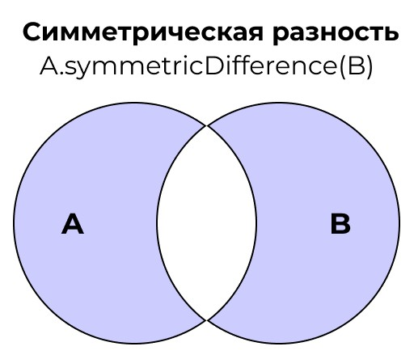
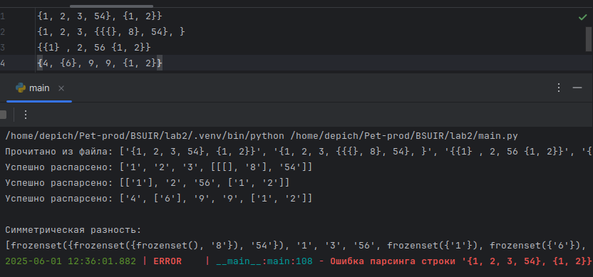
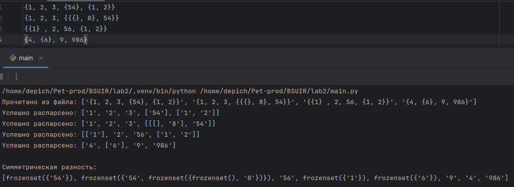
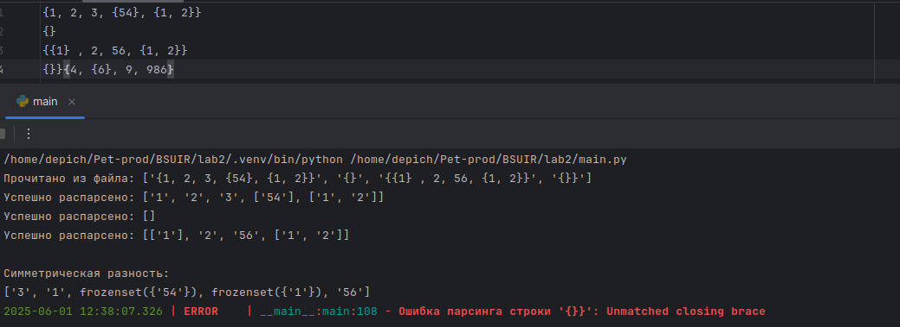
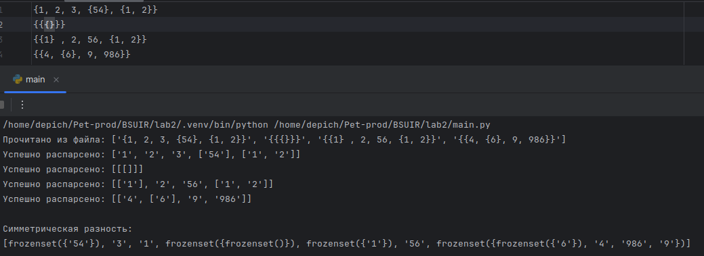

<h1>Лабораторная работа №2</h1>


## Цели:
* Изучить основные понятия, связанные  с множествами
* Научиться правильно выполять операции над множествами
* Уметь использовать основные свойства множеств

## Задачи:
* Выполнить свой вариант лабораторной работы 
* Перенести получившееся решение на язык программирования Python


 ## Вариант 
Для выполнения лабораторной работы мне был выдан вариант **3**. 

## Множество 

**Множество** – простейшая информационная конструкция и математическая структура,
позволяющая рассматривать какие-то объекты как целое, связывая их. Объекты, связываемые
некоторым множеством, называются элементами этого множества. Если объект связан
некоторым множеством, то говорят, что существует вхождение объекта в это множество, а
объект принадлежит этому множеству.

Симметрической разностью неориентированных множеств A и B с учётом кратных
вхождений элементов будем называть неориентированное множество S тогда и только тогда,
когда для любого x истинно S|x| = max{A|x|-B|x|, B|x|-A|x|}.

<p align="center"></p>

<p></p>
Данная программа рассчитана на то, что множество может быть элементом множества
<p></p>

Основные части программы:

**1)** Чтение множеств с файла
```Python
def read_file(filename: str) -> list:
    try:
        with open(filename, 'r', encoding='utf-8') as file:
            return [line.strip() for line in file if line.strip()]
    except FileNotFoundError:
        raise FileNotFoundError(f"Файл {filename} не найден!")
    except Exception as e:
        raise Exception(f"Ошибка при чтении файла: {e}")
```
**2)** Парсинг строки во вложенный список

```Python
def parse(s: str) -> list:
    stack = []
    current = []
    i = 0
    n = len(s)

    while i < n:
        if s[i] == '{':
            stack.append(current)
            current = []
            i += 1
        elif s[i] == '}':
            if not stack:
                raise ValueError("Unmatched closing brace")
            parent = stack.pop()
            parent.append(current)
            current = parent
            i += 1
        elif s[i] == ',' or s[i] == ' ':
            i += 1
        else:
            el = find_full_el(s[i:])
            if el:
                current.append(el)
                i += len(el)
            else:
                i += 1

    if stack:
        raise ValueError

    return current[0] if current else []
```

**3)** Симметрическая разность
```Python
def symmetric_difference(*lists) -> list:
    if not lists:
        return []

    hashable_lists = []
    for lst in lists:
        hashable_lst = frozenset(convert_to_hashable(x) for x in lst)
        hashable_lists.append(hashable_lst)

    element_counts = Counter()
    for lst in hashable_lists:
        element_counts.update(lst)

# Собираем элементы, которые встречаются ровно 1 раз
    result = []
    for lst in hashable_lists:
        for item in lst:
            if element_counts[item] == 1:
                result.append(item)

    seen = set()
    unique_result = []
    for item in result:
        if item not in seen:
            seen.add(item)
            unique_result.append(item)

    return unique_result

```

**4)** main файл 
```Python
input_filename = "input.txt"

    try:
        # Чтение строк из файла
        input_lines = read_file(input_filename)
        print(f"Прочитано из файла: {input_lines}")

        # Парсинг каждого множества
        parsed_lists = []
        for line in input_lines:
            try:
                parsed = parse(line)
                parsed_lists.append(parsed)
                print(f"Успешно распарсено: {parsed}")
            except ValueError as e:
                logger.error(f"Ошибка парсинга строки '{line}': {e}")
                continue

        # Вычисление симметрической разности
        if len(parsed_lists) < 2:
            logger.warning("Нужно как минимум 2 множества для вычисления симметрической разности")
        else:
            result = symmetric_difference(*parsed_lists)
            print("\nСимметрическая разность:")
            print(result)

    except Exception as e:
        logger.exception(e)
```

## Примеры

<p align="center"></p>

<p align="center"></p>

<p align="center"></p>

<p align="center"></p>

<p align="center"></p>


## Используемые  источники

### Свободная энциклопедия "Википедия" [Электронный ресурс]-Режим доступа

* https://ru.m.wikipedia.org/wiki/


### Google Disk 
* https://drive.google.com/drive/folders/1_xy849HXgTDetxSMlFd0KikTBo8-xalN

