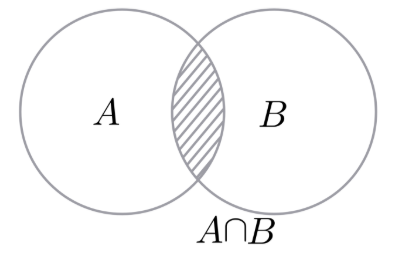
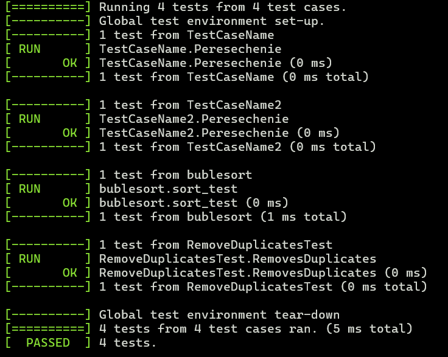
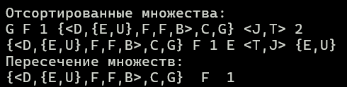

<h1 align="center">Лабораторная работа №2</h1>

<h3>Цели:</h3>
<ul>
<li>Изучить основные понятия, связанные с явными множествами, кортежами.</li>
<li>Научиться правильно выполять операции над явными множествами</li>
<li>Уметь использовать основные свойства явных множеств</li>
</ul>

<h3>Задачи:</h3>
<ul>
<li>Разработать алгоритм для решения задачи, описанной в заданном варианте</li>
<li>Перенести разработанный алгоритм на язык программирования С++</li>
<li>Реализовать выполнение Unit-Тестов для данного алноритма</li>
</ul>

<h3>Вариант:</h3>

Для выполнения лабораторной работы мне был выдан вариант 2. Для работы с множествами буду использовать библиотеки <b>vector</b> и <b>string</b>.

<h3>Краткие теоретические сведения:</h3>

<b>Множество</b> — одно из ключевых понятий математики, представляющее собой набор, совокупность каких-либо (вообще говоря любых) объектов — элементов этого множества. Два множества равны тогда и только тогда, когда содержат в точности одинаковые элементы.

<b>Пересечением</b> двух множеств называется множество, которому принадлежат те и только те элементы, которые одновременно принадлежат двум данным множествам.

</img>

<h3>Описание программы:</h3>

Получение множеств и разбиение:

<pre>
<code> vector<string> get_elements(string& set) {
    vector<string> elements;
    string current;
    int bracket_count = 0;
    int bracket_count_treug = 0;

    for (int i = 1; i < set.length() - 1; i++) {
        char c = set[i];

        if (c == bracket1) {
            bracket_count++;
            current += c;
        }
        else if (c == bracket2) {
            bracket_count--;
            current += c;
            if (bracket_count == 0 && bracket_count_treug == 0) {
                elements.push_back(current);
                current.clear();
            }
        }
        else if (c == bracket3) {
            bracket_count_treug++;
            current += c;
        }
        else if (c == bracket4) {
            bracket_count_treug--;
            current += c;
            if (bracket_count == 0 && bracket_count_treug == 0) {
                elements.push_back(current);
                current.clear();
            }
        }
        else if ((c == ',' || c == ' ') && bracket_count == 0 && bracket_count_treug == 0) {
            if (!current.empty()) {
                elements.push_back(current);
                current.clear();
            }

        }
        else {
            current += c;
        }
    }

    if (!current.empty()) {
        elements.push_back(current);
    }

    return elements;
}

string sort_set(string& str) {
    if (is_tupple(str)) {
        vector<string> elements = get_elements(str);
        for (auto& element : elements) {
            if (is_set(element) || is_tupple(element)) {
                element = sort_set(element);
            }
        }
        string result = "<";
        for (size_t i = 0; i < elements.size(); i++) {
            if (i > 0) result += ",";
            result += elements[i];
        }
        result += ">";
        return result;
    }

    if (is_set(str)) {
        vector<string> elements = get_elements(str);
        for (auto& element : elements) {
            if (is_set(element) || is_tupple(element)) {
                element = sort_set(element);
            }
        }
        bubble_sort(elements);
        remove_duplicates(elements);
        string result = "{";
        for (size_t i = 0; i < elements.size(); i++) {
            if (i > 0) result += ",";
            result += elements[i];
        }
        result += "}";
        return result;
    }

    return str;
} </code> </pre>

Сортировка и удаление повторяющихся элементов множеств:

<pre> <code> void bubble_sort(vector<string>& elements) {
    for (size_t i = 0; i < elements.size(); i++) {
        for (size_t j = 0; j < elements.size() - 1 - i; j++) {
            if (!compare_strings(elements[j], elements[j + 1])) {
                string temp = elements[j];
                elements[j] = elements[j + 1];
                elements[j + 1] = temp;
            }
        }
    }
}
</code> </pre>
<pre> <code> void remove_duplicates(vector<string>& elements) {
    if (elements.empty()) return;
    vector <string> unique;
    for (int i = 0; i < elements.size(); i++) {
        bool flag = false;
        for (int j = 0; j < unique.size(); j++) {
            if (elements[i] == unique[j]) {
                flag = true;
                break;
            }
        }
        if (!flag) {
            unique.push_back(elements[i]);
        }
    }
    elements = unique;
} </code> </pre>

Пересечение множеств:

<pre> <code> void peresechenie(vector <string> res, vector<string>& result) {
    vector <string> temp;
    for (auto& el : res) {
        bool flag = false;
        for (auto& s : result) {
            if (el == s) {
                flag = true;
                break;
            }
        }
        if (flag) {
            temp.push_back(el);
        }
    }
    result.clear();
    result = temp;
} </code> </pre>
<h3>Unit-Тестирование программы:</h3>

<b>Unit</b>-тестирование – это процесс, который позволяет проверить работоспособность отдельных частей исходного кода программы.

<h3>Какими качествами должен обладать юнит-тест?</h3>

Таких качеств всего три, и они достаточно общие. Юнит-тест должен проверять правильность работы небольшого фрагмента кода – юнита, должен делать это быстро и поддерживать изоляцию от другого кода.

<h3>Google - Test</h3>

Для юнит-тестирования я использовал технологию google test.

Тестирование функции пересечения 2 множеств:

<pre> <code> TEST(TestCaseName, Peresechenie) {
	vector <Set> test(2);
	vector <string> first = {
		"x", "{x,y,z}", "{x,y,z,{m,n}}", "{{x,y}}"
	};
	test[0].set_vector(first);

	vector <string> second = {
		"x", "2", "{x,y,z,p,q,r}", "{x,y,z,{m,n,p}}", "{{x,y,y}}"
	};
	test[1].set_vector(second);

	for (auto& el : test[0].get_vector()) {
		string result = sort_set(el);
		el = result;
	}
	for (auto& el : test[1].get_vector()) {
		string result = sort_set(el);
		el = result;
	}
	vector <string> resulti = test[0].get_vector();

	main_intersection(test, resulti);
	EXPECT_EQ(resulti.size(), 2);
	EXPECT_EQ(resulti[0], "x");
	EXPECT_EQ(resulti[1], "{{x,y}}");
} </code> </pre>

Пример тестирования пересечения 4 множеств:

<pre> <code> TEST(TestCaseName2, Peresechenie) {
	vector <Set> test(4);
	vector <string> first = {
		"p", "{p,q,r}", "{p,r,s,{t,u}}", "{{p,q}}"
	};
	test[0].set_vector(first);

	vector <string> second = {
		"p", "3", "{p,q,r,s}", "{p,r,{v,w}}", "{{p,q,q}}"
	};
	test[1].set_vector(second);

	vector <string> third = {
		"p", "{p,s,t}", "{p,q,{x,y}}", "{{p}}"
	};
	test[2].set_vector(third);

	vector <string> fourth = {
		"p", "4", "{p,q,x}", "{p,s,{v}}", "{{p,q,r}}"
	};
	test[3].set_vector(fourth);

	for (auto& el : test[0].get_vector()) {
		string result = sort_set(el);
		el = result;
	}
	for (auto& el : test[1].get_vector()) {
		string result = sort_set(el);
		el = result;
	}
	for (auto& el : test[2].get_vector()) {
		string result = sort_set(el);
		el = result;
	}
	for (auto& el : test[3].get_vector()) {
		string result = sort_set(el);
		el = result;
	}

	vector <string> resulti = test[0].get_vector();
	main_intersection(test, resulti);

	EXPECT_EQ(resulti.size(), 1);
	EXPECT_EQ(resulti[0], "p");
} </code> </pre>

Пример тестирования функции сортировки:

<pre> <code> TEST(bublesort, sort_test) {
	vector <string> test{

		"f", "{m, z, l, l, f, f}", "<z, y, x>", "{a,s,d,f,g,h,j,{a,{{x,x,d}},d}}", "{}", "{{}}"
	};

	for (auto& el : test) {
		el = sort_set(el);
	}
	EXPECT_EQ(test[0], "f");
	EXPECT_EQ(test[1], "{f,l,m,z}");
	EXPECT_EQ(test[2], "<z,y,x>");
	EXPECT_EQ(test[3], "{a,d,f,g,h,j,s,{a,d,{{d,x}}}}");
	EXPECT_EQ(test[4], "{}");
	EXPECT_EQ(test[5], "{{}}");

} </code> </pre>

Пример тестирования функции удаления повторяющихся элементов.

<pre> <code> TEST(RemoveDuplicatesTest, RemovesDuplicates) {
	std::vector<std::string> test_unique = {

		"b", "r", "f", "f", "i", "s", "a", "i", "d", "g", "g"
	};

	remove_duplicates(test_unique);

	EXPECT_EQ(test_unique.size(), 8);

	EXPECT_EQ(test_unique[0], "b");
	EXPECT_EQ(test_unique[1], "r");
	EXPECT_EQ(test_unique[2], "f");
	EXPECT_EQ(test_unique[3], "i");
	EXPECT_EQ(test_unique[4], "s");
	EXPECT_EQ(test_unique[5], "a");
	EXPECT_EQ(test_unique[6], "d");
	EXPECT_EQ(test_unique[7], "g");

	std::vector<std::string> expected = {"b", "r", "f", "i", "s", "a", "d", "g"};
	EXPECT_EQ(test_unique, expected);
}</code> </pre>

результат:

</img>
<h3>Тестовые пример:</h3>
</img>
<h3>Выводы:</h3>

В результате данной лабораторной работы я реализовал алгоритм пересечения для n количества множеств, перенес его на язык программирования С++, а также изучил и реализовал юнит-тесты с помощью google tests.

<h3>Литературные источники:</h3>
<a href="https://foxford.ru/wiki/matematika/operatsii-nad-mnozhestvami?ysclid=ma83isbm4v175196975&utm_referrer=https%3A%2F%2Fyandex.by%2F">Foxford/wiki/matematika</a>  
<a href="https://ru.wikipedia.org/wiki/%D0%9C%D0%BD%D0%BE%D0%B6%D0%B5%D1%81%D1%82%D0%B2%D0%BE">Wikipedia</a>  
<a href="https://habr.com/en/companies/sportmaster_lab/articles/676840/">Habr</a>