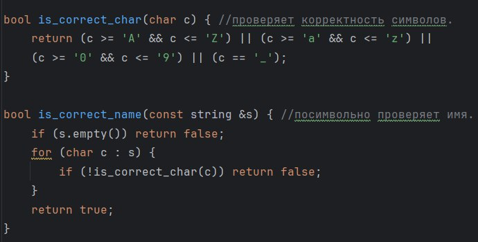
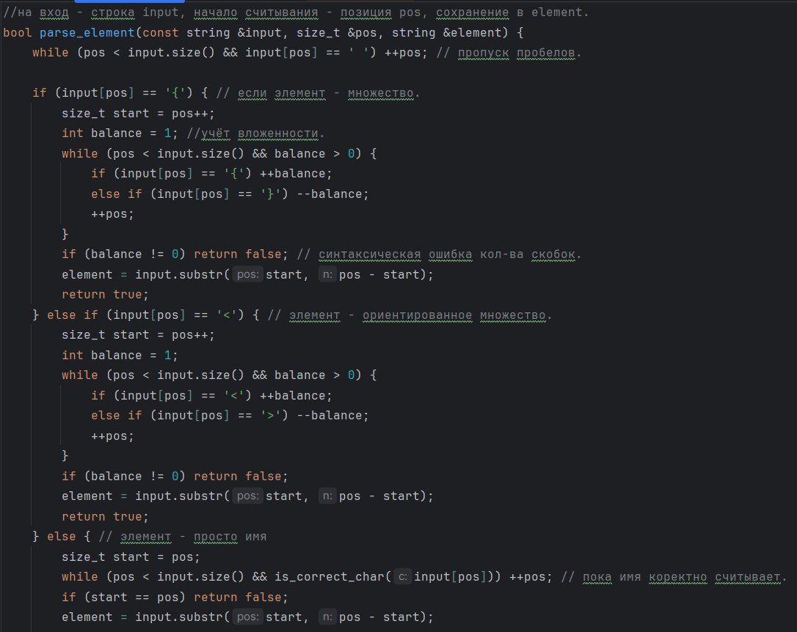
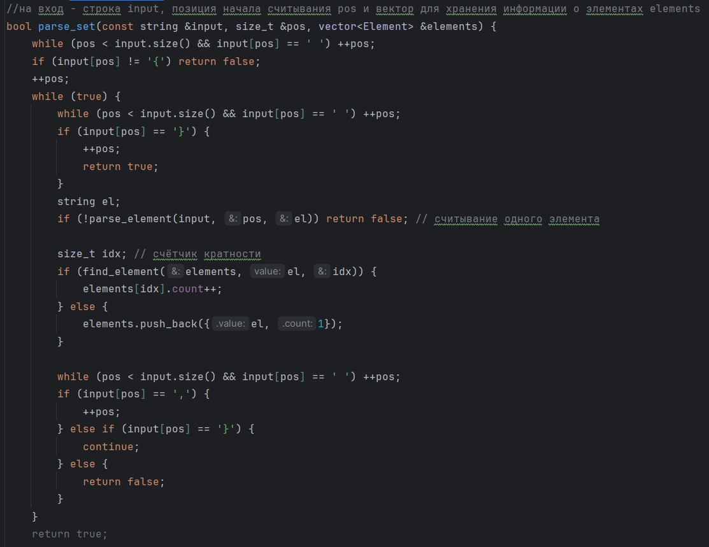
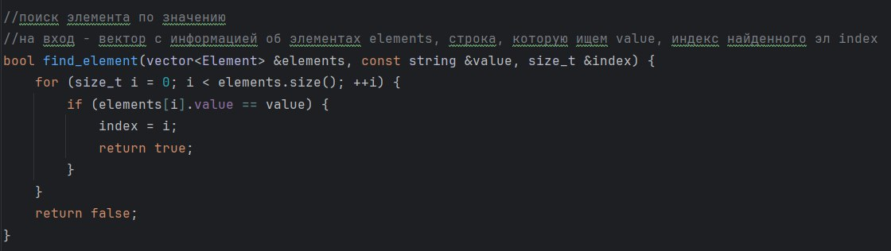
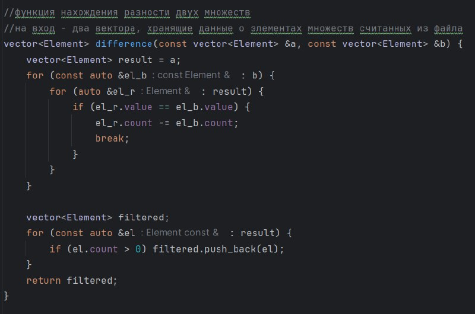
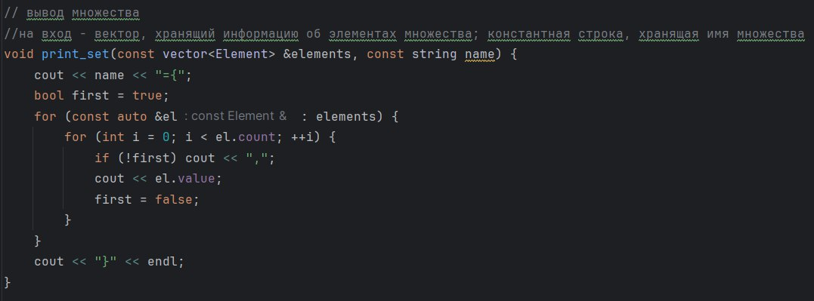
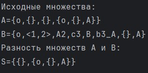

# Лабораторная работа №2
## Цель
* Реализовать программу, формирующую множество равное разности двух исходных множеств (с учётом кратных вхождений элементов).
## Задачи
* Изучить основные понятия, связанные с множествами, содержащие кратные вхождения элементов.
* Спроектировать структуру данных, хранящюю информацию об элементах множества.
* Реализовать операцию нахождения разности двух исходных множеств.
## Вариант
Для выполнения лабораторной работы мне был выдан **13** выриант.
### Глоссарий
* Множество – простейшая информационная конструкция и математическая структура,
  позволяющая рассматривать какие-то объекты как целое, связывая их.
* Элементы множества - объекты, связываемые некоторым множеством.
* Множество с кратными вхождениями элементов - множество S, для которого существует **x** такой, что истинно **S|x| > 1**.
* **Разность** неориентированных множеств **A** и **B** с учётом кратных вхождений элементов - 
неориентированное множество **S** тогда и только тогда, когда для любого x
  истинно **S|x| = max{A|x|-B|x|, 0}**.
### Алгоритм
#### Описание алгоритма
Программа считывает строку из текстового файла и извлекает из нее множество. 
После считанное множество проверяется на корректность. 
Если ошибок не обнаружено, множество разбивается на члены. 
Членами множества считаются элементы, разделенные запятыми.
Внешние скобки и разделительные запятые не являются элементами множества

Входные данные:
* Множество A = {a₁, a₂, ..., aₙ} (элементы могут повторяться)
* Множество B = {b₁, b₂, ..., bₘ} (элементы могут повторяться)

Выходные данные:
* Множество C = A \ B (разность множеств с учётом кратности элементов)

Элементы из множества А копируются в множество С. Для каждого элемента из В находится соответствующий
элемент в множестве С с таким же значением. Если такой элемент найден, то уменьшается счетчик кратности элемента 
в множестве С на кратность элемента из В, если счётчик стал <= 0, элемент исключается из С. Далее из множества С
удаляются все элементы с нулевой или отрицательной кратностью. В качестве результата возвращается отфильтрованное множество С.
#### Реализация алгоритма 
Множества реализованы ввиде векторов, которые составлены из элементов структуры, хранящей название элемента и его кратность.

Проверка считанных множеств происходит с помощью функций **is_correct_name**, которая с помощью **is_correct_char** 
посимвольно проверяет названия множеств.

Функция **parse_set** считывает множество целиком и с помощью **parse_element** считывает, по элементно занося информацию в структуру,
формируя вектор с информацией об элементах множеств.

Функция **find_element** - поиск элементов по значению, используется в обновлении счётчика кратности.

Функция **vector<Element> difference** по описанному алгоритму находит разность двух множеств, формируя конечне множество С.

Функция **void print_set** используется для вывода множеств.

### Пример работы программы

## Источники

1. [Разность множеств](https://ru.hexlet.io/courses/set-theory/lessons/difference/theory_unit)
2. [Операции над множествами](https://foxford.ru/wiki/matematika/operatsii-nad-mnozhestvami)
3. Гладков Л.А., Курейчик В.В., Курейчик В.М. Дискретная математика, 2014.-490с.
